# DesignScript Library

## Arquivos

### [Autodesk.DesignScript.Geometry.Arc.ByBestFitThroughPoints.dyn](assets/Autodesk.DesignScript.Geometry.Arc.ByBestFitThroughPoints.dyn)

### [Autodesk.DesignScript.Geometry.Arc.ByCenterPointRadiusAngle.dyn](assets/Autodesk.DesignScript.Geometry.Arc.ByCenterPointRadiusAngle.dyn)

### [Autodesk.DesignScript.Geometry.Arc.ByCenterPointStartPointEndPoint.dyn](assets/Autodesk.DesignScript.Geometry.Arc.ByCenterPointStartPointEndPoint.dyn)

### [Autodesk.DesignScript.Geometry.Arc.ByFillet.dyn](assets/Autodesk.DesignScript.Geometry.Arc.ByFillet.dyn)

### [Autodesk.DesignScript.Geometry.Arc.ByFilletTangentToCurve.dyn](assets/Autodesk.DesignScript.Geometry.Arc.ByFilletTangentToCurve.dyn)
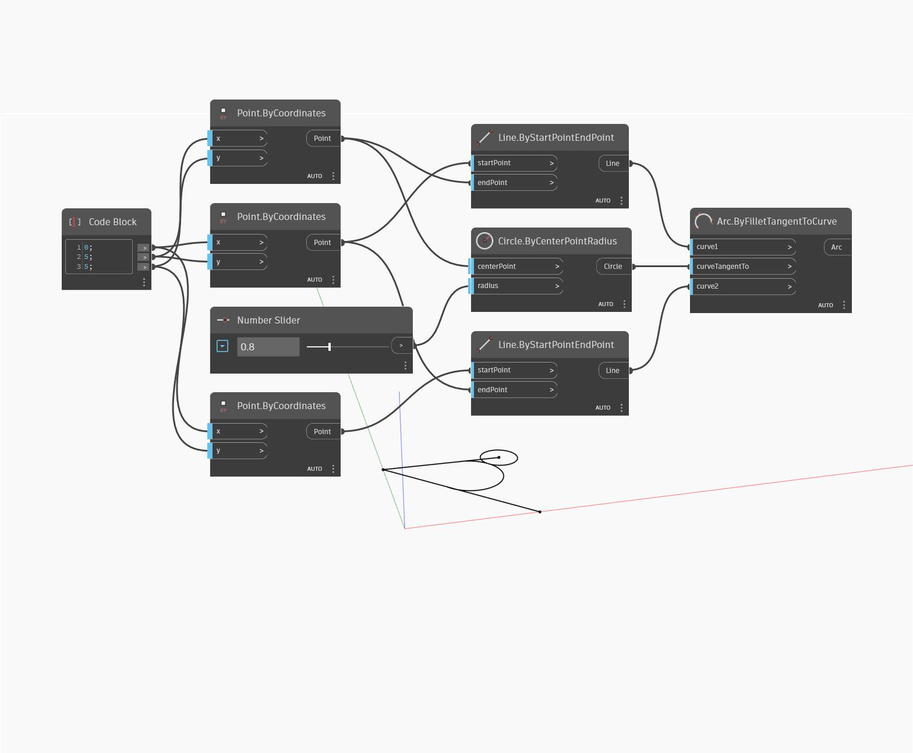

### [Autodesk.DesignScript.Geometry.Arc.ByStartEndAndTangencies.dyn](assets/Autodesk.DesignScript.Geometry.Arc.ByStartEndAndTangencies.dyn)

### [Autodesk.DesignScript.Geometry.Arc.ByStartPointEndPointStartTangent.dyn](assets/Autodesk.DesignScript.Geometry.Arc.ByStartPointEndPointStartTangent.dyn)

### [Autodesk.DesignScript.Geometry.Arc.ByThreePoints.dyn](assets/Autodesk.DesignScript.Geometry.Arc.ByThreePoints.dyn)
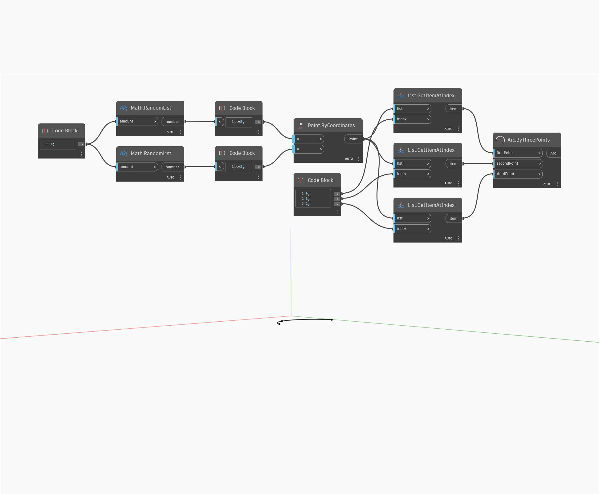

### [Autodesk.DesignScript.Geometry.Arc.CenterPoint.dyn](assets/Autodesk.DesignScript.Geometry.Arc.CenterPoint.dyn)

### [Autodesk.DesignScript.Geometry.Arc.Radius.dyn](assets/Autodesk.DesignScript.Geometry.Arc.Radius.dyn)

### [Autodesk.DesignScript.Geometry.Arc.StartAngle.dyn](assets/Autodesk.DesignScript.Geometry.Arc.StartAngle.dyn)
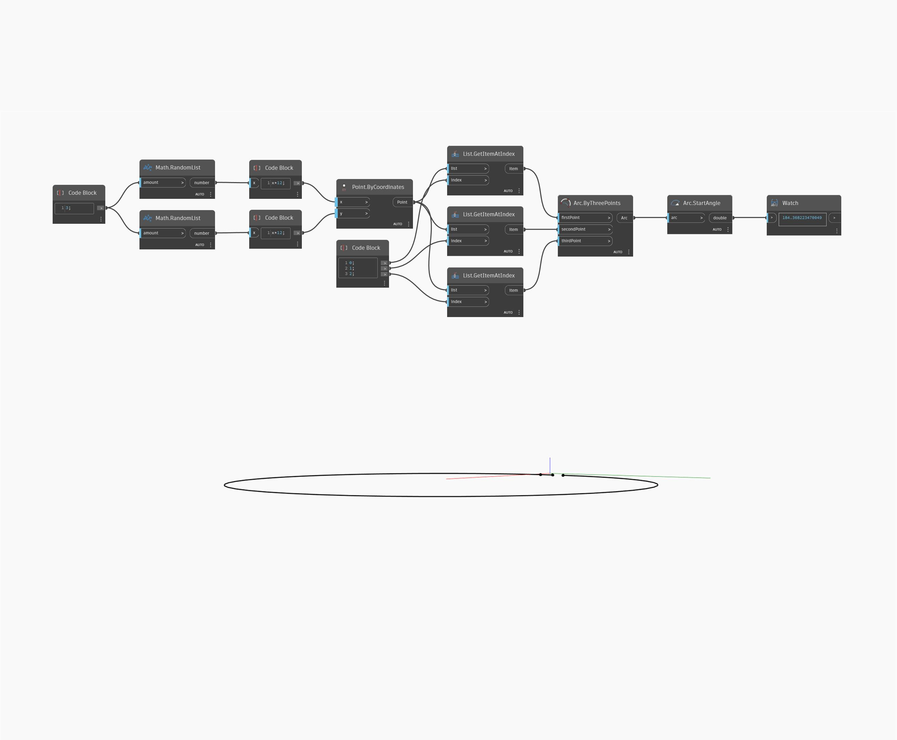

### [Autodesk.DesignScript.Geometry.Arc.SweepAngle.dyn](assets/Autodesk.DesignScript.Geometry.Arc.SweepAngle.dyn)

### [Autodesk.DesignScript.Geometry.BoundingBox.ByCorners.dyn](assets/Autodesk.DesignScript.Geometry.BoundingBox.ByCorners.dyn)

### [Autodesk.DesignScript.Geometry.BoundingBox.ByGeometry.dyn](assets/Autodesk.DesignScript.Geometry.BoundingBox.ByGeometry.dyn)

### [Autodesk.DesignScript.Geometry.BoundingBox.ByMinimumVolume.dyn](assets/Autodesk.DesignScript.Geometry.BoundingBox.ByMinimumVolume.dyn)

### [Autodesk.DesignScript.Geometry.BoundingBox.Contains.dyn](assets/Autodesk.DesignScript.Geometry.BoundingBox.Contains.dyn)

### [Autodesk.DesignScript.Geometry.BoundingBox.Intersection.dyn](assets/Autodesk.DesignScript.Geometry.BoundingBox.Intersection.dyn)

### [Autodesk.DesignScript.Geometry.BoundingBox.Intersects.dyn](assets/Autodesk.DesignScript.Geometry.BoundingBox.Intersects.dyn)

### [Autodesk.DesignScript.Geometry.BoundingBox.IsEmpty.dyn](assets/Autodesk.DesignScript.Geometry.BoundingBox.IsEmpty.dyn)

### [Autodesk.DesignScript.Geometry.BoundingBox.MaxPoint.dyn](assets/Autodesk.DesignScript.Geometry.BoundingBox.MaxPoint.dyn)

### [Autodesk.DesignScript.Geometry.BoundingBox.MinPoint.dyn](assets/Autodesk.DesignScript.Geometry.BoundingBox.MinPoint.dyn)

### [Autodesk.DesignScript.Geometry.BoundingBox.ToCuboid.dyn](assets/Autodesk.DesignScript.Geometry.BoundingBox.ToCuboid.dyn)

### [Autodesk.DesignScript.Geometry.BoundingBox.ToPolySurface.dyn](assets/Autodesk.DesignScript.Geometry.BoundingBox.ToPolySurface.dyn)

### [Autodesk.DesignScript.Geometry.Circle.ByBestFitThroughPoints.dyn](assets/Autodesk.DesignScript.Geometry.Circle.ByBestFitThroughPoints.dyn)

### [Autodesk.DesignScript.Geometry.Circle.ByCenterPointRadius.dyn](assets/Autodesk.DesignScript.Geometry.Circle.ByCenterPointRadius.dyn)

### [Autodesk.DesignScript.Geometry.Circle.ByCenterPointRadiusNormal.dyn](assets/Autodesk.DesignScript.Geometry.Circle.ByCenterPointRadiusNormal.dyn)
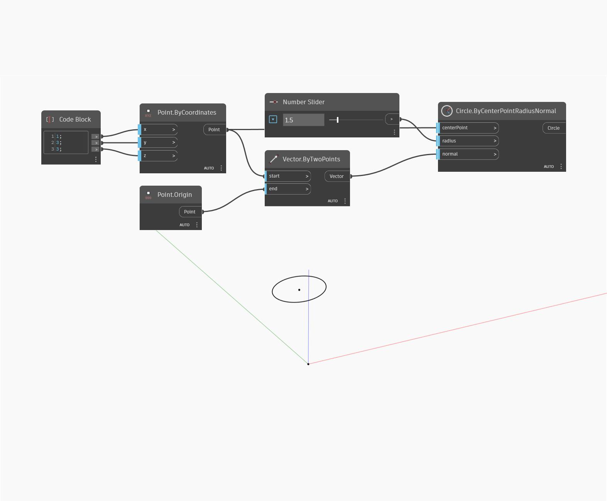

### [Autodesk.DesignScript.Geometry.Circle.ByPlaneRadius.dyn](assets/Autodesk.DesignScript.Geometry.Circle.ByPlaneRadius.dyn)

### [Autodesk.DesignScript.Geometry.Circle.ByThreePoints.dyn](assets/Autodesk.DesignScript.Geometry.Circle.ByThreePoints.dyn)

### [Autodesk.DesignScript.Geometry.Circle.CenterPoint.dyn](assets/Autodesk.DesignScript.Geometry.Circle.CenterPoint.dyn)
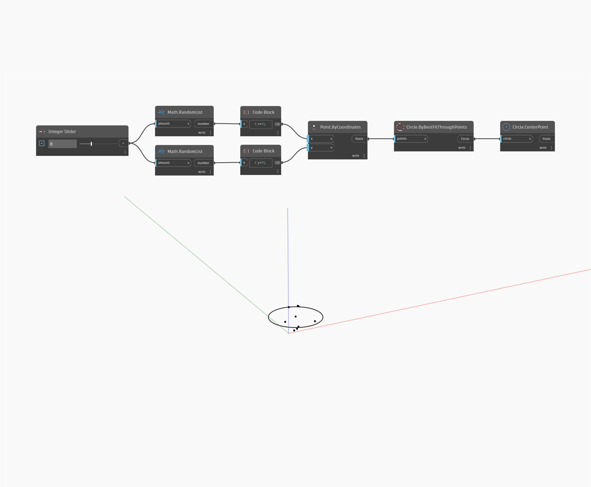

### [Autodesk.DesignScript.Geometry.Circle.Radius.dyn](assets/Autodesk.DesignScript.Geometry.Circle.Radius.dyn)

### [Autodesk.DesignScript.Geometry.Cone.ByCoordinateSystemHeightRadii.dyn](assets/Autodesk.DesignScript.Geometry.Cone.ByCoordinateSystemHeightRadii.dyn)

### [Autodesk.DesignScript.Geometry.Cone.ByCoordinateSystemHeightRadius.dyn](assets/Autodesk.DesignScript.Geometry.Cone.ByCoordinateSystemHeightRadius.dyn)

### [Autodesk.DesignScript.Geometry.Cone.ByPointsRadii.dyn](assets/Autodesk.DesignScript.Geometry.Cone.ByPointsRadii.dyn)

### [Autodesk.DesignScript.Geometry.Cone.ByPointsRadius.dyn](assets/Autodesk.DesignScript.Geometry.Cone.ByPointsRadius.dyn)

### [Autodesk.DesignScript.Geometry.Cone.EndPoint.dyn](assets/Autodesk.DesignScript.Geometry.Cone.EndPoint.dyn)

### [Autodesk.DesignScript.Geometry.Cone.EndRadius.dyn](assets/Autodesk.DesignScript.Geometry.Cone.EndRadius.dyn)

### [Autodesk.DesignScript.Geometry.Cone.Height.dyn](assets/Autodesk.DesignScript.Geometry.Cone.Height.dyn)

### [Autodesk.DesignScript.Geometry.Cone.RadiusRatio.dyn](assets/Autodesk.DesignScript.Geometry.Cone.RadiusRatio.dyn)

### [Autodesk.DesignScript.Geometry.Cone.StartPoint.dyn](assets/Autodesk.DesignScript.Geometry.Cone.StartPoint.dyn)

### [Autodesk.DesignScript.Geometry.Cone.StartRadius.dyn](assets/Autodesk.DesignScript.Geometry.Cone.StartRadius.dyn)

### [Autodesk.DesignScript.Geometry.CoordinateSystem.ByOrigin(origin).dyn](assets/Autodesk.DesignScript.Geometry.CoordinateSystem.ByOrigin(origin).dyn)
_img.jpg)

### [Autodesk.DesignScript.Geometry.CoordinateSystem.ByOrigin(x, y).dyn](assets/Autodesk.DesignScript.Geometry.CoordinateSystem.ByOrigin(x, y).dyn)
_img.jpg)

### [Autodesk.DesignScript.Geometry.CoordinateSystem.ByOrigin(x, y, z).dyn](assets/Autodesk.DesignScript.Geometry.CoordinateSystem.ByOrigin(x, y, z).dyn)
_img.jpg)

### [Autodesk.DesignScript.Geometry.CoordinateSystem.ByPlane.dyn](assets/Autodesk.DesignScript.Geometry.CoordinateSystem.ByPlane.dyn)

### [Autodesk.DesignScript.Geometry.CoordinateSystem.Determinant.dyn](assets/Autodesk.DesignScript.Geometry.CoordinateSystem.Determinant.dyn)
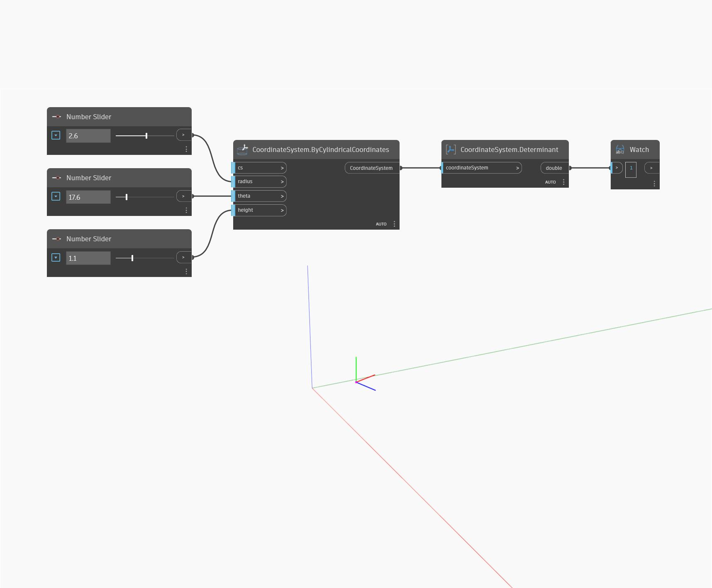

### [Autodesk.DesignScript.Geometry.CoordinateSystem.Identity.dyn](assets/Autodesk.DesignScript.Geometry.CoordinateSystem.Identity.dyn)

### [Autodesk.DesignScript.Geometry.CoordinateSystem.Inverse.dyn](assets/Autodesk.DesignScript.Geometry.CoordinateSystem.Inverse.dyn)

### [Autodesk.DesignScript.Geometry.CoordinateSystem.IsEqualTo.dyn](assets/Autodesk.DesignScript.Geometry.CoordinateSystem.IsEqualTo.dyn)

### [Autodesk.DesignScript.Geometry.CoordinateSystem.IsScaledOrtho.dyn](assets/Autodesk.DesignScript.Geometry.CoordinateSystem.IsScaledOrtho.dyn)

### [Autodesk.DesignScript.Geometry.CoordinateSystem.IsSingular.dyn](assets/Autodesk.DesignScript.Geometry.CoordinateSystem.IsSingular.dyn)

### [Autodesk.DesignScript.Geometry.CoordinateSystem.IsUniscaledOrtho.dyn](assets/Autodesk.DesignScript.Geometry.CoordinateSystem.IsUniscaledOrtho.dyn)

### [Autodesk.DesignScript.Geometry.CoordinateSystem.Mirror.dyn](assets/Autodesk.DesignScript.Geometry.CoordinateSystem.Mirror.dyn)

### [Autodesk.DesignScript.Geometry.CoordinateSystem.Origin.dyn](assets/Autodesk.DesignScript.Geometry.CoordinateSystem.Origin.dyn)

### [Autodesk.DesignScript.Geometry.CoordinateSystem.PostMultiplyBy.dyn](assets/Autodesk.DesignScript.Geometry.CoordinateSystem.PostMultiplyBy.dyn)

### [Autodesk.DesignScript.Geometry.CoordinateSystem.PreMultiplyBy.dyn](assets/Autodesk.DesignScript.Geometry.CoordinateSystem.PreMultiplyBy.dyn)

### [Autodesk.DesignScript.Geometry.CoordinateSystem.Scale(amount).dyn](assets/Autodesk.DesignScript.Geometry.CoordinateSystem.Scale(amount).dyn)
_img.jpg)

### [Autodesk.DesignScript.Geometry.CoordinateSystem.Scale1D.dyn](assets/Autodesk.DesignScript.Geometry.CoordinateSystem.Scale1D.dyn)

### [Autodesk.DesignScript.Geometry.CoordinateSystem.Scale2D.dyn](assets/Autodesk.DesignScript.Geometry.CoordinateSystem.Scale2D.dyn)

### [Autodesk.DesignScript.Geometry.CoordinateSystem.ScaleFactor.dyn](assets/Autodesk.DesignScript.Geometry.CoordinateSystem.ScaleFactor.dyn)

### [Autodesk.DesignScript.Geometry.CoordinateSystem.XAxis.dyn](assets/Autodesk.DesignScript.Geometry.CoordinateSystem.XAxis.dyn)

### [Autodesk.DesignScript.Geometry.CoordinateSystem.XScaleFactor.dyn](assets/Autodesk.DesignScript.Geometry.CoordinateSystem.XScaleFactor.dyn)

### [Autodesk.DesignScript.Geometry.CoordinateSystem.XYPlane.dyn](assets/Autodesk.DesignScript.Geometry.CoordinateSystem.XYPlane.dyn)

### [Autodesk.DesignScript.Geometry.CoordinateSystem.YAxis.dyn](assets/Autodesk.DesignScript.Geometry.CoordinateSystem.YAxis.dyn)

### [Autodesk.DesignScript.Geometry.CoordinateSystem.YScaleFactor.dyn](assets/Autodesk.DesignScript.Geometry.CoordinateSystem.YScaleFactor.dyn)

### [Autodesk.DesignScript.Geometry.CoordinateSystem.YZPlane.dyn](assets/Autodesk.DesignScript.Geometry.CoordinateSystem.YZPlane.dyn)

### [Autodesk.DesignScript.Geometry.CoordinateSystem.ZAxis.dyn](assets/Autodesk.DesignScript.Geometry.CoordinateSystem.ZAxis.dyn)

### [Autodesk.DesignScript.Geometry.CoordinateSystem.ZScaleFactor.dyn](assets/Autodesk.DesignScript.Geometry.CoordinateSystem.ZScaleFactor.dyn)

### [Autodesk.DesignScript.Geometry.CoordinateSystem.ZXPlane.dyn](assets/Autodesk.DesignScript.Geometry.CoordinateSystem.ZXPlane.dyn)

### [Autodesk.DesignScript.Geometry.Cuboid.ByCorners.dyn](assets/Autodesk.DesignScript.Geometry.Cuboid.ByCorners.dyn)

### [Autodesk.DesignScript.Geometry.Cuboid.Height.dyn](assets/Autodesk.DesignScript.Geometry.Cuboid.Height.dyn)

### [Autodesk.DesignScript.Geometry.Cuboid.Length.dyn](assets/Autodesk.DesignScript.Geometry.Cuboid.Length.dyn)
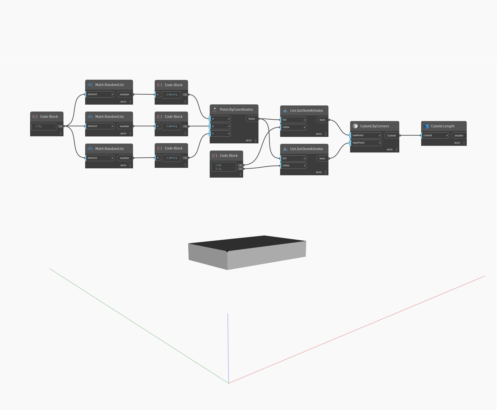

### [Autodesk.DesignScript.Geometry.Cuboid.Width.dyn](assets/Autodesk.DesignScript.Geometry.Cuboid.Width.dyn)

### [Autodesk.DesignScript.Geometry.Curve.ByBlendBetweenCurves.dyn](assets/Autodesk.DesignScript.Geometry.Curve.ByBlendBetweenCurves.dyn)

### [Autodesk.DesignScript.Geometry.Curve.ByIsoCurveOnSurface.dyn](assets/Autodesk.DesignScript.Geometry.Curve.ByIsoCurveOnSurface.dyn)
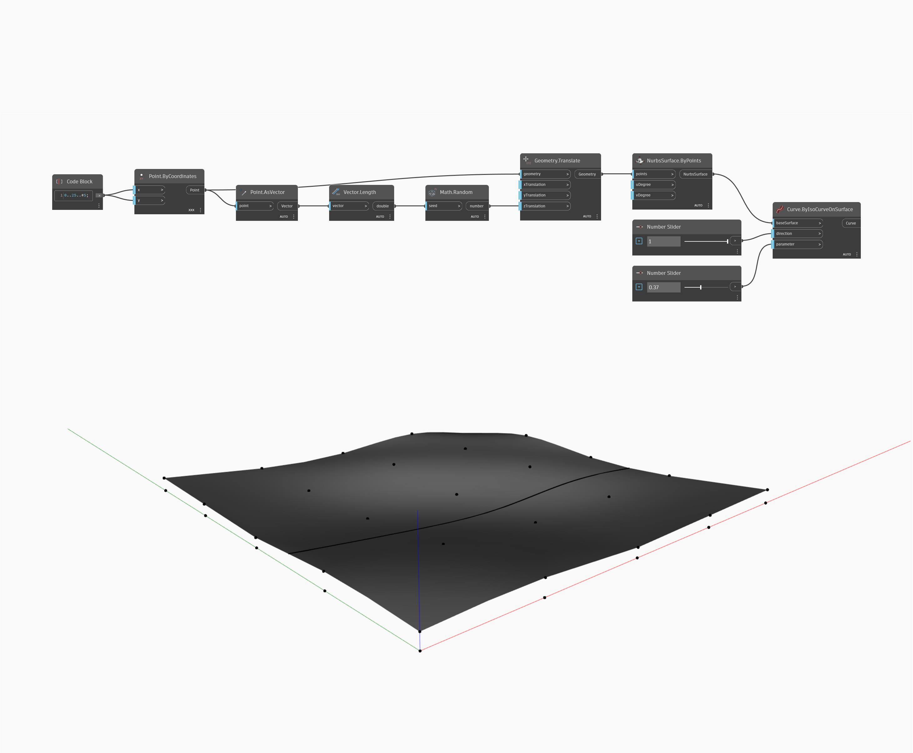

### [Autodesk.DesignScript.Geometry.Curve.ByParameterLineOnSurface.dyn](assets/Autodesk.DesignScript.Geometry.Curve.ByParameterLineOnSurface.dyn)

### [Autodesk.DesignScript.Geometry.Curve.CoordinateSystemAtParameter.dyn](assets/Autodesk.DesignScript.Geometry.Curve.CoordinateSystemAtParameter.dyn)

### [Autodesk.DesignScript.Geometry.Curve.EndParameter.dyn](assets/Autodesk.DesignScript.Geometry.Curve.EndParameter.dyn)

### [Autodesk.DesignScript.Geometry.Curve.EndPoint.dyn](assets/Autodesk.DesignScript.Geometry.Curve.EndPoint.dyn)
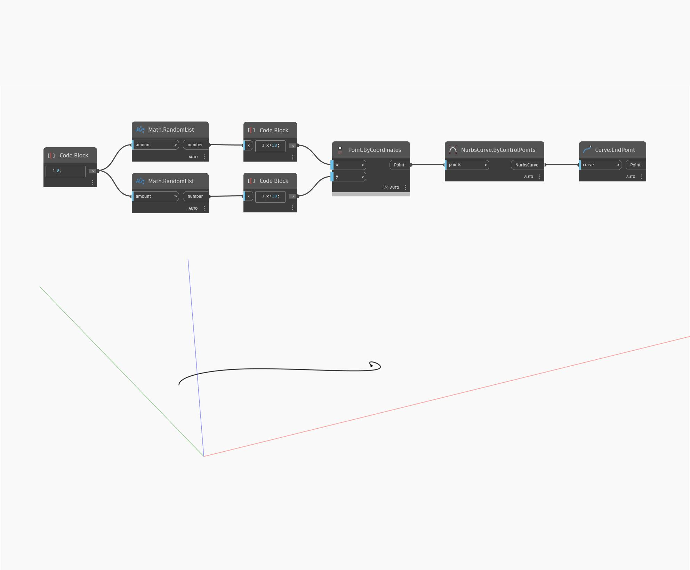

### [Autodesk.DesignScript.Geometry.Curve.Extend.dyn](assets/Autodesk.DesignScript.Geometry.Curve.Extend.dyn)

### [Autodesk.DesignScript.Geometry.Curve.ExtendEnd.dyn](assets/Autodesk.DesignScript.Geometry.Curve.ExtendEnd.dyn)

### [Autodesk.DesignScript.Geometry.Curve.ExtendStart.dyn](assets/Autodesk.DesignScript.Geometry.Curve.ExtendStart.dyn)

### [Autodesk.DesignScript.Geometry.Curve.Extrude(curve, direction).dyn](assets/Autodesk.DesignScript.Geometry.Curve.Extrude(curve, direction).dyn)
_img.jpg)

### [Autodesk.DesignScript.Geometry.Curve.Extrude(curve, distance).dyn](assets/Autodesk.DesignScript.Geometry.Curve.Extrude(curve, distance).dyn)
_img.jpg)

### [Autodesk.DesignScript.Geometry.Curve.Extrude(direction).dyn](assets/Autodesk.DesignScript.Geometry.Curve.Extrude(direction).dyn)
_img.jpg)

### [Autodesk.DesignScript.Geometry.Curve.Extrude(direction, distance).dyn](assets/Autodesk.DesignScript.Geometry.Curve.Extrude(direction, distance).dyn)
_img.jpg)

### [Autodesk.DesignScript.Geometry.Curve.Extrude(distance).dyn](assets/Autodesk.DesignScript.Geometry.Curve.Extrude(distance).dyn)
_img.jpg)

### [Autodesk.DesignScript.Geometry.Curve.ExtrudeAsSolid(direction).dyn](assets/Autodesk.DesignScript.Geometry.Curve.ExtrudeAsSolid(direction).dyn)
_img.jpg)

### [Autodesk.DesignScript.Geometry.Curve.ExtrudeAsSolid(distance).dyn](assets/Autodesk.DesignScript.Geometry.Curve.ExtrudeAsSolid(distance).dyn)
_img.jpg)

### [Autodesk.DesignScript.Geometry.Curve.HorizontalFrameAtParameter.dyn](assets/Autodesk.DesignScript.Geometry.Curve.HorizontalFrameAtParameter.dyn)

### [Autodesk.DesignScript.Geometry.Curve.IsClosed.dyn](assets/Autodesk.DesignScript.Geometry.Curve.IsClosed.dyn)
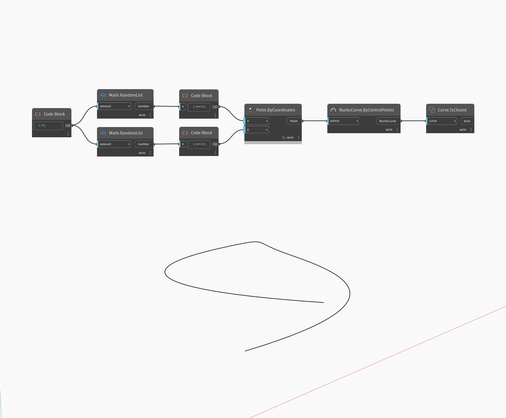

### [Autodesk.DesignScript.Geometry.Curve.IsPlanar.dyn](assets/Autodesk.DesignScript.Geometry.Curve.IsPlanar.dyn)

### [Autodesk.DesignScript.Geometry.Curve.Join.dyn](assets/Autodesk.DesignScript.Geometry.Curve.Join.dyn)
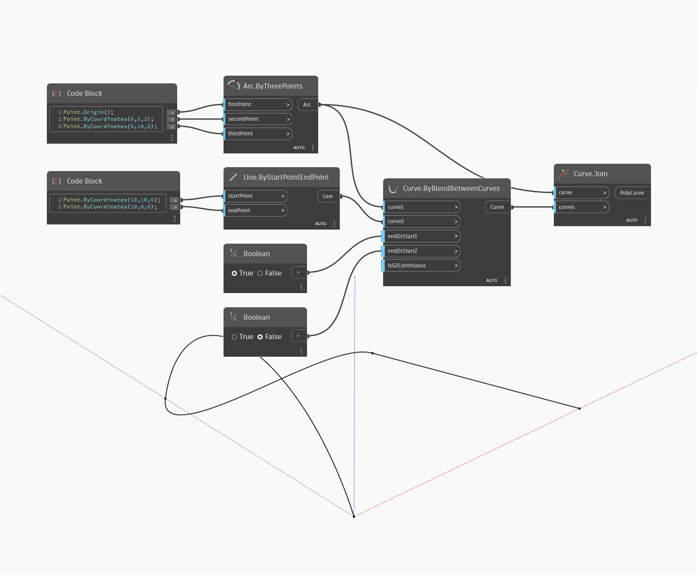

### [Autodesk.DesignScript.Geometry.Curve.Length.dyn](assets/Autodesk.DesignScript.Geometry.Curve.Length.dyn)

### [Autodesk.DesignScript.Geometry.Curve.Normal.dyn](assets/Autodesk.DesignScript.Geometry.Curve.Normal.dyn)

### [Autodesk.DesignScript.Geometry.Curve.NormalAtParameter.dyn](assets/Autodesk.DesignScript.Geometry.Curve.NormalAtParameter.dyn)

### [Autodesk.DesignScript.Geometry.Curve.Offset.dyn](assets/Autodesk.DesignScript.Geometry.Curve.Offset.dyn)

### [Autodesk.DesignScript.Geometry.Curve.OffsetMany.dyn](assets/Autodesk.DesignScript.Geometry.Curve.OffsetMany.dyn)

### [Autodesk.DesignScript.Geometry.Curve.ParameterAtChordLength.dyn](assets/Autodesk.DesignScript.Geometry.Curve.ParameterAtChordLength.dyn)
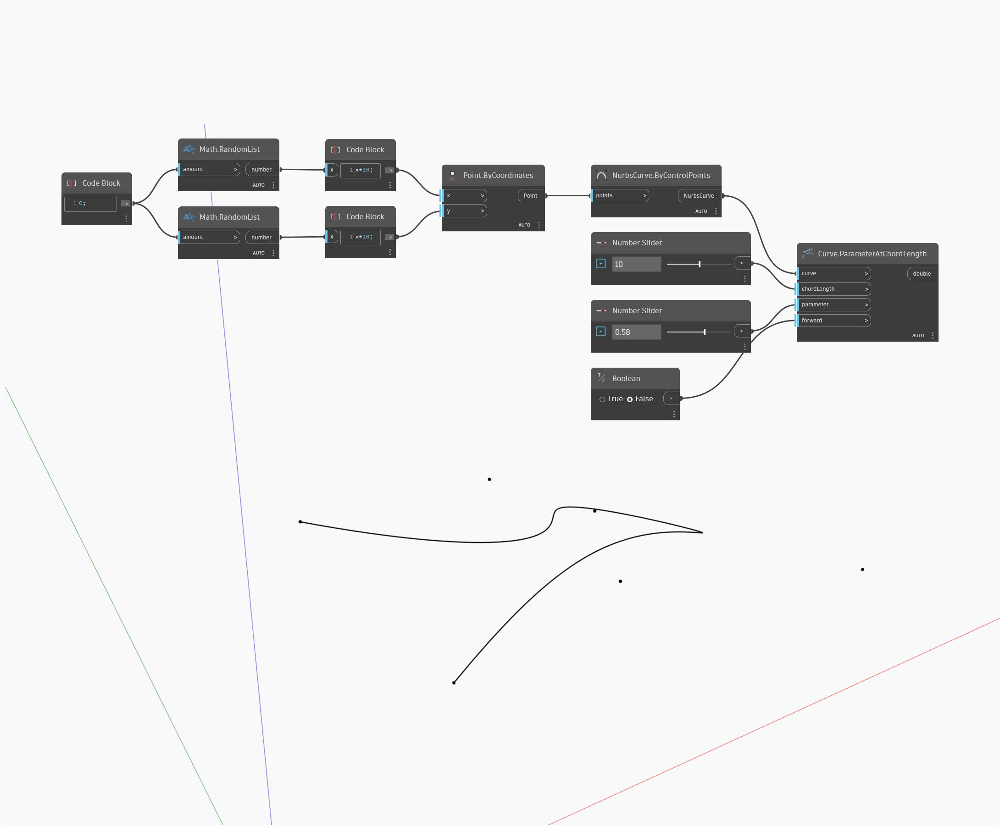

### [Autodesk.DesignScript.Geometry.Curve.ParameterAtPoint.dyn](assets/Autodesk.DesignScript.Geometry.Curve.ParameterAtPoint.dyn)

### [Autodesk.DesignScript.Geometry.Curve.ParameterAtSegmentLength.dyn](assets/Autodesk.DesignScript.Geometry.Curve.ParameterAtSegmentLength.dyn)

### [Autodesk.DesignScript.Geometry.Curve.Patch.dyn](assets/Autodesk.DesignScript.Geometry.Curve.Patch.dyn)

### [Autodesk.DesignScript.Geometry.Curve.PlaneAtParameter.dyn](assets/Autodesk.DesignScript.Geometry.Curve.PlaneAtParameter.dyn)

### [Autodesk.DesignScript.Geometry.Curve.PlaneAtSegmentLength.dyn](assets/Autodesk.DesignScript.Geometry.Curve.PlaneAtSegmentLength.dyn)
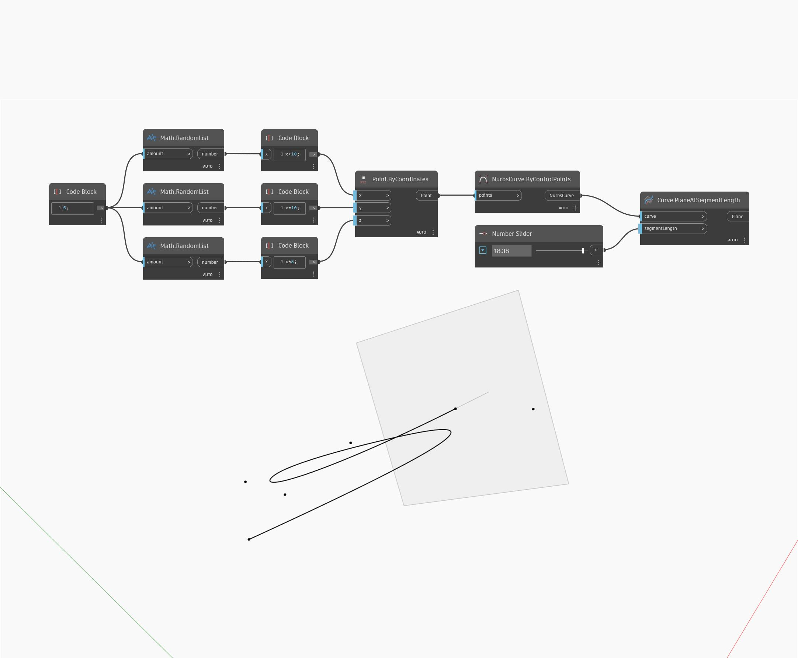

### [Autodesk.DesignScript.Geometry.Curve.PointAtChordLength.dyn](assets/Autodesk.DesignScript.Geometry.Curve.PointAtChordLength.dyn)

### [Autodesk.DesignScript.Geometry.Curve.PointAtParameter.dyn](assets/Autodesk.DesignScript.Geometry.Curve.PointAtParameter.dyn)

### [Autodesk.DesignScript.Geometry.Curve.PointAtSegmentLength.dyn](assets/Autodesk.DesignScript.Geometry.Curve.PointAtSegmentLength.dyn)

### [Autodesk.DesignScript.Geometry.Curve.PointsAtChordLengthFromPoint.dyn](assets/Autodesk.DesignScript.Geometry.Curve.PointsAtChordLengthFromPoint.dyn)

### [Autodesk.DesignScript.Geometry.Curve.PointsAtEqualChordLength.dyn](assets/Autodesk.DesignScript.Geometry.Curve.PointsAtEqualChordLength.dyn)
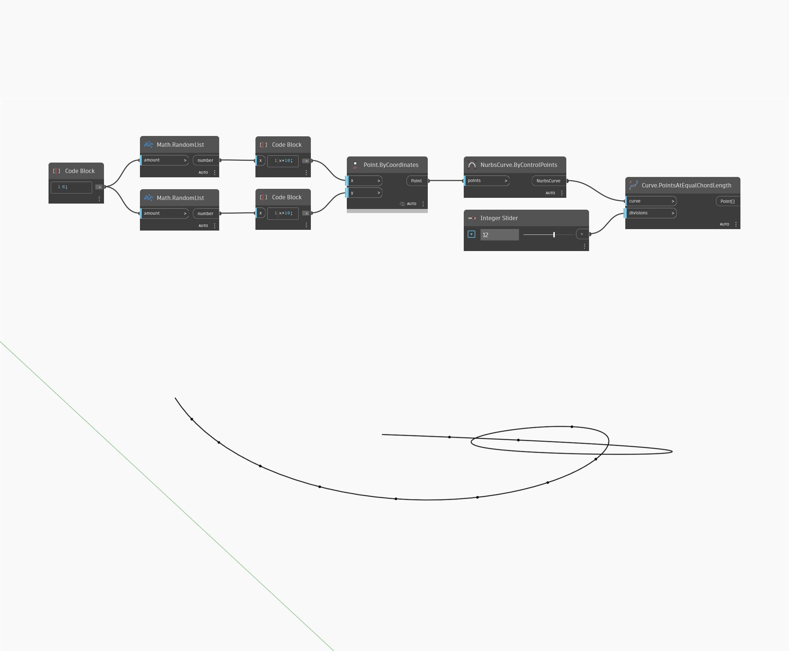

### [Autodesk.DesignScript.Geometry.Curve.PointsAtEqualSegmentLength.dyn](assets/Autodesk.DesignScript.Geometry.Curve.PointsAtEqualSegmentLength.dyn)
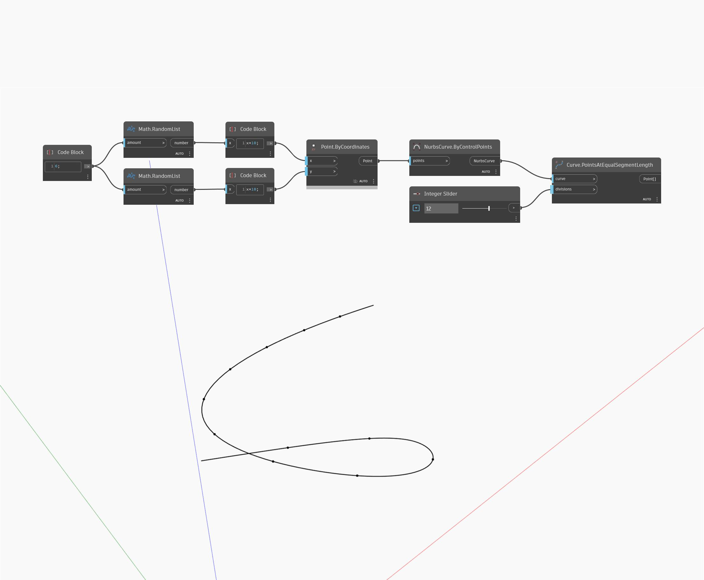

### [Autodesk.DesignScript.Geometry.Curve.PointsAtSegmentLengthFromPoint.dyn](assets/Autodesk.DesignScript.Geometry.Curve.PointsAtSegmentLengthFromPoint.dyn)

### [Autodesk.DesignScript.Geometry.Curve.Project.dyn](assets/Autodesk.DesignScript.Geometry.Curve.Project.dyn)

### [Autodesk.DesignScript.Geometry.Curve.PullOntoPlane.dyn](assets/Autodesk.DesignScript.Geometry.Curve.PullOntoPlane.dyn)

### [Autodesk.DesignScript.Geometry.Curve.PullOntoSurface.dyn](assets/Autodesk.DesignScript.Geometry.Curve.PullOntoSurface.dyn)

### [Autodesk.DesignScript.Geometry.Curve.Reverse.dyn](assets/Autodesk.DesignScript.Geometry.Curve.Reverse.dyn)

### [Autodesk.DesignScript.Geometry.Curve.SegmentLengthAtParameter.dyn](assets/Autodesk.DesignScript.Geometry.Curve.SegmentLengthAtParameter.dyn)

### [Autodesk.DesignScript.Geometry.Curve.SegmentLengthBetweenParameters.dyn](assets/Autodesk.DesignScript.Geometry.Curve.SegmentLengthBetweenParameters.dyn)

### [Autodesk.DesignScript.Geometry.Curve.Simplify.dyn](assets/Autodesk.DesignScript.Geometry.Curve.Simplify.dyn)
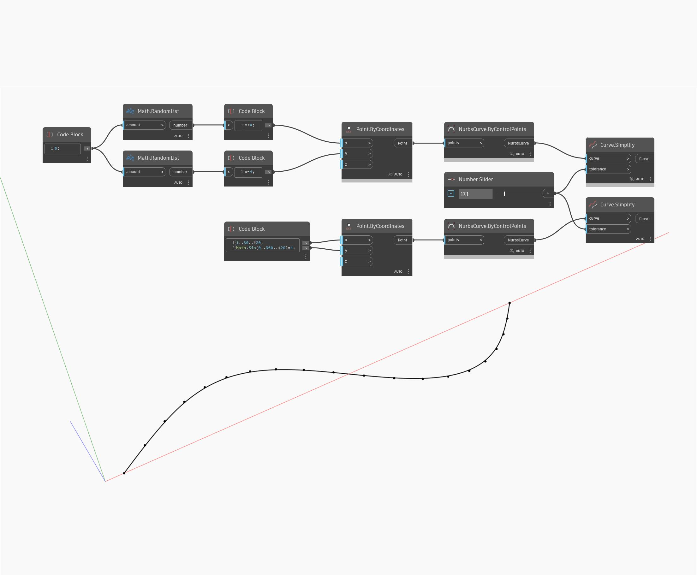

### [Autodesk.DesignScript.Geometry.Curve.SplitByParameter.dyn](assets/Autodesk.DesignScript.Geometry.Curve.SplitByParameter.dyn)

### [Autodesk.DesignScript.Geometry.Curve.SplitByPoints.dyn](assets/Autodesk.DesignScript.Geometry.Curve.SplitByPoints.dyn)

### [Autodesk.DesignScript.Geometry.Curve.StartParameter.dyn](assets/Autodesk.DesignScript.Geometry.Curve.StartParameter.dyn)

### [Autodesk.DesignScript.Geometry.Curve.StartPoint.dyn](assets/Autodesk.DesignScript.Geometry.Curve.StartPoint.dyn)

### [Autodesk.DesignScript.Geometry.Curve.SweepAsSurface.dyn](assets/Autodesk.DesignScript.Geometry.Curve.SweepAsSurface.dyn)

### [Autodesk.DesignScript.Geometry.Curve.TangentAtParameter.dyn](assets/Autodesk.DesignScript.Geometry.Curve.TangentAtParameter.dyn)

### [Autodesk.DesignScript.Geometry.Curve.ToNurbsCurve.dyn](assets/Autodesk.DesignScript.Geometry.Curve.ToNurbsCurve.dyn)

### [Autodesk.DesignScript.Geometry.Curve.TrimByEndParameter.dyn](assets/Autodesk.DesignScript.Geometry.Curve.TrimByEndParameter.dyn)

### [Autodesk.DesignScript.Geometry.Curve.TrimByParameter.dyn](assets/Autodesk.DesignScript.Geometry.Curve.TrimByParameter.dyn)

### [Autodesk.DesignScript.Geometry.Curve.TrimByStartParameter.dyn](assets/Autodesk.DesignScript.Geometry.Curve.TrimByStartParameter.dyn)

### [Autodesk.DesignScript.Geometry.Curve.TrimInteriorByParameter.dyn](assets/Autodesk.DesignScript.Geometry.Curve.TrimInteriorByParameter.dyn)

### [Autodesk.DesignScript.Geometry.Cylinder.Axis.dyn](assets/Autodesk.DesignScript.Geometry.Cylinder.Axis.dyn)
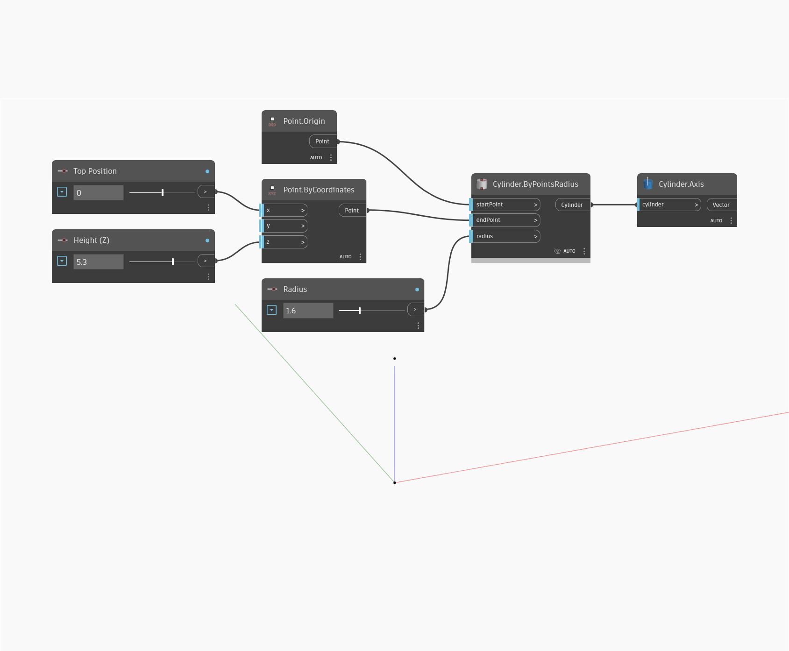

### [Autodesk.DesignScript.Geometry.Cylinder.ByPointsRadius.dyn](assets/Autodesk.DesignScript.Geometry.Cylinder.ByPointsRadius.dyn)
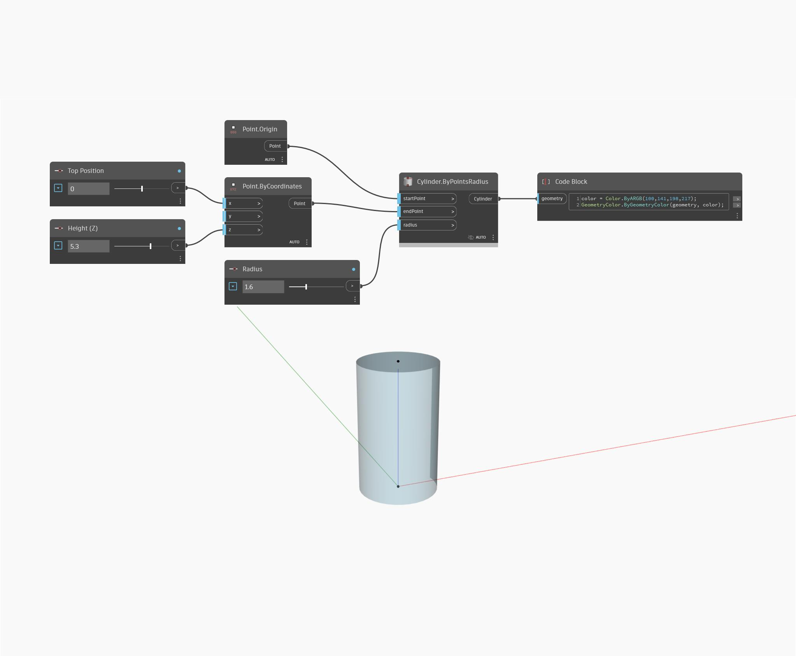

### [Autodesk.DesignScript.Geometry.Cylinder.ByRadiusHeight.dyn](assets/Autodesk.DesignScript.Geometry.Cylinder.ByRadiusHeight.dyn)

### [Autodesk.DesignScript.Geometry.Cylinder.Height.dyn](assets/Autodesk.DesignScript.Geometry.Cylinder.Height.dyn)

### [Autodesk.DesignScript.Geometry.Cylinder.Radius.dyn](assets/Autodesk.DesignScript.Geometry.Cylinder.Radius.dyn)

### [Autodesk.DesignScript.Geometry.Edge.AdjacentFaces.dyn](assets/Autodesk.DesignScript.Geometry.Edge.AdjacentFaces.dyn)

### [Autodesk.DesignScript.Geometry.Edge.CurveGeometry.dyn](assets/Autodesk.DesignScript.Geometry.Edge.CurveGeometry.dyn)

### [Autodesk.DesignScript.Geometry.Edge.EndVertex.dyn](assets/Autodesk.DesignScript.Geometry.Edge.EndVertex.dyn)
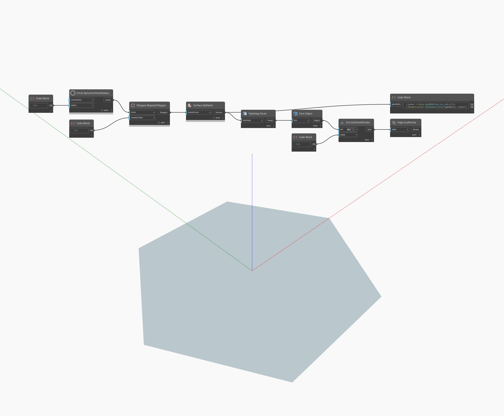

### [Autodesk.DesignScript.Geometry.Edge.StartVertex.dyn](assets/Autodesk.DesignScript.Geometry.Edge.StartVertex.dyn)

### [Autodesk.DesignScript.Geometry.Ellipse.ByCoordinateSystemRadii.dyn](assets/Autodesk.DesignScript.Geometry.Ellipse.ByCoordinateSystemRadii.dyn)

### [Autodesk.DesignScript.Geometry.Ellipse.ByOriginRadii.dyn](assets/Autodesk.DesignScript.Geometry.Ellipse.ByOriginRadii.dyn)

### [Autodesk.DesignScript.Geometry.Ellipse.ByOriginVectors.dyn](assets/Autodesk.DesignScript.Geometry.Ellipse.ByOriginVectors.dyn)

### [Autodesk.DesignScript.Geometry.Ellipse.ByPlaneRadii.dyn](assets/Autodesk.DesignScript.Geometry.Ellipse.ByPlaneRadii.dyn)
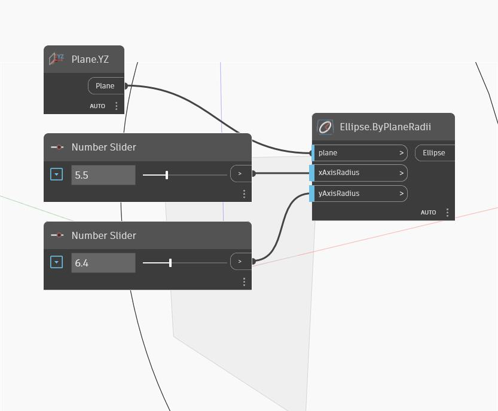

### [Autodesk.DesignScript.Geometry.Ellipse.CenterPoint.dyn](assets/Autodesk.DesignScript.Geometry.Ellipse.CenterPoint.dyn)

### [Autodesk.DesignScript.Geometry.Ellipse.MajorAxis.dyn](assets/Autodesk.DesignScript.Geometry.Ellipse.MajorAxis.dyn)

### [Autodesk.DesignScript.Geometry.Ellipse.MinorAxis.dyn](assets/Autodesk.DesignScript.Geometry.Ellipse.MinorAxis.dyn)

### [Autodesk.DesignScript.Geometry.EllipseArc.ByPlaneRadiiAngles.dyn](assets/Autodesk.DesignScript.Geometry.EllipseArc.ByPlaneRadiiAngles.dyn)

### [Autodesk.DesignScript.Geometry.EllipseArc.CenterPoint.dyn](assets/Autodesk.DesignScript.Geometry.EllipseArc.CenterPoint.dyn)

### [Autodesk.DesignScript.Geometry.EllipseArc.MajorAxis.dyn](assets/Autodesk.DesignScript.Geometry.EllipseArc.MajorAxis.dyn)

### [Autodesk.DesignScript.Geometry.EllipseArc.MinorAxis.dyn](assets/Autodesk.DesignScript.Geometry.EllipseArc.MinorAxis.dyn)

### [Autodesk.DesignScript.Geometry.EllipseArc.Plane.dyn](assets/Autodesk.DesignScript.Geometry.EllipseArc.Plane.dyn)

### [Autodesk.DesignScript.Geometry.EllipseArc.StartAngle.dyn](assets/Autodesk.DesignScript.Geometry.EllipseArc.StartAngle.dyn)

### [Autodesk.DesignScript.Geometry.EllipseArc.SweepAngle.dyn](assets/Autodesk.DesignScript.Geometry.EllipseArc.SweepAngle.dyn)

### [Autodesk.DesignScript.Geometry.Face.Edges.dyn](assets/Autodesk.DesignScript.Geometry.Face.Edges.dyn)

### [Autodesk.DesignScript.Geometry.Face.SurfaceGeometry.dyn](assets/Autodesk.DesignScript.Geometry.Face.SurfaceGeometry.dyn)

### [Autodesk.DesignScript.Geometry.Face.Vertices.dyn](assets/Autodesk.DesignScript.Geometry.Face.Vertices.dyn)

### [Autodesk.DesignScript.Geometry.Geometry.BoundingBox.dyn](assets/Autodesk.DesignScript.Geometry.Geometry.BoundingBox.dyn)

### [Autodesk.DesignScript.Geometry.Geometry.ClosestPointTo.dyn](assets/Autodesk.DesignScript.Geometry.Geometry.ClosestPointTo.dyn)

### [Autodesk.DesignScript.Geometry.Geometry.ContextCoordinateSystem.dyn](assets/Autodesk.DesignScript.Geometry.Geometry.ContextCoordinateSystem.dyn)

### [Autodesk.DesignScript.Geometry.Geometry.DeserializeFromSAB.dyn](assets/Autodesk.DesignScript.Geometry.Geometry.DeserializeFromSAB.dyn)

### [Autodesk.DesignScript.Geometry.Geometry.DistanceTo.dyn](assets/Autodesk.DesignScript.Geometry.Geometry.DistanceTo.dyn)

### [Autodesk.DesignScript.Geometry.Geometry.DoesIntersect.dyn](assets/Autodesk.DesignScript.Geometry.Geometry.DoesIntersect.dyn)
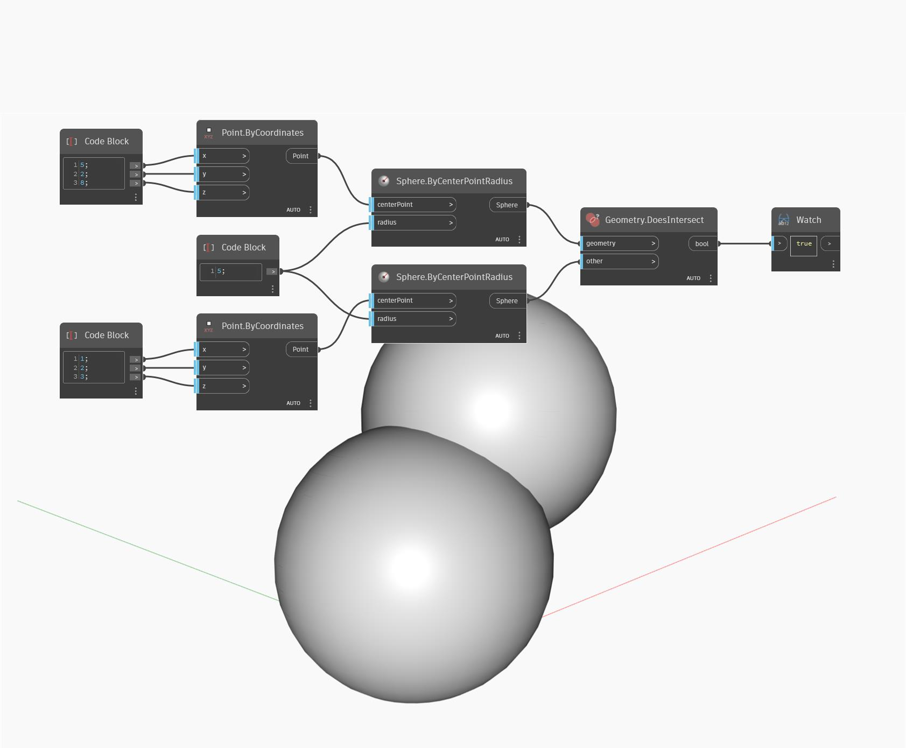

### [Autodesk.DesignScript.Geometry.Geometry.Explode.dyn](assets/Autodesk.DesignScript.Geometry.Geometry.Explode.dyn)

### [Autodesk.DesignScript.Geometry.Geometry.ExportToSAT.dyn](assets/Autodesk.DesignScript.Geometry.Geometry.ExportToSAT.dyn)

### [Autodesk.DesignScript.Geometry.Geometry.FromSolidDef.dyn](assets/Autodesk.DesignScript.Geometry.Geometry.FromSolidDef.dyn)

### [Autodesk.DesignScript.Geometry.Geometry.ImportFromSAT(file).dyn](assets/Autodesk.DesignScript.Geometry.Geometry.ImportFromSAT(file).dyn)
_img.jpg)

### [Autodesk.DesignScript.Geometry.Geometry.ImportFromSAT(filePath).dyn](assets/Autodesk.DesignScript.Geometry.Geometry.ImportFromSAT(filePath).dyn)
_img.jpg)

### [Autodesk.DesignScript.Geometry.Geometry.Intersect.dyn](assets/Autodesk.DesignScript.Geometry.Geometry.Intersect.dyn)

### [Autodesk.DesignScript.Geometry.Geometry.IntersectAll.dyn](assets/Autodesk.DesignScript.Geometry.Geometry.IntersectAll.dyn)

### [Autodesk.DesignScript.Geometry.Geometry.IsAlmostEqualTo.dyn](assets/Autodesk.DesignScript.Geometry.Geometry.IsAlmostEqualTo.dyn)

### [Autodesk.DesignScript.Geometry.Geometry.Mirror.dyn](assets/Autodesk.DesignScript.Geometry.Geometry.Mirror.dyn)
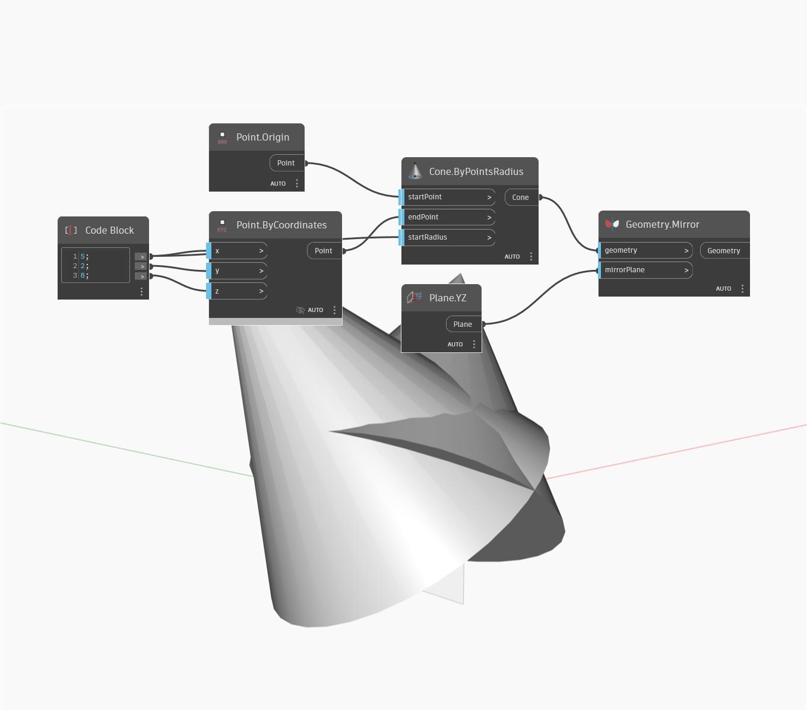

### [Autodesk.DesignScript.Geometry.Geometry.OrientedBoundingBox.dyn](assets/Autodesk.DesignScript.Geometry.Geometry.OrientedBoundingBox.dyn)

### [Autodesk.DesignScript.Geometry.Geometry.Scale(basePoint, from, to).dyn](assets/Autodesk.DesignScript.Geometry.Geometry.Scale(basePoint, from, to).dyn)
_img.jpg)

### [Autodesk.DesignScript.Geometry.Geometry.Scale(geometry, amount).dyn](assets/Autodesk.DesignScript.Geometry.Geometry.Scale(geometry, amount).dyn)
_img.jpg)

### [Autodesk.DesignScript.Geometry.Geometry.Scale1D.dyn](assets/Autodesk.DesignScript.Geometry.Geometry.Scale1D.dyn)

### [Autodesk.DesignScript.Geometry.Geometry.Scale2D.dyn](assets/Autodesk.DesignScript.Geometry.Geometry.Scale2D.dyn)

### [Autodesk.DesignScript.Geometry.Geometry.SerializeAsSAB.dyn](assets/Autodesk.DesignScript.Geometry.Geometry.SerializeAsSAB.dyn)

### [Autodesk.DesignScript.Geometry.Geometry.Split.dyn](assets/Autodesk.DesignScript.Geometry.Geometry.Split.dyn)

### [Autodesk.DesignScript.Geometry.Geometry.ToSolidDef.dyn](assets/Autodesk.DesignScript.Geometry.Geometry.ToSolidDef.dyn)

### [Autodesk.DesignScript.Geometry.Geometry.Transform(geometry, cs).dyn](assets/Autodesk.DesignScript.Geometry.Geometry.Transform(geometry, cs).dyn)
_img.jpg)

### [Autodesk.DesignScript.Geometry.Geometry.Trim.dyn](assets/Autodesk.DesignScript.Geometry.Geometry.Trim.dyn)

### [Autodesk.DesignScript.Geometry.Helix.Angle.dyn](assets/Autodesk.DesignScript.Geometry.Helix.Angle.dyn)

### [Autodesk.DesignScript.Geometry.Helix.AxisDirection.dyn](assets/Autodesk.DesignScript.Geometry.Helix.AxisDirection.dyn)

### [Autodesk.DesignScript.Geometry.Helix.AxisPoint.dyn](assets/Autodesk.DesignScript.Geometry.Helix.AxisPoint.dyn)
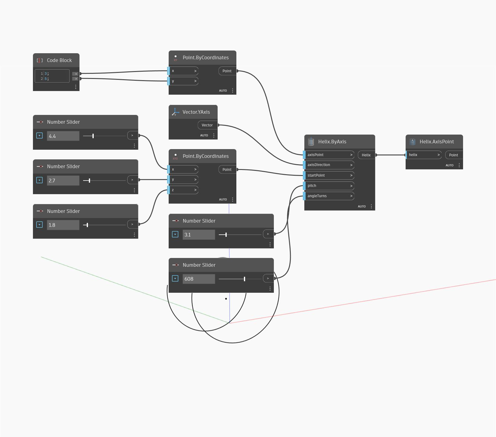

### [Autodesk.DesignScript.Geometry.Helix.ByAxis.dyn](assets/Autodesk.DesignScript.Geometry.Helix.ByAxis.dyn)

### [Autodesk.DesignScript.Geometry.Helix.Pitch.dyn](assets/Autodesk.DesignScript.Geometry.Helix.Pitch.dyn)

### [Autodesk.DesignScript.Geometry.Helix.Radius.dyn](assets/Autodesk.DesignScript.Geometry.Helix.Radius.dyn)

### [Autodesk.DesignScript.Geometry.IndexGroup.A.dyn](assets/Autodesk.DesignScript.Geometry.IndexGroup.A.dyn)

### [Autodesk.DesignScript.Geometry.IndexGroup.B.dyn](assets/Autodesk.DesignScript.Geometry.IndexGroup.B.dyn)

### [Autodesk.DesignScript.Geometry.IndexGroup.ByIndices(a, b, c).dyn](assets/Autodesk.DesignScript.Geometry.IndexGroup.ByIndices(a, b, c).dyn)
_img.jpg)

### [Autodesk.DesignScript.Geometry.IndexGroup.ByIndices(a, b, c, d).dyn](assets/Autodesk.DesignScript.Geometry.IndexGroup.ByIndices(a, b, c, d).dyn)
_img.jpg)

### [Autodesk.DesignScript.Geometry.IndexGroup.C.dyn](assets/Autodesk.DesignScript.Geometry.IndexGroup.C.dyn)
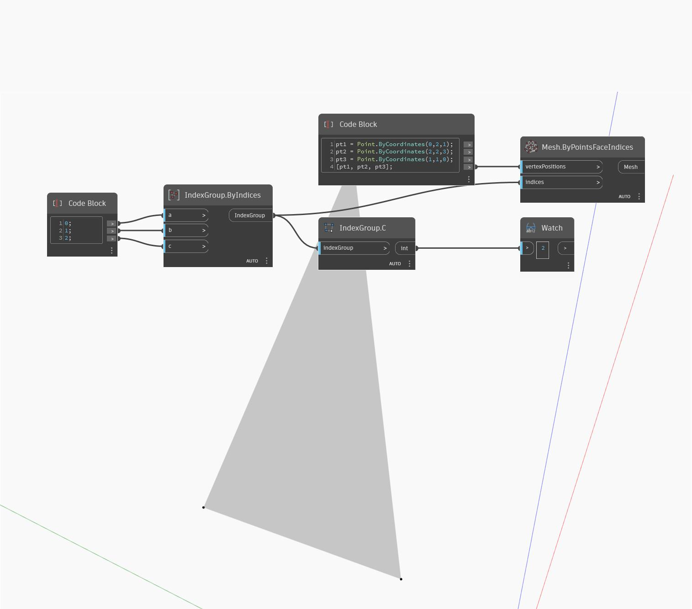

### [Autodesk.DesignScript.Geometry.IndexGroup.Count.dyn](assets/Autodesk.DesignScript.Geometry.IndexGroup.Count.dyn)

### [Autodesk.DesignScript.Geometry.IndexGroup.D.dyn](assets/Autodesk.DesignScript.Geometry.IndexGroup.D.dyn)

### [Autodesk.DesignScript.Geometry.Line.ByBestFitThroughPoints.dyn](assets/Autodesk.DesignScript.Geometry.Line.ByBestFitThroughPoints.dyn)

### [Autodesk.DesignScript.Geometry.Line.ByStartPointDirectionLength.dyn](assets/Autodesk.DesignScript.Geometry.Line.ByStartPointDirectionLength.dyn)

### [Autodesk.DesignScript.Geometry.Line.ByStartPointEndPoint.dyn](assets/Autodesk.DesignScript.Geometry.Line.ByStartPointEndPoint.dyn)

### [Autodesk.DesignScript.Geometry.Line.ByTangency.dyn](assets/Autodesk.DesignScript.Geometry.Line.ByTangency.dyn)

### [Autodesk.DesignScript.Geometry.Line.Direction.dyn](assets/Autodesk.DesignScript.Geometry.Line.Direction.dyn)

### [Autodesk.DesignScript.Geometry.Mesh.ByPointsFaceIndices.dyn](assets/Autodesk.DesignScript.Geometry.Mesh.ByPointsFaceIndices.dyn)

### [Autodesk.DesignScript.Geometry.Mesh.FaceIndices.dyn](assets/Autodesk.DesignScript.Geometry.Mesh.FaceIndices.dyn)

### [Autodesk.DesignScript.Geometry.Mesh.VertexNormals.dyn](assets/Autodesk.DesignScript.Geometry.Mesh.VertexNormals.dyn)

### [Autodesk.DesignScript.Geometry.Mesh.VertexPositions.dyn](assets/Autodesk.DesignScript.Geometry.Mesh.VertexPositions.dyn)

### [Autodesk.DesignScript.Geometry.NurbsCurve.ByControlPoints(points).dyn](assets/Autodesk.DesignScript.Geometry.NurbsCurve.ByControlPoints(points).dyn)
_img.jpg)

### [Autodesk.DesignScript.Geometry.NurbsCurve.ByPoints(points).dyn](assets/Autodesk.DesignScript.Geometry.NurbsCurve.ByPoints(points).dyn)
_img.jpg)

### [Autodesk.DesignScript.Geometry.NurbsCurve.ByPoints(points, degree).dyn](assets/Autodesk.DesignScript.Geometry.NurbsCurve.ByPoints(points, degree).dyn)
_img.jpg)

### [Autodesk.DesignScript.Geometry.NurbsCurve.ByPointsTangents.dyn](assets/Autodesk.DesignScript.Geometry.NurbsCurve.ByPointsTangents.dyn)

### [Autodesk.DesignScript.Geometry.NurbsCurve.ControlPoints.dyn](assets/Autodesk.DesignScript.Geometry.NurbsCurve.ControlPoints.dyn)
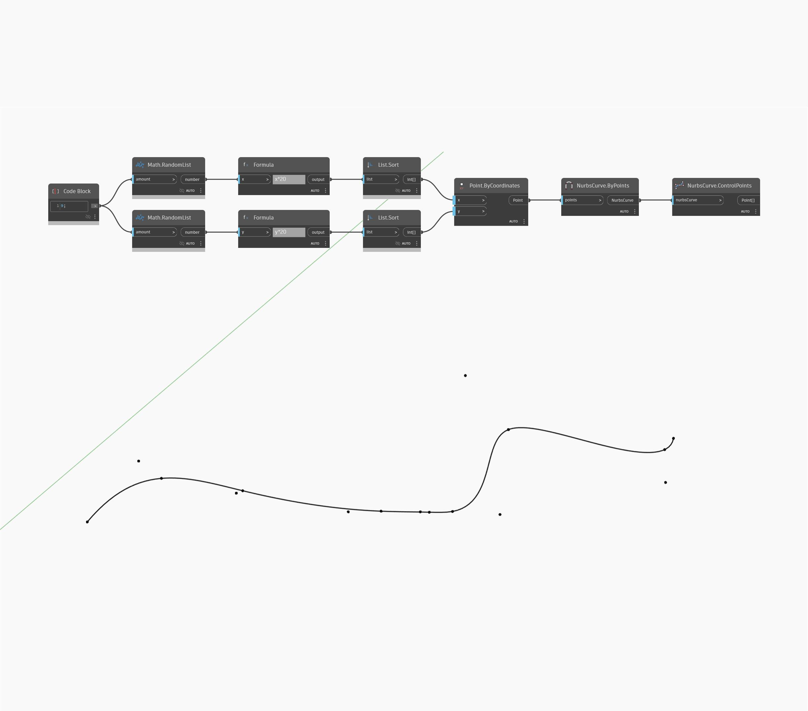

### [Autodesk.DesignScript.Geometry.NurbsCurve.Degree.dyn](assets/Autodesk.DesignScript.Geometry.NurbsCurve.Degree.dyn)

### [Autodesk.DesignScript.Geometry.NurbsCurve.IsPeriodic.dyn](assets/Autodesk.DesignScript.Geometry.NurbsCurve.IsPeriodic.dyn)

### [Autodesk.DesignScript.Geometry.NurbsCurve.IsRational.dyn](assets/Autodesk.DesignScript.Geometry.NurbsCurve.IsRational.dyn)

### [Autodesk.DesignScript.Geometry.NurbsCurve.Knots.dyn](assets/Autodesk.DesignScript.Geometry.NurbsCurve.Knots.dyn)
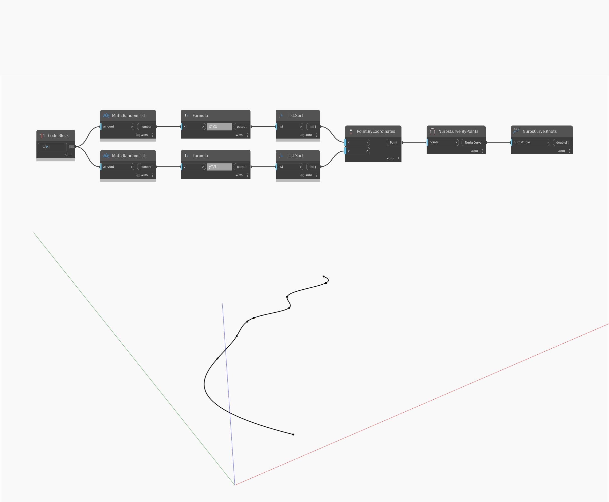

### [Autodesk.DesignScript.Geometry.NurbsCurve.Weights.dyn](assets/Autodesk.DesignScript.Geometry.NurbsCurve.Weights.dyn)

### [Autodesk.DesignScript.Geometry.NurbsSurface.ByControlPoints.dyn](assets/Autodesk.DesignScript.Geometry.NurbsSurface.ByControlPoints.dyn)
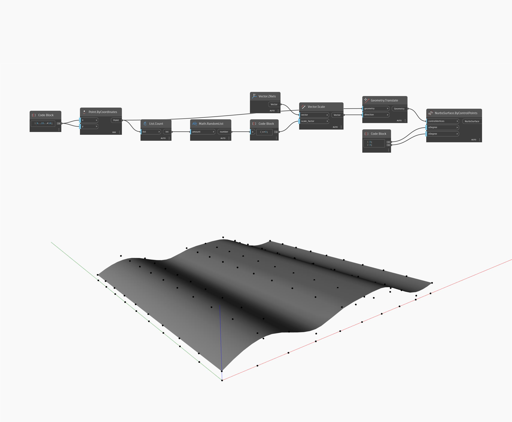

### [Autodesk.DesignScript.Geometry.NurbsSurface.ByPoints.dyn](assets/Autodesk.DesignScript.Geometry.NurbsSurface.ByPoints.dyn)
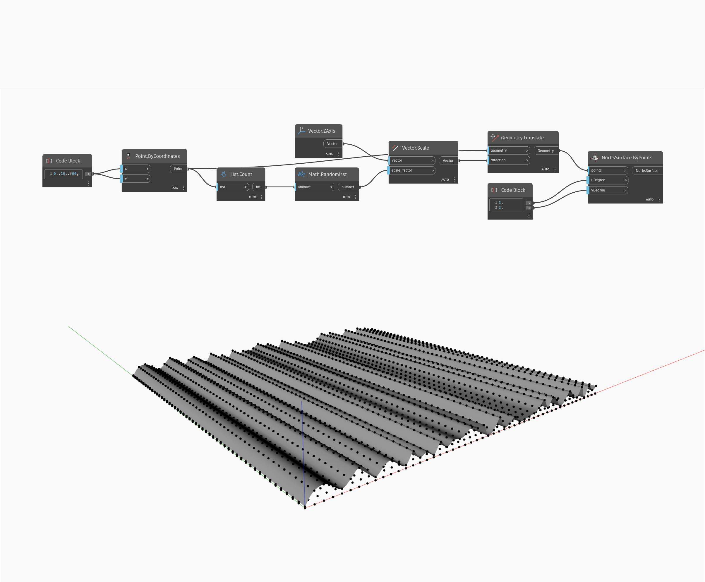

### [Autodesk.DesignScript.Geometry.NurbsSurface.ByPointsTangents.dyn](assets/Autodesk.DesignScript.Geometry.NurbsSurface.ByPointsTangents.dyn)
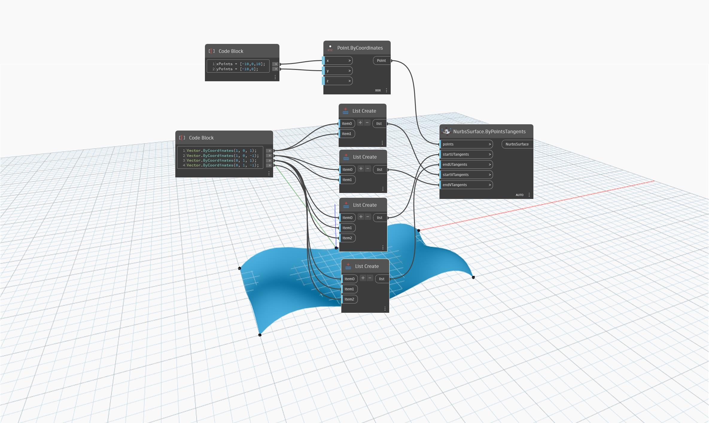

### [Autodesk.DesignScript.Geometry.NurbsSurface.ControlPoints.dyn](assets/Autodesk.DesignScript.Geometry.NurbsSurface.ControlPoints.dyn)

### [Autodesk.DesignScript.Geometry.NurbsSurface.DegreeU.dyn](assets/Autodesk.DesignScript.Geometry.NurbsSurface.DegreeU.dyn)

### [Autodesk.DesignScript.Geometry.NurbsSurface.DegreeV.dyn](assets/Autodesk.DesignScript.Geometry.NurbsSurface.DegreeV.dyn)

### [Autodesk.DesignScript.Geometry.NurbsSurface.IsPeriodicInU.dyn](assets/Autodesk.DesignScript.Geometry.NurbsSurface.IsPeriodicInU.dyn)

### [Autodesk.DesignScript.Geometry.NurbsSurface.IsPeriodicInV.dyn](assets/Autodesk.DesignScript.Geometry.NurbsSurface.IsPeriodicInV.dyn)

### [Autodesk.DesignScript.Geometry.NurbsSurface.IsRational.dyn](assets/Autodesk.DesignScript.Geometry.NurbsSurface.IsRational.dyn)

### [Autodesk.DesignScript.Geometry.NurbsSurface.NumControlPointsU.dyn](assets/Autodesk.DesignScript.Geometry.NurbsSurface.NumControlPointsU.dyn)

### [Autodesk.DesignScript.Geometry.NurbsSurface.NumControlPointsV.dyn](assets/Autodesk.DesignScript.Geometry.NurbsSurface.NumControlPointsV.dyn)
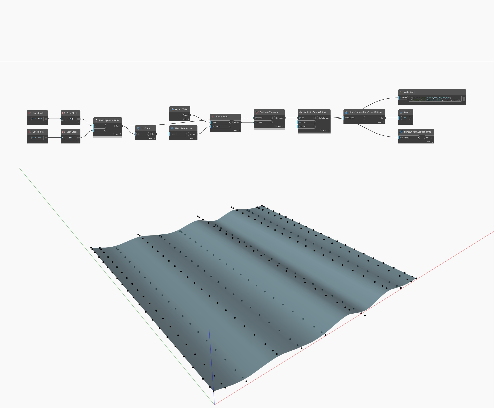

### [Autodesk.DesignScript.Geometry.NurbsSurface.UKnots.dyn](assets/Autodesk.DesignScript.Geometry.NurbsSurface.UKnots.dyn)

### [Autodesk.DesignScript.Geometry.NurbsSurface.VKnots.dyn](assets/Autodesk.DesignScript.Geometry.NurbsSurface.VKnots.dyn)

### [Autodesk.DesignScript.Geometry.NurbsSurface.Weights.dyn](assets/Autodesk.DesignScript.Geometry.NurbsSurface.Weights.dyn)

### [Autodesk.DesignScript.Geometry.PanelSurface.ByCrossSplitSquares.dyn](assets/Autodesk.DesignScript.Geometry.PanelSurface.ByCrossSplitSquares.dyn)

### [Autodesk.DesignScript.Geometry.PanelSurface.ByDiagonallySplitSquares.dyn](assets/Autodesk.DesignScript.Geometry.PanelSurface.ByDiagonallySplitSquares.dyn)

### [Autodesk.DesignScript.Geometry.PanelSurface.ByDiamonds.dyn](assets/Autodesk.DesignScript.Geometry.PanelSurface.ByDiamonds.dyn)

### [Autodesk.DesignScript.Geometry.PanelSurface.ByHexagons.dyn](assets/Autodesk.DesignScript.Geometry.PanelSurface.ByHexagons.dyn)

### [Autodesk.DesignScript.Geometry.PanelSurface.ByParallelograms.dyn](assets/Autodesk.DesignScript.Geometry.PanelSurface.ByParallelograms.dyn)

### [Autodesk.DesignScript.Geometry.PanelSurface.ByQuads.dyn](assets/Autodesk.DesignScript.Geometry.PanelSurface.ByQuads.dyn)
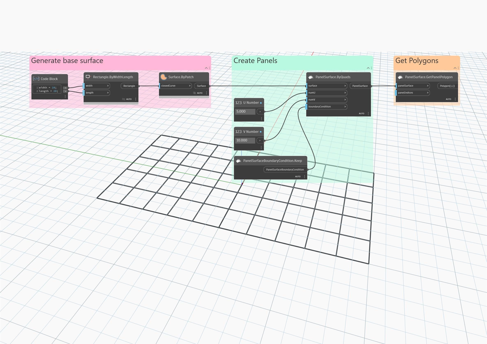

### [Autodesk.DesignScript.Geometry.PanelSurface.ByRhombiTriHexagonals.dyn](assets/Autodesk.DesignScript.Geometry.PanelSurface.ByRhombiTriHexagonals.dyn)

### [Autodesk.DesignScript.Geometry.PanelSurface.BySplitDiamonds.dyn](assets/Autodesk.DesignScript.Geometry.PanelSurface.BySplitDiamonds.dyn)

### [Autodesk.DesignScript.Geometry.PanelSurface.ByStaggeredQuads.dyn](assets/Autodesk.DesignScript.Geometry.PanelSurface.ByStaggeredQuads.dyn)

### [Autodesk.DesignScript.Geometry.PanelSurface.GetNumPanelVertices.dyn](assets/Autodesk.DesignScript.Geometry.PanelSurface.GetNumPanelVertices.dyn)

### [Autodesk.DesignScript.Geometry.PanelSurface.GetPanelPoints.dyn](assets/Autodesk.DesignScript.Geometry.PanelSurface.GetPanelPoints.dyn)

### [Autodesk.DesignScript.Geometry.PanelSurface.GetPanelPolygon.dyn](assets/Autodesk.DesignScript.Geometry.PanelSurface.GetPanelPolygon.dyn)

### [Autodesk.DesignScript.Geometry.PanelSurface.GetPanelVertices.dyn](assets/Autodesk.DesignScript.Geometry.PanelSurface.GetPanelVertices.dyn)

### [Autodesk.DesignScript.Geometry.PanelSurface.GetPoint.dyn](assets/Autodesk.DesignScript.Geometry.PanelSurface.GetPoint.dyn)
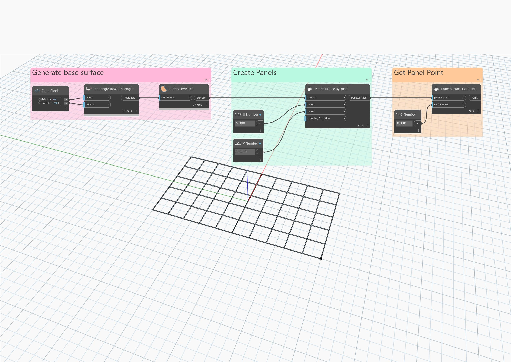

### [Autodesk.DesignScript.Geometry.PanelSurface.GetVertex.dyn](assets/Autodesk.DesignScript.Geometry.PanelSurface.GetVertex.dyn)
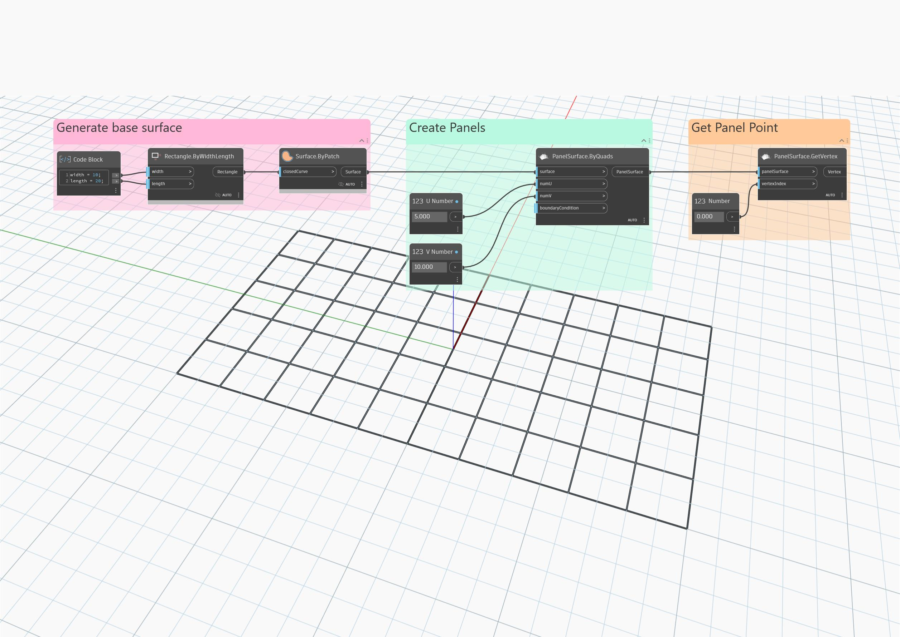

### [Autodesk.DesignScript.Geometry.PanelSurface.GetVertexIndex.dyn](assets/Autodesk.DesignScript.Geometry.PanelSurface.GetVertexIndex.dyn)

### [Autodesk.DesignScript.Geometry.PanelSurface.NumPanels.dyn](assets/Autodesk.DesignScript.Geometry.PanelSurface.NumPanels.dyn)

### [Autodesk.DesignScript.Geometry.PanelSurface.NumVertices.dyn](assets/Autodesk.DesignScript.Geometry.PanelSurface.NumVertices.dyn)

### [Autodesk.DesignScript.Geometry.PanelSurfaceBoundaryCondition.Keep.dyn](assets/Autodesk.DesignScript.Geometry.PanelSurfaceBoundaryCondition.Keep.dyn)

### [Autodesk.DesignScript.Geometry.PanelSurfaceBoundaryCondition.Remove.dyn](assets/Autodesk.DesignScript.Geometry.PanelSurfaceBoundaryCondition.Remove.dyn)

### [Autodesk.DesignScript.Geometry.PanelSurfaceBoundaryCondition.RemoveVertices.dyn](assets/Autodesk.DesignScript.Geometry.PanelSurfaceBoundaryCondition.RemoveVertices.dyn)

### [Autodesk.DesignScript.Geometry.Plane.ByBestFitThroughPoints.dyn](assets/Autodesk.DesignScript.Geometry.Plane.ByBestFitThroughPoints.dyn)

### [Autodesk.DesignScript.Geometry.Plane.ByLineAndPoint.dyn](assets/Autodesk.DesignScript.Geometry.Plane.ByLineAndPoint.dyn)

### [Autodesk.DesignScript.Geometry.Plane.ByOriginNormal.dyn](assets/Autodesk.DesignScript.Geometry.Plane.ByOriginNormal.dyn)
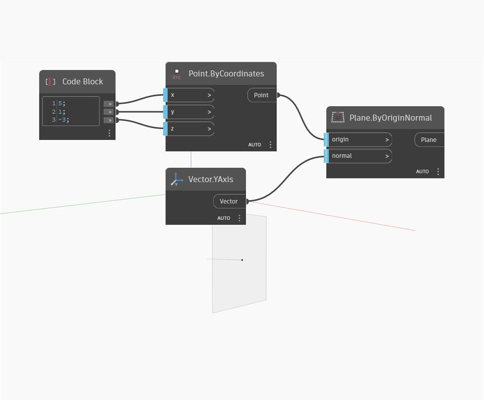

### [Autodesk.DesignScript.Geometry.Plane.ByOriginNormalXAxis.dyn](assets/Autodesk.DesignScript.Geometry.Plane.ByOriginNormalXAxis.dyn)

### [Autodesk.DesignScript.Geometry.Plane.ByOriginXAxisYAxis.dyn](assets/Autodesk.DesignScript.Geometry.Plane.ByOriginXAxisYAxis.dyn)

### [Autodesk.DesignScript.Geometry.Plane.ByThreePoints.dyn](assets/Autodesk.DesignScript.Geometry.Plane.ByThreePoints.dyn)

### [Autodesk.DesignScript.Geometry.Plane.Normal.dyn](assets/Autodesk.DesignScript.Geometry.Plane.Normal.dyn)

### [Autodesk.DesignScript.Geometry.Plane.Offset.dyn](assets/Autodesk.DesignScript.Geometry.Plane.Offset.dyn)

### [Autodesk.DesignScript.Geometry.Plane.Origin.dyn](assets/Autodesk.DesignScript.Geometry.Plane.Origin.dyn)
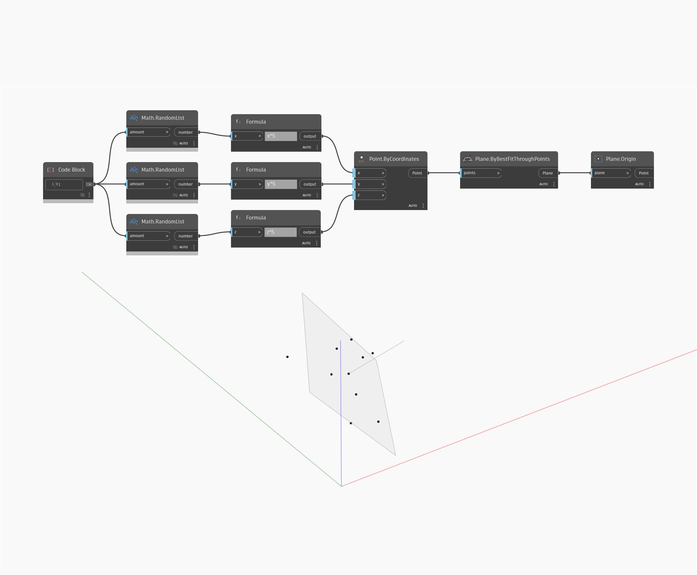

### [Autodesk.DesignScript.Geometry.Plane.ToCoordinateSystem.dyn](assets/Autodesk.DesignScript.Geometry.Plane.ToCoordinateSystem.dyn)

### [Autodesk.DesignScript.Geometry.Plane.XAxis.dyn](assets/Autodesk.DesignScript.Geometry.Plane.XAxis.dyn)

### [Autodesk.DesignScript.Geometry.Plane.XY.dyn](assets/Autodesk.DesignScript.Geometry.Plane.XY.dyn)

### [Autodesk.DesignScript.Geometry.Plane.XZ.dyn](assets/Autodesk.DesignScript.Geometry.Plane.XZ.dyn)

### [Autodesk.DesignScript.Geometry.Plane.YAxis.dyn](assets/Autodesk.DesignScript.Geometry.Plane.YAxis.dyn)

### [Autodesk.DesignScript.Geometry.Plane.YZ.dyn](assets/Autodesk.DesignScript.Geometry.Plane.YZ.dyn)

### [Autodesk.DesignScript.Geometry.Point.Add.dyn](assets/Autodesk.DesignScript.Geometry.Point.Add.dyn)

### [Autodesk.DesignScript.Geometry.Point.AsVector.dyn](assets/Autodesk.DesignScript.Geometry.Point.AsVector.dyn)

### [Autodesk.DesignScript.Geometry.Point.ByCartesianCoordinates.dyn](assets/Autodesk.DesignScript.Geometry.Point.ByCartesianCoordinates.dyn)

### [Autodesk.DesignScript.Geometry.Point.ByCoordinates(x, y).dyn](assets/Autodesk.DesignScript.Geometry.Point.ByCoordinates(x, y).dyn)
_img.jpg)

### [Autodesk.DesignScript.Geometry.Point.ByCoordinates(x, y, z).dyn](assets/Autodesk.DesignScript.Geometry.Point.ByCoordinates(x, y, z).dyn)
_img.jpg)

### [Autodesk.DesignScript.Geometry.Point.ByCylindricalCoordinates.dyn](assets/Autodesk.DesignScript.Geometry.Point.ByCylindricalCoordinates.dyn)

### [Autodesk.DesignScript.Geometry.Point.BySphericalCoordinates.dyn](assets/Autodesk.DesignScript.Geometry.Point.BySphericalCoordinates.dyn)

### [Autodesk.DesignScript.Geometry.Point.Origin.dyn](assets/Autodesk.DesignScript.Geometry.Point.Origin.dyn)
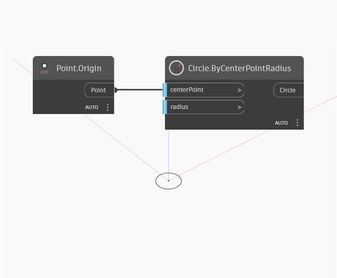

### [Autodesk.DesignScript.Geometry.Point.Project.dyn](assets/Autodesk.DesignScript.Geometry.Point.Project.dyn)
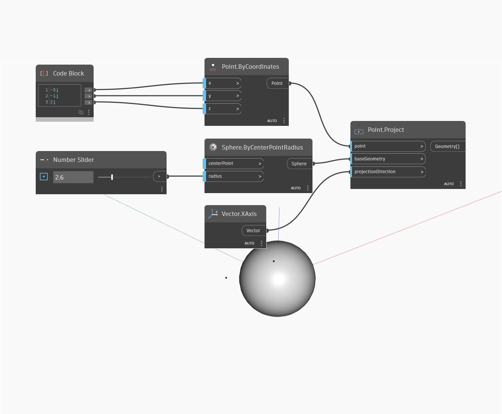

### [Autodesk.DesignScript.Geometry.Point.PruneDuplicates.dyn](assets/Autodesk.DesignScript.Geometry.Point.PruneDuplicates.dyn)

### [Autodesk.DesignScript.Geometry.Point.Subtract.dyn](assets/Autodesk.DesignScript.Geometry.Point.Subtract.dyn)

### [Autodesk.DesignScript.Geometry.Point.X.dyn](assets/Autodesk.DesignScript.Geometry.Point.X.dyn)

### [Autodesk.DesignScript.Geometry.Point.Y.dyn](assets/Autodesk.DesignScript.Geometry.Point.Y.dyn)

### [Autodesk.DesignScript.Geometry.Point.Z.dyn](assets/Autodesk.DesignScript.Geometry.Point.Z.dyn)

### [Autodesk.DesignScript.Geometry.PolyCurve.BasePlane.dyn](assets/Autodesk.DesignScript.Geometry.PolyCurve.BasePlane.dyn)

### [Autodesk.DesignScript.Geometry.PolyCurve.ByPoints.dyn](assets/Autodesk.DesignScript.Geometry.PolyCurve.ByPoints.dyn)

### [Autodesk.DesignScript.Geometry.PolyCurve.CloseWithLine.dyn](assets/Autodesk.DesignScript.Geometry.PolyCurve.CloseWithLine.dyn)

### [Autodesk.DesignScript.Geometry.PolyCurve.CurveAtIndex.dyn](assets/Autodesk.DesignScript.Geometry.PolyCurve.CurveAtIndex.dyn)

### [Autodesk.DesignScript.Geometry.PolyCurve.Curves.dyn](assets/Autodesk.DesignScript.Geometry.PolyCurve.Curves.dyn)

### [Autodesk.DesignScript.Geometry.PolyCurve.ExtendWithArc.dyn](assets/Autodesk.DesignScript.Geometry.PolyCurve.ExtendWithArc.dyn)
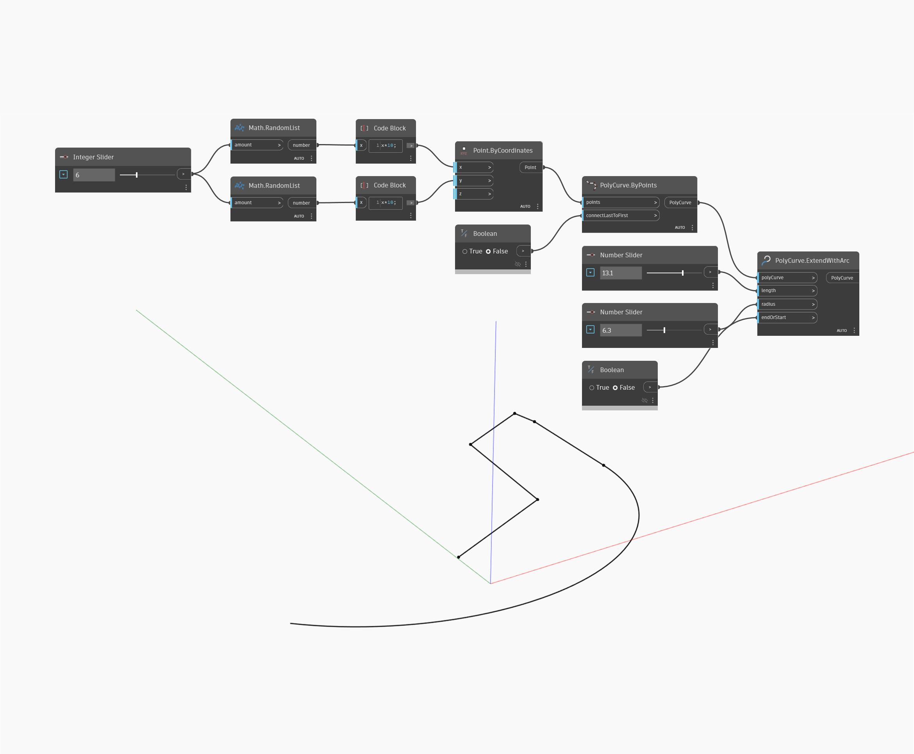

### [Autodesk.DesignScript.Geometry.PolyCurve.ExtendWithEllipse.dyn](assets/Autodesk.DesignScript.Geometry.PolyCurve.ExtendWithEllipse.dyn)

### [Autodesk.DesignScript.Geometry.PolyCurve.Fillet.dyn](assets/Autodesk.DesignScript.Geometry.PolyCurve.Fillet.dyn)

### [Autodesk.DesignScript.Geometry.PolyCurve.Heal.dyn](assets/Autodesk.DesignScript.Geometry.PolyCurve.Heal.dyn)

### [Autodesk.DesignScript.Geometry.PolyCurve.NumberOfCurves.dyn](assets/Autodesk.DesignScript.Geometry.PolyCurve.NumberOfCurves.dyn)

### [Autodesk.DesignScript.Geometry.PolyCurve.Offset.dyn](assets/Autodesk.DesignScript.Geometry.PolyCurve.Offset.dyn)
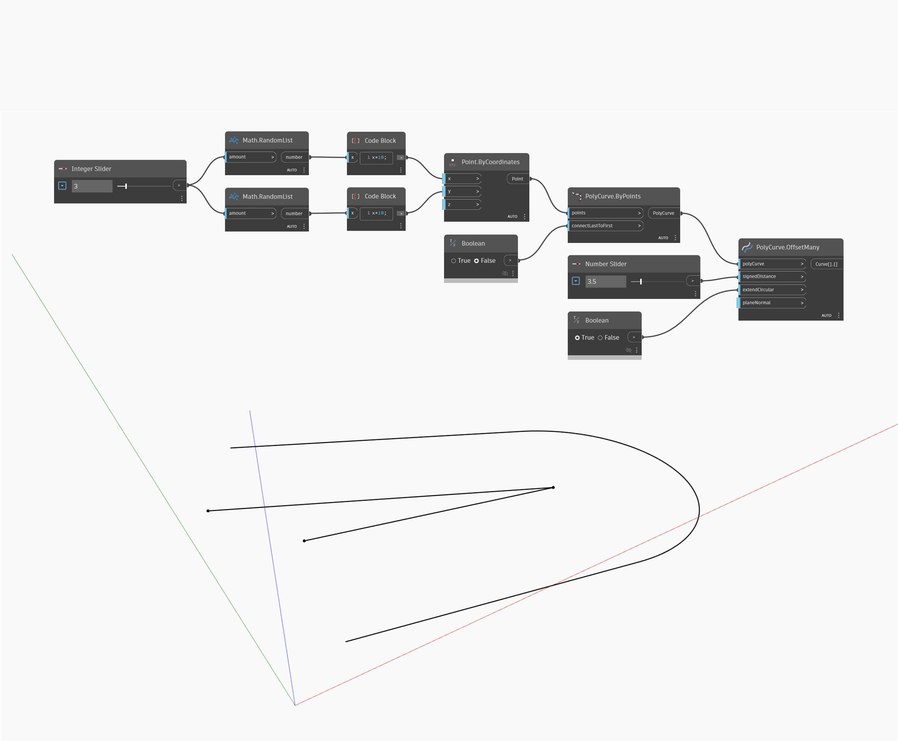

### [Autodesk.DesignScript.Geometry.PolyCurve.Points.dyn](assets/Autodesk.DesignScript.Geometry.PolyCurve.Points.dyn)

### [Autodesk.DesignScript.Geometry.Polygon.ByPoints.dyn](assets/Autodesk.DesignScript.Geometry.Polygon.ByPoints.dyn)
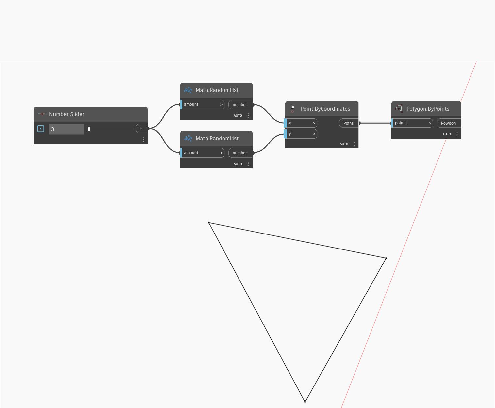

### [Autodesk.DesignScript.Geometry.Polygon.Center.dyn](assets/Autodesk.DesignScript.Geometry.Polygon.Center.dyn)

### [Autodesk.DesignScript.Geometry.Polygon.ContainmentTest.dyn](assets/Autodesk.DesignScript.Geometry.Polygon.ContainmentTest.dyn)

### [Autodesk.DesignScript.Geometry.Polygon.Corners.dyn](assets/Autodesk.DesignScript.Geometry.Polygon.Corners.dyn)

### [Autodesk.DesignScript.Geometry.Polygon.PlaneDeviation.dyn](assets/Autodesk.DesignScript.Geometry.Polygon.PlaneDeviation.dyn)

### [Autodesk.DesignScript.Geometry.Polygon.Points.dyn](assets/Autodesk.DesignScript.Geometry.Polygon.Points.dyn)

### [Autodesk.DesignScript.Geometry.Polygon.RegularPolygon.dyn](assets/Autodesk.DesignScript.Geometry.Polygon.RegularPolygon.dyn)

### [Autodesk.DesignScript.Geometry.Polygon.SelfIntersections.dyn](assets/Autodesk.DesignScript.Geometry.Polygon.SelfIntersections.dyn)

### [Autodesk.DesignScript.Geometry.PolySurface.ByJoinedSurfaces.dyn](assets/Autodesk.DesignScript.Geometry.PolySurface.ByJoinedSurfaces.dyn)

### [Autodesk.DesignScript.Geometry.PolySurface.ByLoft(crossSections).dyn](assets/Autodesk.DesignScript.Geometry.PolySurface.ByLoft(crossSections).dyn)
_img.jpg)

### [Autodesk.DesignScript.Geometry.PolySurface.ByLoftGuides.dyn](assets/Autodesk.DesignScript.Geometry.PolySurface.ByLoftGuides.dyn)

### [Autodesk.DesignScript.Geometry.PolySurface.BySolid.dyn](assets/Autodesk.DesignScript.Geometry.PolySurface.BySolid.dyn)

### [Autodesk.DesignScript.Geometry.PolySurface.BySweep.dyn](assets/Autodesk.DesignScript.Geometry.PolySurface.BySweep.dyn)

### [Autodesk.DesignScript.Geometry.PolySurface.Chamfer.dyn](assets/Autodesk.DesignScript.Geometry.PolySurface.Chamfer.dyn)

### [Autodesk.DesignScript.Geometry.PolySurface.EdgeCount.dyn](assets/Autodesk.DesignScript.Geometry.PolySurface.EdgeCount.dyn)
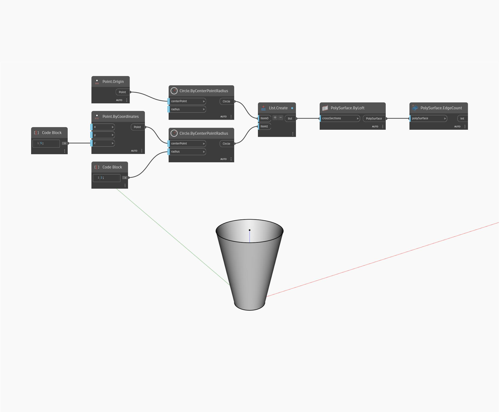

### [Autodesk.DesignScript.Geometry.PolySurface.ExtractSolids.dyn](assets/Autodesk.DesignScript.Geometry.PolySurface.ExtractSolids.dyn)

### [Autodesk.DesignScript.Geometry.PolySurface.LocateSurfacesByLine.dyn](assets/Autodesk.DesignScript.Geometry.PolySurface.LocateSurfacesByLine.dyn)

### [Autodesk.DesignScript.Geometry.PolySurface.LocateSurfacesByPoint.dyn](assets/Autodesk.DesignScript.Geometry.PolySurface.LocateSurfacesByPoint.dyn)

### [Autodesk.DesignScript.Geometry.PolySurface.Surfaces.dyn](assets/Autodesk.DesignScript.Geometry.PolySurface.Surfaces.dyn)

### [Autodesk.DesignScript.Geometry.PolySurface.UnconnectedBoundaries.dyn](assets/Autodesk.DesignScript.Geometry.PolySurface.UnconnectedBoundaries.dyn)

### [Autodesk.DesignScript.Geometry.PolySurface.VertexCount.dyn](assets/Autodesk.DesignScript.Geometry.PolySurface.VertexCount.dyn)

### [Autodesk.DesignScript.Geometry.Rectangle.ByCornerPoints(points).dyn](assets/Autodesk.DesignScript.Geometry.Rectangle.ByCornerPoints(points).dyn)
_img.jpg)

### [Autodesk.DesignScript.Geometry.Rectangle.Height.dyn](assets/Autodesk.DesignScript.Geometry.Rectangle.Height.dyn)

### [Autodesk.DesignScript.Geometry.Rectangle.Width.dyn](assets/Autodesk.DesignScript.Geometry.Rectangle.Width.dyn)

### [Autodesk.DesignScript.Geometry.Solid.Area.dyn](assets/Autodesk.DesignScript.Geometry.Solid.Area.dyn)

### [Autodesk.DesignScript.Geometry.Solid.ByJoinedSurfaces.dyn](assets/Autodesk.DesignScript.Geometry.Solid.ByJoinedSurfaces.dyn)

### [Autodesk.DesignScript.Geometry.Solid.ByLoft(crossSections).dyn](assets/Autodesk.DesignScript.Geometry.Solid.ByLoft(crossSections).dyn)
_img.jpg)

### [Autodesk.DesignScript.Geometry.Solid.ByRevolve.dyn](assets/Autodesk.DesignScript.Geometry.Solid.ByRevolve.dyn)

### [Autodesk.DesignScript.Geometry.Solid.BySweep.dyn](assets/Autodesk.DesignScript.Geometry.Solid.BySweep.dyn)
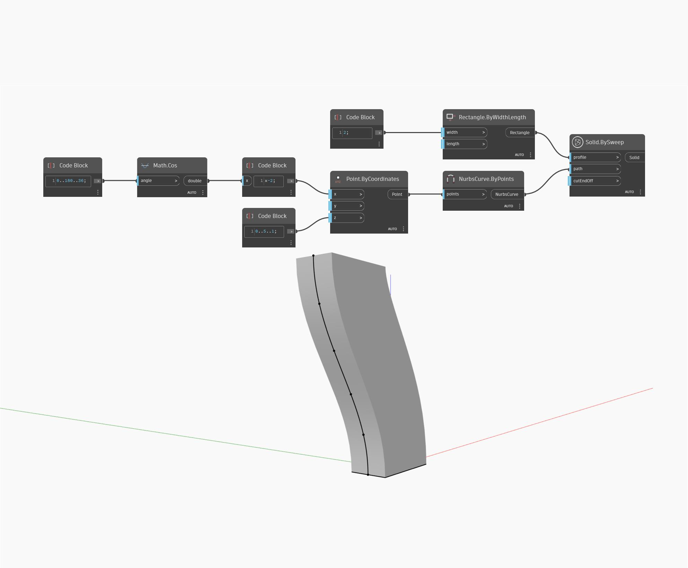

### [Autodesk.DesignScript.Geometry.Solid.BySweep2Rails.dyn](assets/Autodesk.DesignScript.Geometry.Solid.BySweep2Rails.dyn)

### [Autodesk.DesignScript.Geometry.Solid.ByUnion.dyn](assets/Autodesk.DesignScript.Geometry.Solid.ByUnion.dyn)

### [Autodesk.DesignScript.Geometry.Solid.Centroid.dyn](assets/Autodesk.DesignScript.Geometry.Solid.Centroid.dyn)

### [Autodesk.DesignScript.Geometry.Solid.Chamfer.dyn](assets/Autodesk.DesignScript.Geometry.Solid.Chamfer.dyn)

### [Autodesk.DesignScript.Geometry.Solid.Difference.dyn](assets/Autodesk.DesignScript.Geometry.Solid.Difference.dyn)
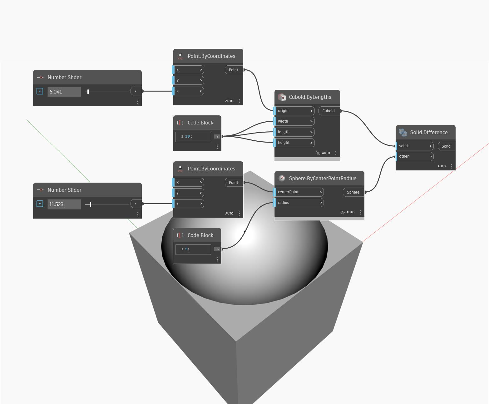

### [Autodesk.DesignScript.Geometry.Solid.DifferenceAll.dyn](assets/Autodesk.DesignScript.Geometry.Solid.DifferenceAll.dyn)
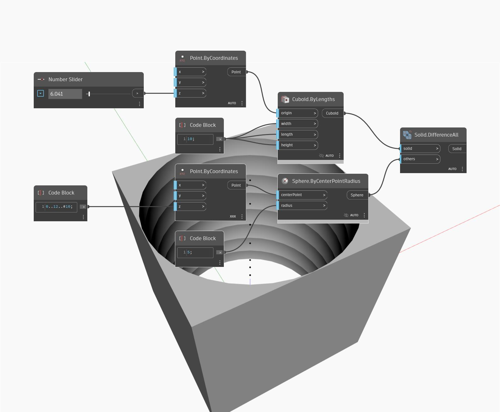

### [Autodesk.DesignScript.Geometry.Solid.Fillet.dyn](assets/Autodesk.DesignScript.Geometry.Solid.Fillet.dyn)
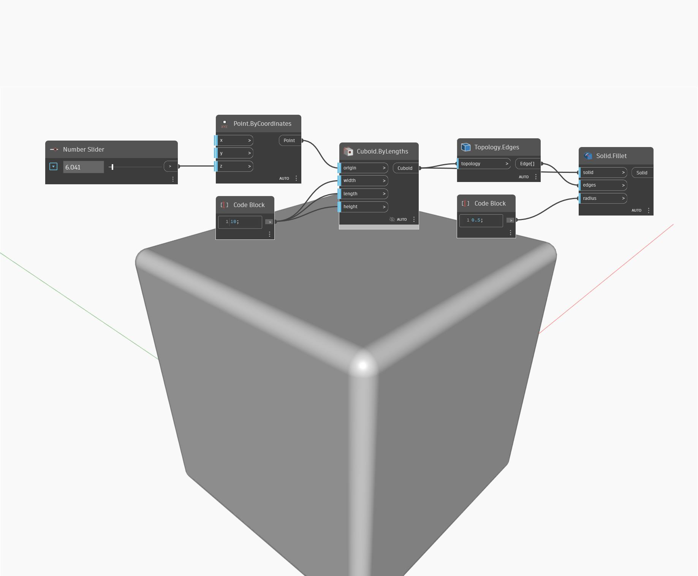

### [Autodesk.DesignScript.Geometry.Solid.ProjectInputOnto.dyn](assets/Autodesk.DesignScript.Geometry.Solid.ProjectInputOnto.dyn)
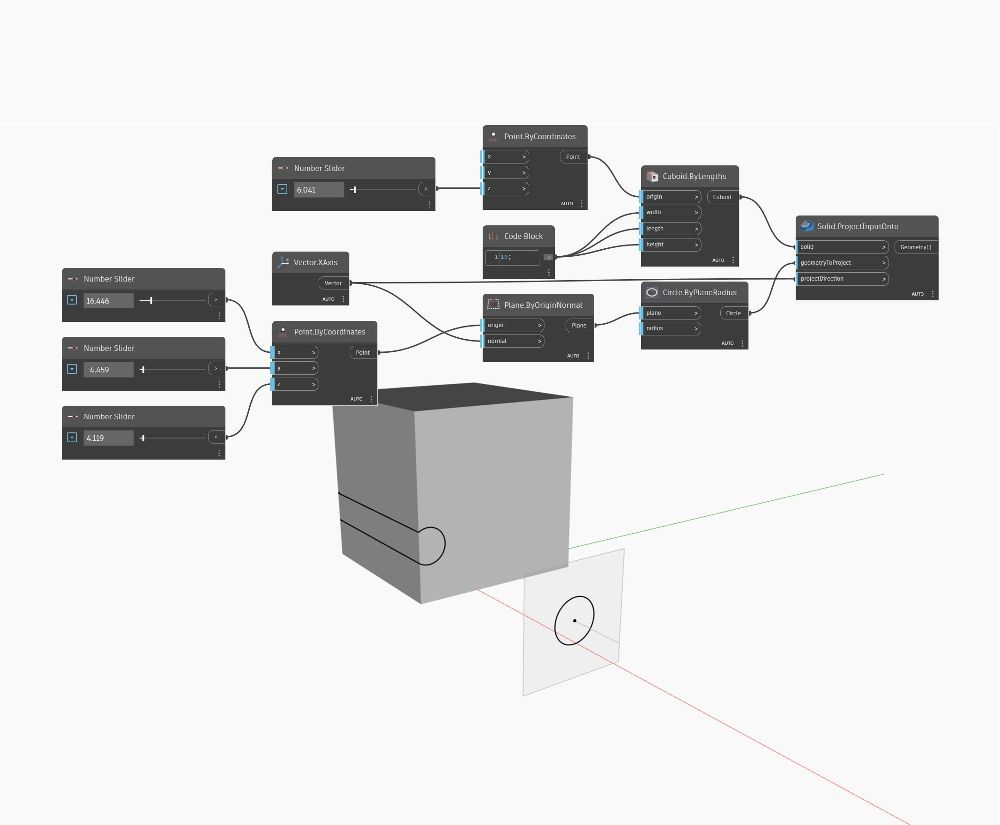

### [Autodesk.DesignScript.Geometry.Solid.ThinShell.dyn](assets/Autodesk.DesignScript.Geometry.Solid.ThinShell.dyn)

### [Autodesk.DesignScript.Geometry.Solid.Union.dyn](assets/Autodesk.DesignScript.Geometry.Solid.Union.dyn)

### [Autodesk.DesignScript.Geometry.Solid.Volume.dyn](assets/Autodesk.DesignScript.Geometry.Solid.Volume.dyn)

### [Autodesk.DesignScript.Geometry.Sphere.ByBestFit.dyn](assets/Autodesk.DesignScript.Geometry.Sphere.ByBestFit.dyn)

### [Autodesk.DesignScript.Geometry.Sphere.ByCenterPointRadius.dyn](assets/Autodesk.DesignScript.Geometry.Sphere.ByCenterPointRadius.dyn)

### [Autodesk.DesignScript.Geometry.Sphere.ByFourPoints.dyn](assets/Autodesk.DesignScript.Geometry.Sphere.ByFourPoints.dyn)

### [Autodesk.DesignScript.Geometry.Sphere.CenterPoint.dyn](assets/Autodesk.DesignScript.Geometry.Sphere.CenterPoint.dyn)

### [Autodesk.DesignScript.Geometry.Sphere.Radius.dyn](assets/Autodesk.DesignScript.Geometry.Sphere.Radius.dyn)

### [Autodesk.DesignScript.Geometry.Surface.ApproximateWithTolerance.dyn](assets/Autodesk.DesignScript.Geometry.Surface.ApproximateWithTolerance.dyn)

### [Autodesk.DesignScript.Geometry.Surface.Area.dyn](assets/Autodesk.DesignScript.Geometry.Surface.Area.dyn)
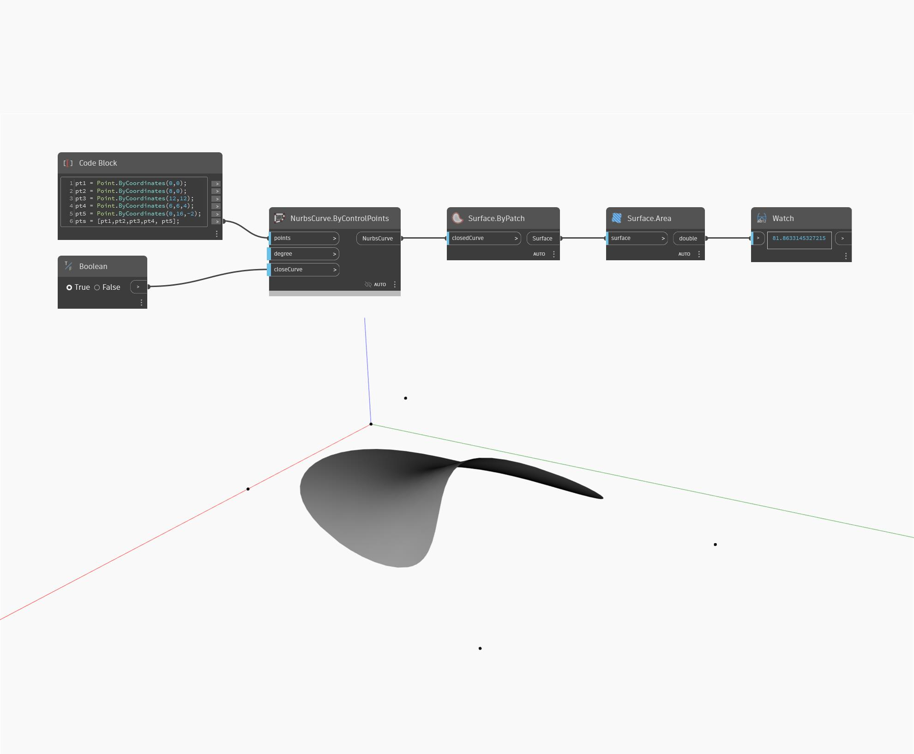

### [Autodesk.DesignScript.Geometry.Surface.ByLoft(crossSections).dyn](assets/Autodesk.DesignScript.Geometry.Surface.ByLoft(crossSections).dyn)
_img.jpg)

### [Autodesk.DesignScript.Geometry.Surface.ByPatch.dyn](assets/Autodesk.DesignScript.Geometry.Surface.ByPatch.dyn)

### [Autodesk.DesignScript.Geometry.Surface.ByPerimeterPoints.dyn](assets/Autodesk.DesignScript.Geometry.Surface.ByPerimeterPoints.dyn)

### [Autodesk.DesignScript.Geometry.Surface.ByRevolve.dyn](assets/Autodesk.DesignScript.Geometry.Surface.ByRevolve.dyn)
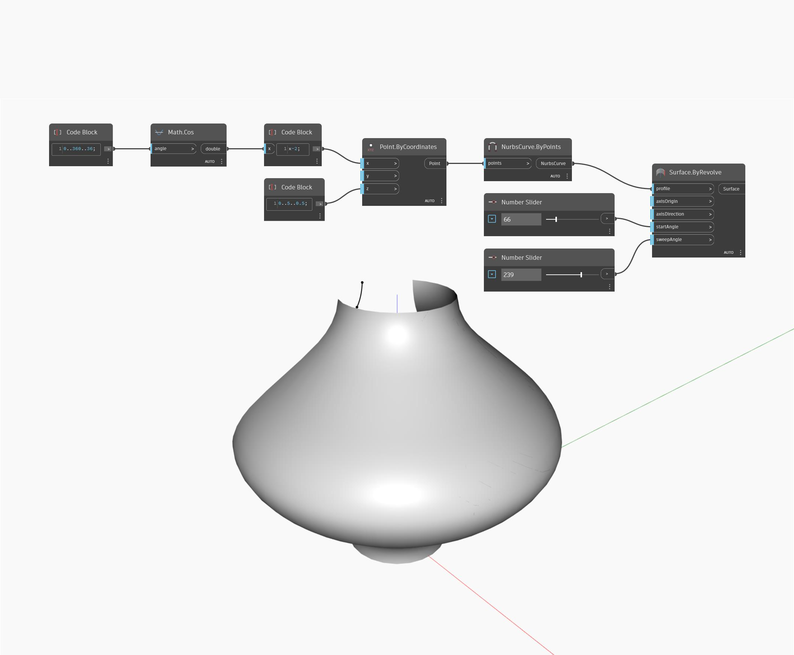

### [Autodesk.DesignScript.Geometry.Surface.ByRuledLoft.dyn](assets/Autodesk.DesignScript.Geometry.Surface.ByRuledLoft.dyn)

### [Autodesk.DesignScript.Geometry.Surface.BySweep.dyn](assets/Autodesk.DesignScript.Geometry.Surface.BySweep.dyn)
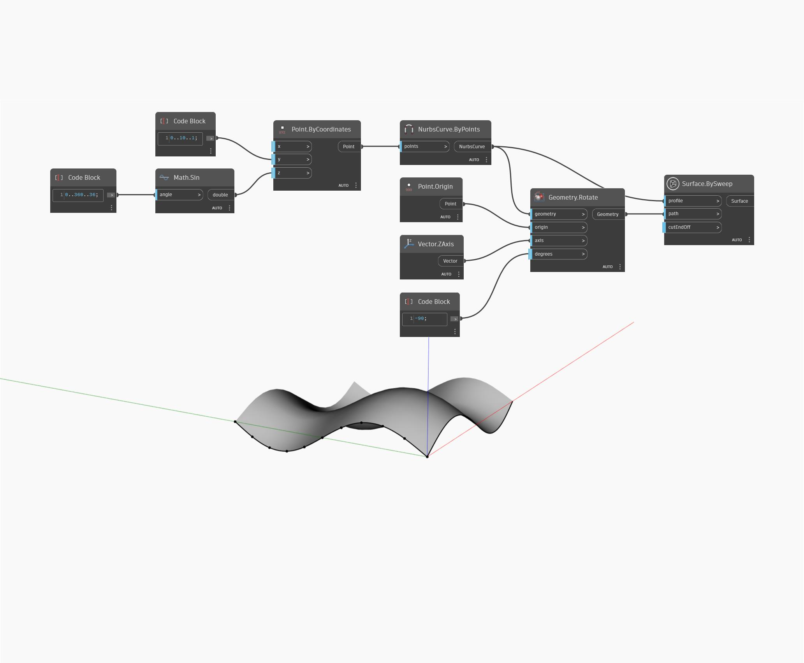

### [Autodesk.DesignScript.Geometry.Surface.BySweep2Rails.dyn](assets/Autodesk.DesignScript.Geometry.Surface.BySweep2Rails.dyn)

### [Autodesk.DesignScript.Geometry.Surface.Closed.dyn](assets/Autodesk.DesignScript.Geometry.Surface.Closed.dyn)

### [Autodesk.DesignScript.Geometry.Surface.ClosedInU.dyn](assets/Autodesk.DesignScript.Geometry.Surface.ClosedInU.dyn)

### [Autodesk.DesignScript.Geometry.Surface.ClosedInV.dyn](assets/Autodesk.DesignScript.Geometry.Surface.ClosedInV.dyn)

### [Autodesk.DesignScript.Geometry.Surface.CoordinateSystemAtParameter.dyn](assets/Autodesk.DesignScript.Geometry.Surface.CoordinateSystemAtParameter.dyn)
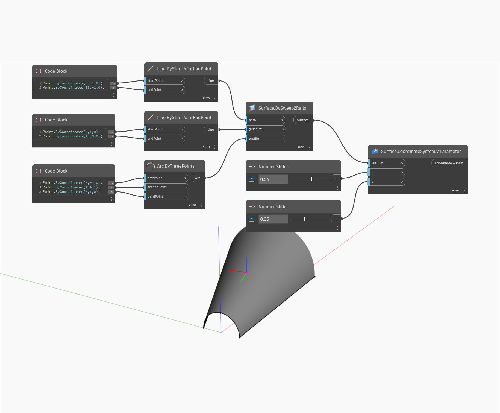

### [Autodesk.DesignScript.Geometry.Surface.CurvatureAtParameter.dyn](assets/Autodesk.DesignScript.Geometry.Surface.CurvatureAtParameter.dyn)

### [Autodesk.DesignScript.Geometry.Surface.DerivativesAtParameter.dyn](assets/Autodesk.DesignScript.Geometry.Surface.DerivativesAtParameter.dyn)
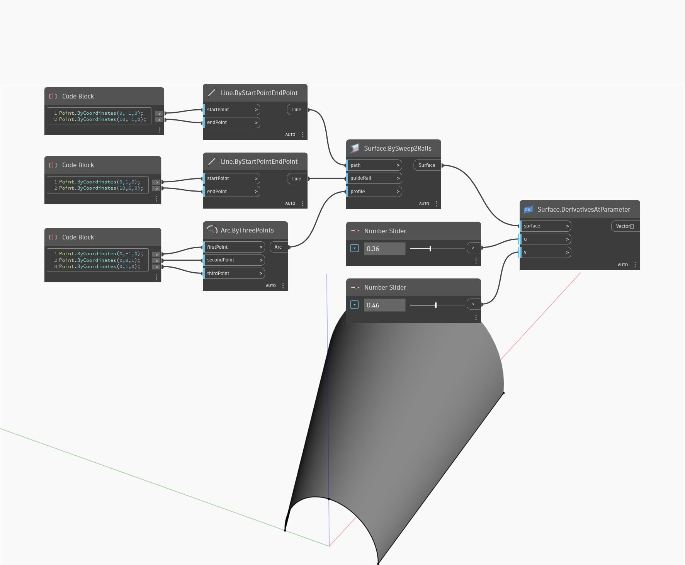

### [Autodesk.DesignScript.Geometry.Surface.FlipNormalDirection.dyn](assets/Autodesk.DesignScript.Geometry.Surface.FlipNormalDirection.dyn)

### [Autodesk.DesignScript.Geometry.Surface.GaussianCurvatureAtParameter.dyn](assets/Autodesk.DesignScript.Geometry.Surface.GaussianCurvatureAtParameter.dyn)

### [Autodesk.DesignScript.Geometry.Surface.GetIsoline.dyn](assets/Autodesk.DesignScript.Geometry.Surface.GetIsoline.dyn)

### [Autodesk.DesignScript.Geometry.Surface.NormalAtParameter.dyn](assets/Autodesk.DesignScript.Geometry.Surface.NormalAtParameter.dyn)

### [Autodesk.DesignScript.Geometry.Surface.NormalAtPoint.dyn](assets/Autodesk.DesignScript.Geometry.Surface.NormalAtPoint.dyn)
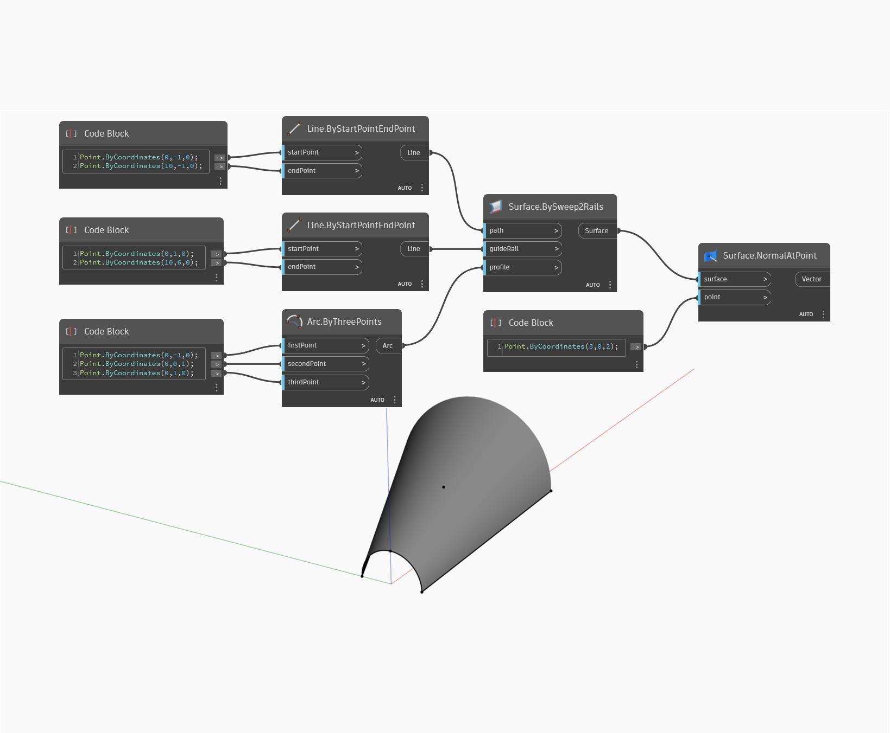

### [Autodesk.DesignScript.Geometry.Surface.Offset.dyn](assets/Autodesk.DesignScript.Geometry.Surface.Offset.dyn)
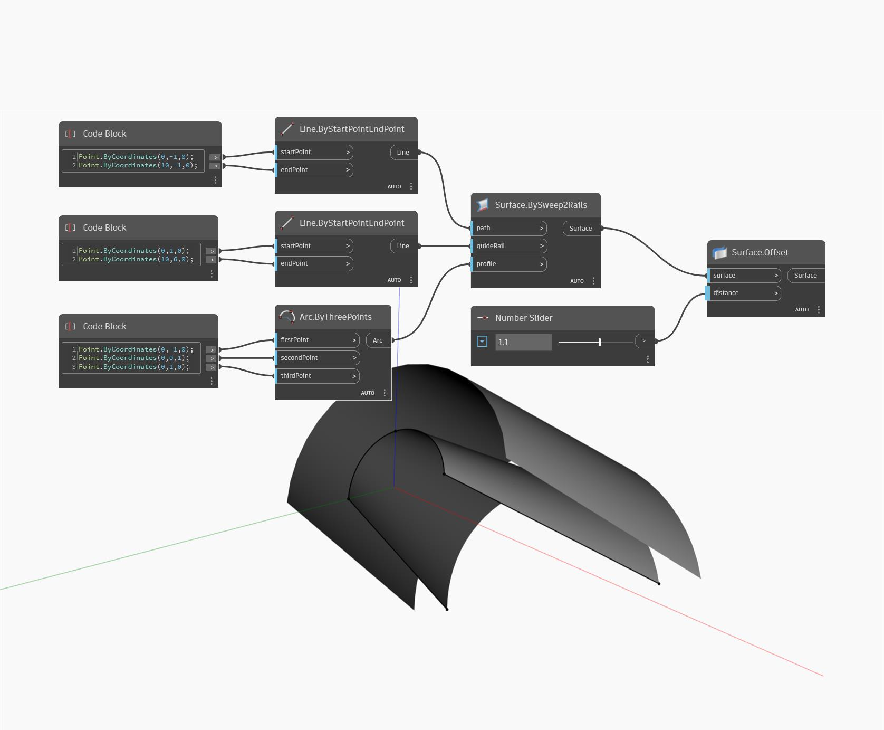

### [Autodesk.DesignScript.Geometry.Surface.Perimeter.dyn](assets/Autodesk.DesignScript.Geometry.Surface.Perimeter.dyn)

### [Autodesk.DesignScript.Geometry.Surface.PerimeterCurves.dyn](assets/Autodesk.DesignScript.Geometry.Surface.PerimeterCurves.dyn)

### [Autodesk.DesignScript.Geometry.Surface.PointAtParameter.dyn](assets/Autodesk.DesignScript.Geometry.Surface.PointAtParameter.dyn)

### [Autodesk.DesignScript.Geometry.Surface.ProjectInputOnto.dyn](assets/Autodesk.DesignScript.Geometry.Surface.ProjectInputOnto.dyn)

### [Autodesk.DesignScript.Geometry.Surface.SubtractFrom.dyn](assets/Autodesk.DesignScript.Geometry.Surface.SubtractFrom.dyn)

### [Autodesk.DesignScript.Geometry.Surface.TangentAtUParameter.dyn](assets/Autodesk.DesignScript.Geometry.Surface.TangentAtUParameter.dyn)

### [Autodesk.DesignScript.Geometry.Surface.TangentAtVParameter.dyn](assets/Autodesk.DesignScript.Geometry.Surface.TangentAtVParameter.dyn)
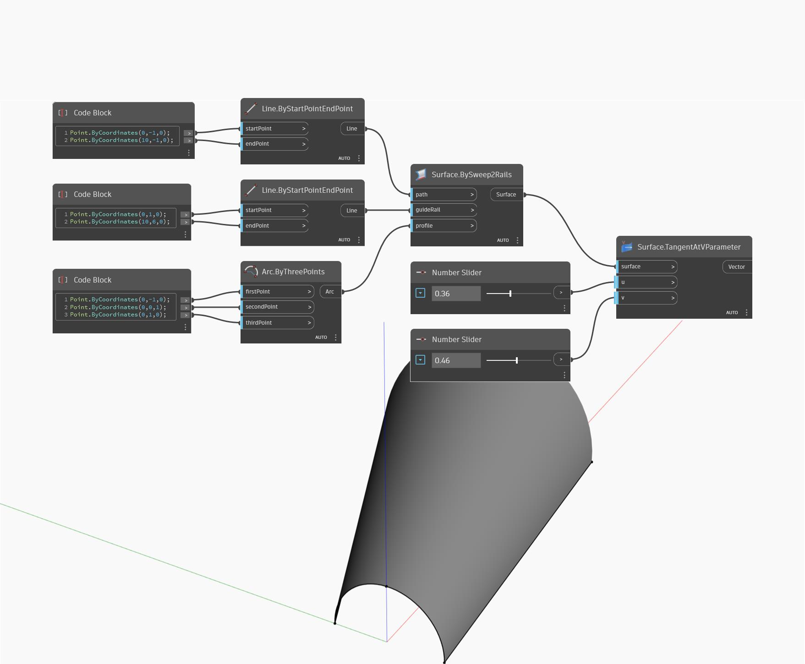

### [Autodesk.DesignScript.Geometry.Surface.Thicken(surface, thickness).dyn](assets/Autodesk.DesignScript.Geometry.Surface.Thicken(surface, thickness).dyn)
_img.jpg)

### [Autodesk.DesignScript.Geometry.Surface.Thicken(thickness).dyn](assets/Autodesk.DesignScript.Geometry.Surface.Thicken(thickness).dyn)
_img.jpg)

### [Autodesk.DesignScript.Geometry.Surface.TrimWithEdgeLoops.dyn](assets/Autodesk.DesignScript.Geometry.Surface.TrimWithEdgeLoops.dyn)

### [Autodesk.DesignScript.Geometry.Surface.UVParameterAtPoint.dyn](assets/Autodesk.DesignScript.Geometry.Surface.UVParameterAtPoint.dyn)
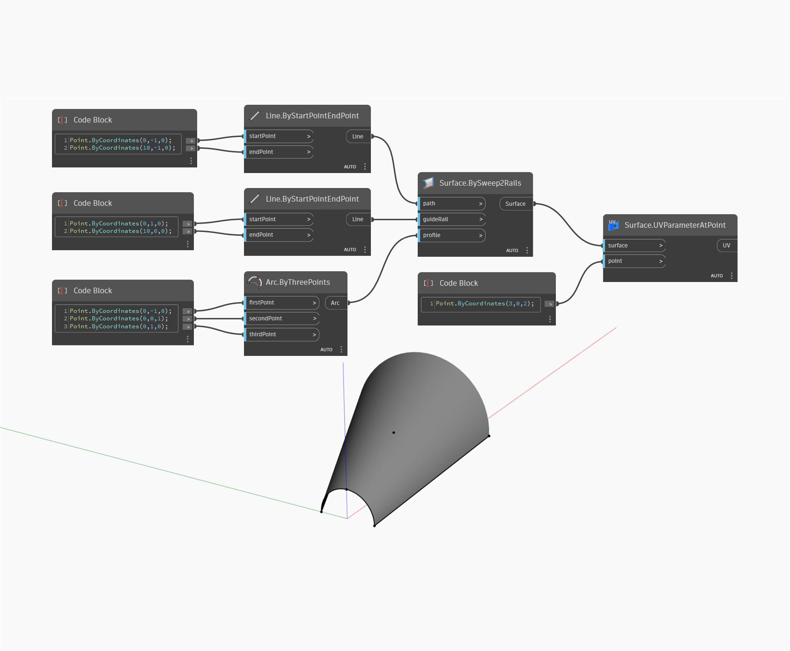

### [Autodesk.DesignScript.Geometry.Topology.Edges.dyn](assets/Autodesk.DesignScript.Geometry.Topology.Edges.dyn)

### [Autodesk.DesignScript.Geometry.Topology.Faces.dyn](assets/Autodesk.DesignScript.Geometry.Topology.Faces.dyn)

### [Autodesk.DesignScript.Geometry.Topology.Vertices.dyn](assets/Autodesk.DesignScript.Geometry.Topology.Vertices.dyn)

### [Autodesk.DesignScript.Geometry.TSpline.TSplineEdge.Index.dyn](assets/Autodesk.DesignScript.Geometry.TSpline.TSplineEdge.Index.dyn)

### [Autodesk.DesignScript.Geometry.TSpline.TSplineEdge.Info.dyn](assets/Autodesk.DesignScript.Geometry.TSpline.TSplineEdge.Info.dyn)

### [Autodesk.DesignScript.Geometry.TSpline.TSplineEdge.IsBorder.dyn](assets/Autodesk.DesignScript.Geometry.TSpline.TSplineEdge.IsBorder.dyn)

### [Autodesk.DesignScript.Geometry.TSpline.TSplineEdge.IsManifold.dyn](assets/Autodesk.DesignScript.Geometry.TSpline.TSplineEdge.IsManifold.dyn)

### [Autodesk.DesignScript.Geometry.TSpline.TSplineEdge.UVNFrame.dyn](assets/Autodesk.DesignScript.Geometry.TSpline.TSplineEdge.UVNFrame.dyn)

### [Autodesk.DesignScript.Geometry.TSpline.TSplineFace.Index.dyn](assets/Autodesk.DesignScript.Geometry.TSpline.TSplineFace.Index.dyn)

### [Autodesk.DesignScript.Geometry.TSpline.TSplineFace.Info.dyn](assets/Autodesk.DesignScript.Geometry.TSpline.TSplineFace.Info.dyn)

### [Autodesk.DesignScript.Geometry.TSpline.TSplineFace.Sides.dyn](assets/Autodesk.DesignScript.Geometry.TSpline.TSplineFace.Sides.dyn)

### [Autodesk.DesignScript.Geometry.TSpline.TSplineFace.UVNFrame.dyn](assets/Autodesk.DesignScript.Geometry.TSpline.TSplineFace.UVNFrame.dyn)

### [Autodesk.DesignScript.Geometry.TSpline.TSplineFace.Valence.dyn](assets/Autodesk.DesignScript.Geometry.TSpline.TSplineFace.Valence.dyn)

### [Autodesk.DesignScript.Geometry.TSpline.TSplineInitialSymmetry.ByAxial.dyn](assets/Autodesk.DesignScript.Geometry.TSpline.TSplineInitialSymmetry.ByAxial.dyn)

### [Autodesk.DesignScript.Geometry.TSpline.TSplineInitialSymmetry.XAxis.dyn](assets/Autodesk.DesignScript.Geometry.TSpline.TSplineInitialSymmetry.XAxis.dyn)

### [Autodesk.DesignScript.Geometry.TSpline.TSplineInitialSymmetry.YAxis.dyn](assets/Autodesk.DesignScript.Geometry.TSpline.TSplineInitialSymmetry.YAxis.dyn)

### [Autodesk.DesignScript.Geometry.TSpline.TSplineInitialSymmetry.ZAxis.dyn](assets/Autodesk.DesignScript.Geometry.TSpline.TSplineInitialSymmetry.ZAxis.dyn)

### [Autodesk.DesignScript.Geometry.TSpline.TSplineReflection.Axis.dyn](assets/Autodesk.DesignScript.Geometry.TSpline.TSplineReflection.Axis.dyn)
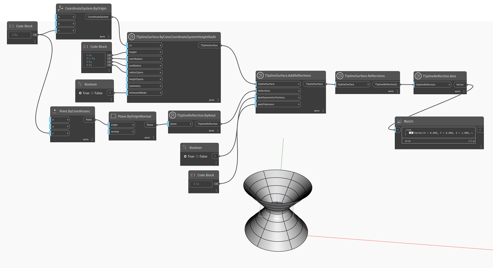

### [Autodesk.DesignScript.Geometry.TSpline.TSplineReflection.ByAxial.dyn](assets/Autodesk.DesignScript.Geometry.TSpline.TSplineReflection.ByAxial.dyn)

### [Autodesk.DesignScript.Geometry.TSpline.TSplineReflection.ByRadial.dyn](assets/Autodesk.DesignScript.Geometry.TSpline.TSplineReflection.ByRadial.dyn)

### [Autodesk.DesignScript.Geometry.TSpline.TSplineReflection.IsRadial.dyn](assets/Autodesk.DesignScript.Geometry.TSpline.TSplineReflection.IsRadial.dyn)
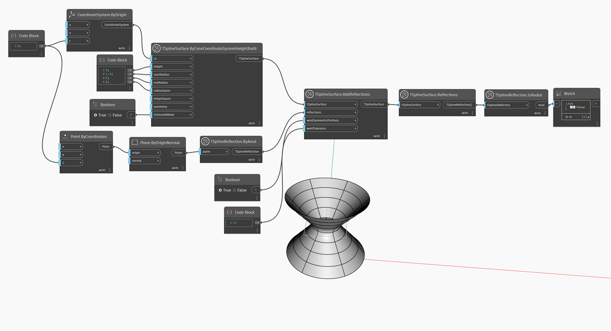

### [Autodesk.DesignScript.Geometry.TSpline.TSplineReflection.Plane.dyn](assets/Autodesk.DesignScript.Geometry.TSpline.TSplineReflection.Plane.dyn)

### [Autodesk.DesignScript.Geometry.TSpline.TSplineSurface.BevelEdges.dyn](assets/Autodesk.DesignScript.Geometry.TSpline.TSplineSurface.BevelEdges.dyn)

### [Autodesk.DesignScript.Geometry.TSpline.TSplineSurface.ByBoxCorners.dyn](assets/Autodesk.DesignScript.Geometry.TSpline.TSplineSurface.ByBoxCorners.dyn)

### [Autodesk.DesignScript.Geometry.TSpline.TSplineSurface.ByExtrude.dyn](assets/Autodesk.DesignScript.Geometry.TSpline.TSplineSurface.ByExtrude.dyn)

### [Autodesk.DesignScript.Geometry.TSpline.TSplineSurface.ByRevolve.dyn](assets/Autodesk.DesignScript.Geometry.TSpline.TSplineSurface.ByRevolve.dyn)

### [Autodesk.DesignScript.Geometry.TSpline.TSplineSurface.BySphereBestFit.dyn](assets/Autodesk.DesignScript.Geometry.TSpline.TSplineSurface.BySphereBestFit.dyn)

### [Autodesk.DesignScript.Geometry.TSpline.TSplineSurface.BySweep.dyn](assets/Autodesk.DesignScript.Geometry.TSpline.TSplineSurface.BySweep.dyn)

### [Autodesk.DesignScript.Geometry.TSpline.TSplineSurface.CreaseEdges.dyn](assets/Autodesk.DesignScript.Geometry.TSpline.TSplineSurface.CreaseEdges.dyn)

### [Autodesk.DesignScript.Geometry.TSpline.TSplineSurface.DeleteEdges.dyn](assets/Autodesk.DesignScript.Geometry.TSpline.TSplineSurface.DeleteEdges.dyn)
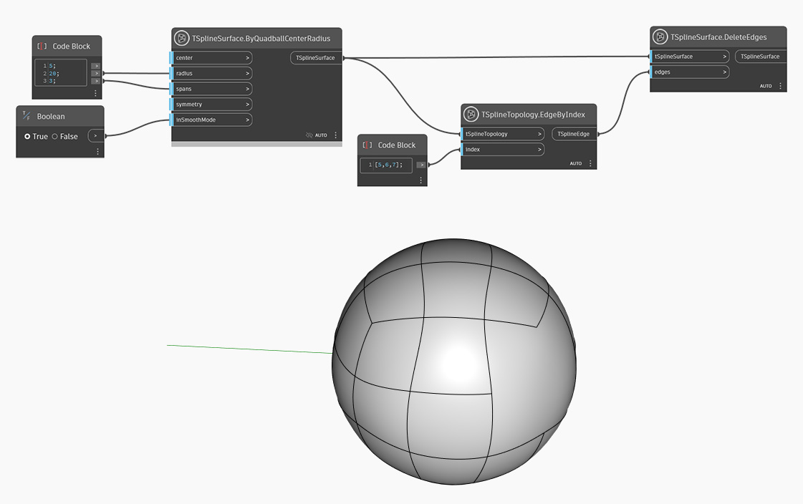

### [Autodesk.DesignScript.Geometry.TSpline.TSplineSurface.DeleteFaces.dyn](assets/Autodesk.DesignScript.Geometry.TSpline.TSplineSurface.DeleteFaces.dyn)

### [Autodesk.DesignScript.Geometry.TSpline.TSplineSurface.ExportToTSM.dyn](assets/Autodesk.DesignScript.Geometry.TSpline.TSplineSurface.ExportToTSM.dyn)

### [Autodesk.DesignScript.Geometry.TSpline.TSplineSurface.ExportToTSS.dyn](assets/Autodesk.DesignScript.Geometry.TSpline.TSplineSurface.ExportToTSS.dyn)

### [Autodesk.DesignScript.Geometry.TSpline.TSplineSurface.ExtrudeFaces.dyn](assets/Autodesk.DesignScript.Geometry.TSpline.TSplineSurface.ExtrudeFaces.dyn)

### [Autodesk.DesignScript.Geometry.TSpline.TSplineSurface.FillHole.dyn](assets/Autodesk.DesignScript.Geometry.TSpline.TSplineSurface.FillHole.dyn)

### [Autodesk.DesignScript.Geometry.TSpline.TSplineSurface.FlipNormals.dyn](assets/Autodesk.DesignScript.Geometry.TSpline.TSplineSurface.FlipNormals.dyn)

### [Autodesk.DesignScript.Geometry.TSpline.TSplineSurface.Interpolate.dyn](assets/Autodesk.DesignScript.Geometry.TSpline.TSplineSurface.Interpolate.dyn)

### [Autodesk.DesignScript.Geometry.TSpline.TSplineSurface.IsClosed.dyn](assets/Autodesk.DesignScript.Geometry.TSpline.TSplineSurface.IsClosed.dyn)
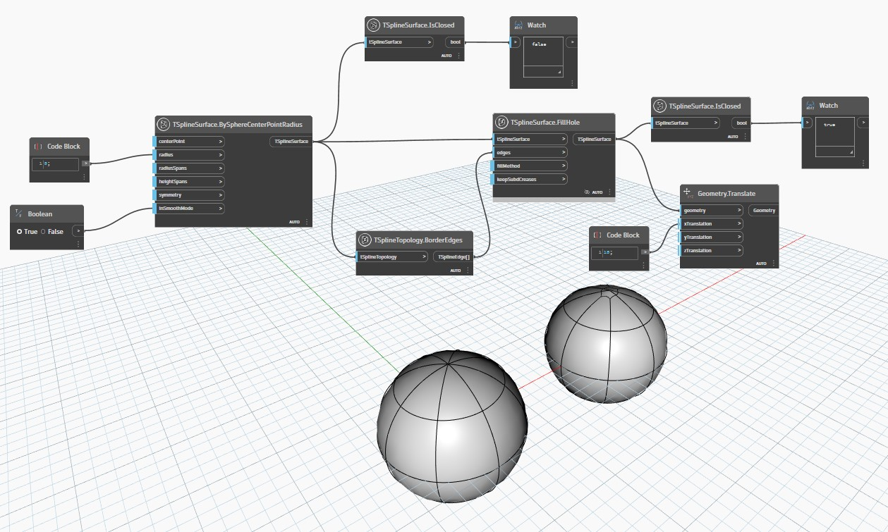

### [Autodesk.DesignScript.Geometry.TSpline.TSplineSurface.IsExtractable.dyn](assets/Autodesk.DesignScript.Geometry.TSpline.TSplineSurface.IsExtractable.dyn)

### [Autodesk.DesignScript.Geometry.TSpline.TSplineSurface.IsInBoxMode.dyn](assets/Autodesk.DesignScript.Geometry.TSpline.TSplineSurface.IsInBoxMode.dyn)

### [Autodesk.DesignScript.Geometry.TSpline.TSplineSurface.IsStandard.dyn](assets/Autodesk.DesignScript.Geometry.TSpline.TSplineSurface.IsStandard.dyn)

### [Autodesk.DesignScript.Geometry.TSpline.TSplineSurface.IsWaterTight.dyn](assets/Autodesk.DesignScript.Geometry.TSpline.TSplineSurface.IsWaterTight.dyn)

### [Autodesk.DesignScript.Geometry.TSpline.TSplineSurface.MakeUniform.dyn](assets/Autodesk.DesignScript.Geometry.TSpline.TSplineSurface.MakeUniform.dyn)

### [Autodesk.DesignScript.Geometry.TSpline.TSplineSurface.MergeEdges.dyn](assets/Autodesk.DesignScript.Geometry.TSpline.TSplineSurface.MergeEdges.dyn)

### [Autodesk.DesignScript.Geometry.TSpline.TSplineSurface.MoveVertices.dyn](assets/Autodesk.DesignScript.Geometry.TSpline.TSplineSurface.MoveVertices.dyn)

### [Autodesk.DesignScript.Geometry.TSpline.TSplineSurface.PullVertices.dyn](assets/Autodesk.DesignScript.Geometry.TSpline.TSplineSurface.PullVertices.dyn)

### [Autodesk.DesignScript.Geometry.TSpline.TSplineSurface.Reflections.dyn](assets/Autodesk.DesignScript.Geometry.TSpline.TSplineSurface.Reflections.dyn)
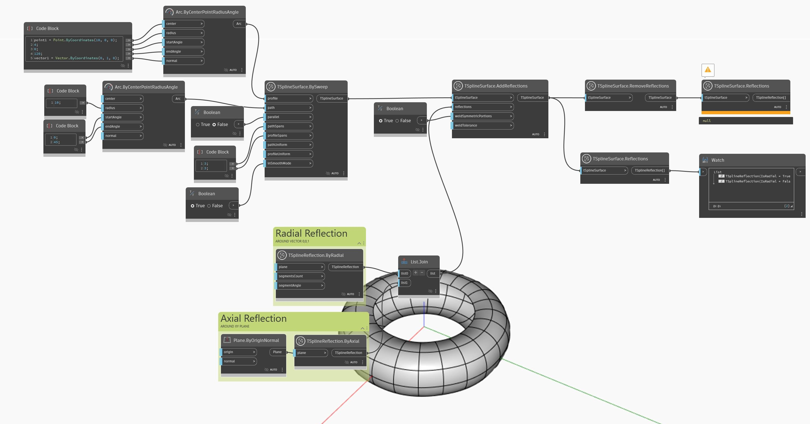

### [Autodesk.DesignScript.Geometry.TSpline.TSplineSurface.Repair.dyn](assets/Autodesk.DesignScript.Geometry.TSpline.TSplineSurface.Repair.dyn)

### [Autodesk.DesignScript.Geometry.TSpline.TSplineSurface.SlideEdges.dyn](assets/Autodesk.DesignScript.Geometry.TSpline.TSplineSurface.SlideEdges.dyn)

### [Autodesk.DesignScript.Geometry.TSpline.TSplineSurface.Standardize.dyn](assets/Autodesk.DesignScript.Geometry.TSpline.TSplineSurface.Standardize.dyn)
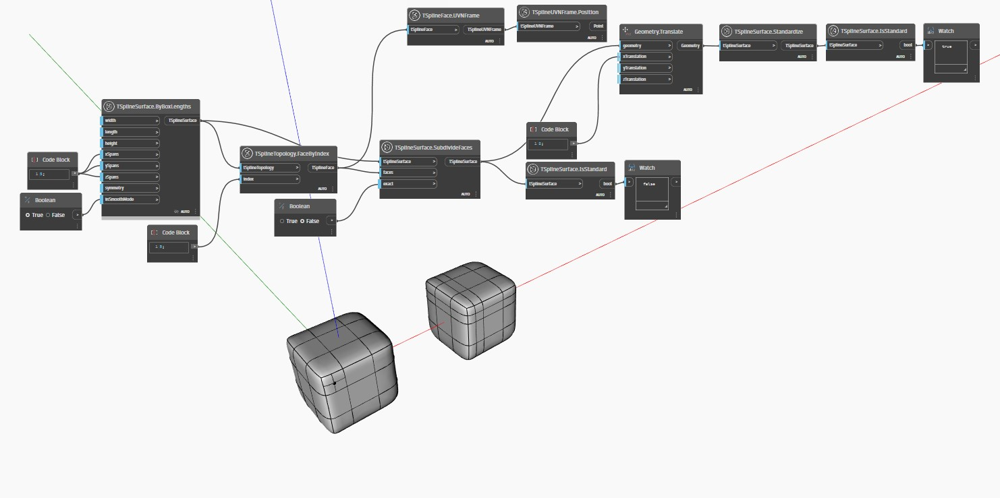

### [Autodesk.DesignScript.Geometry.TSpline.TSplineSurface.ToBRep.dyn](assets/Autodesk.DesignScript.Geometry.TSpline.TSplineSurface.ToBRep.dyn)

### [Autodesk.DesignScript.Geometry.TSpline.TSplineSurface.ToMesh.dyn](assets/Autodesk.DesignScript.Geometry.TSpline.TSplineSurface.ToMesh.dyn)

### [Autodesk.DesignScript.Geometry.TSpline.TSplineSurface.UncreaseEdges.dyn](assets/Autodesk.DesignScript.Geometry.TSpline.TSplineSurface.UncreaseEdges.dyn)

### [Autodesk.DesignScript.Geometry.TSpline.TSplineSurface.UnweldEdges.dyn](assets/Autodesk.DesignScript.Geometry.TSpline.TSplineSurface.UnweldEdges.dyn)

### [Autodesk.DesignScript.Geometry.TSpline.TSplineTopology.BorderEdges.dyn](assets/Autodesk.DesignScript.Geometry.TSpline.TSplineTopology.BorderEdges.dyn)

### [Autodesk.DesignScript.Geometry.TSpline.TSplineTopology.BorderFaces.dyn](assets/Autodesk.DesignScript.Geometry.TSpline.TSplineTopology.BorderFaces.dyn)

### [Autodesk.DesignScript.Geometry.TSpline.TSplineTopology.EdgeByIndex.dyn](assets/Autodesk.DesignScript.Geometry.TSpline.TSplineTopology.EdgeByIndex.dyn)
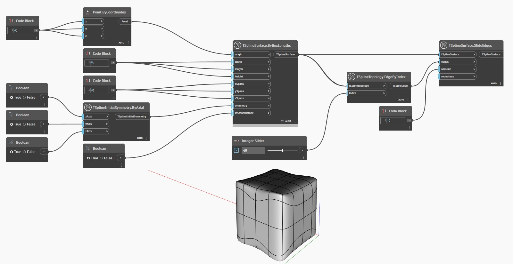

### [Autodesk.DesignScript.Geometry.TSpline.TSplineTopology.EdgesCount.dyn](assets/Autodesk.DesignScript.Geometry.TSpline.TSplineTopology.EdgesCount.dyn)

### [Autodesk.DesignScript.Geometry.TSpline.TSplineTopology.FaceByIndex.dyn](assets/Autodesk.DesignScript.Geometry.TSpline.TSplineTopology.FaceByIndex.dyn)

### [Autodesk.DesignScript.Geometry.TSpline.TSplineTopology.FacesCount.dyn](assets/Autodesk.DesignScript.Geometry.TSpline.TSplineTopology.FacesCount.dyn)

### [Autodesk.DesignScript.Geometry.TSpline.TSplineTopology.InnerEdges.dyn](assets/Autodesk.DesignScript.Geometry.TSpline.TSplineTopology.InnerEdges.dyn)

### [Autodesk.DesignScript.Geometry.TSpline.TSplineTopology.InnerFaces.dyn](assets/Autodesk.DesignScript.Geometry.TSpline.TSplineTopology.InnerFaces.dyn)

### [Autodesk.DesignScript.Geometry.TSpline.TSplineTopology.InnerVertices.dyn](assets/Autodesk.DesignScript.Geometry.TSpline.TSplineTopology.InnerVertices.dyn)
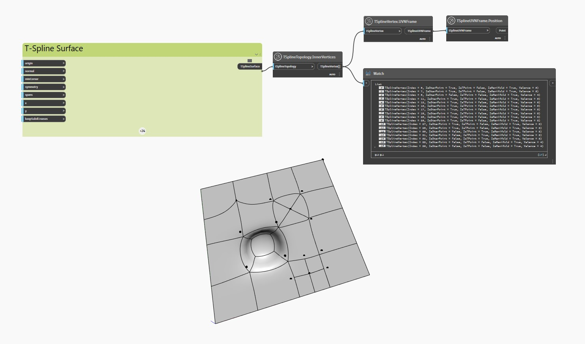

### [Autodesk.DesignScript.Geometry.TSpline.TSplineTopology.NGonFaces.dyn](assets/Autodesk.DesignScript.Geometry.TSpline.TSplineTopology.NGonFaces.dyn)

### [Autodesk.DesignScript.Geometry.TSpline.TSplineTopology.RegularFaces.dyn](assets/Autodesk.DesignScript.Geometry.TSpline.TSplineTopology.RegularFaces.dyn)

### [Autodesk.DesignScript.Geometry.TSpline.TSplineUVNFrame.Normal.dyn](assets/Autodesk.DesignScript.Geometry.TSpline.TSplineUVNFrame.Normal.dyn)

### [Autodesk.DesignScript.Geometry.TSpline.TSplineUVNFrame.Position.dyn](assets/Autodesk.DesignScript.Geometry.TSpline.TSplineUVNFrame.Position.dyn)

### [Autodesk.DesignScript.Geometry.TSpline.TSplineUVNFrame.U.dyn](assets/Autodesk.DesignScript.Geometry.TSpline.TSplineUVNFrame.U.dyn)

### [Autodesk.DesignScript.Geometry.TSpline.TSplineUVNFrame.V.dyn](assets/Autodesk.DesignScript.Geometry.TSpline.TSplineUVNFrame.V.dyn)

### [Autodesk.DesignScript.Geometry.TSpline.TSplineVertex.Index.dyn](assets/Autodesk.DesignScript.Geometry.TSpline.TSplineVertex.Index.dyn)

### [Autodesk.DesignScript.Geometry.TSpline.TSplineVertex.Info.dyn](assets/Autodesk.DesignScript.Geometry.TSpline.TSplineVertex.Info.dyn)

### [Autodesk.DesignScript.Geometry.TSpline.TSplineVertex.IsManifold.dyn](assets/Autodesk.DesignScript.Geometry.TSpline.TSplineVertex.IsManifold.dyn)

### [Autodesk.DesignScript.Geometry.TSpline.TSplineVertex.IsStarPoint.dyn](assets/Autodesk.DesignScript.Geometry.TSpline.TSplineVertex.IsStarPoint.dyn)
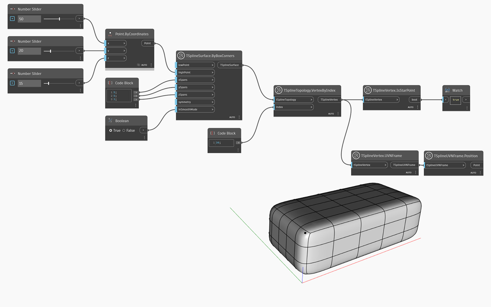

### [Autodesk.DesignScript.Geometry.TSpline.TSplineVertex.IsTPoint.dyn](assets/Autodesk.DesignScript.Geometry.TSpline.TSplineVertex.IsTPoint.dyn)

### [Autodesk.DesignScript.Geometry.TSpline.TSplineVertex.UVNFrame.dyn](assets/Autodesk.DesignScript.Geometry.TSpline.TSplineVertex.UVNFrame.dyn)

### [Autodesk.DesignScript.Geometry.TSpline.TSplineVertex.Valence.dyn](assets/Autodesk.DesignScript.Geometry.TSpline.TSplineVertex.Valence.dyn)

### [Autodesk.DesignScript.Geometry.UV.ByCoordinates.dyn](assets/Autodesk.DesignScript.Geometry.UV.ByCoordinates.dyn)

### [Autodesk.DesignScript.Geometry.UV.U.dyn](assets/Autodesk.DesignScript.Geometry.UV.U.dyn)

### [Autodesk.DesignScript.Geometry.UV.V.dyn](assets/Autodesk.DesignScript.Geometry.UV.V.dyn)

### [Autodesk.DesignScript.Geometry.Vector.Add.dyn](assets/Autodesk.DesignScript.Geometry.Vector.Add.dyn)

### [Autodesk.DesignScript.Geometry.Vector.AngleAboutAxis.dyn](assets/Autodesk.DesignScript.Geometry.Vector.AngleAboutAxis.dyn)
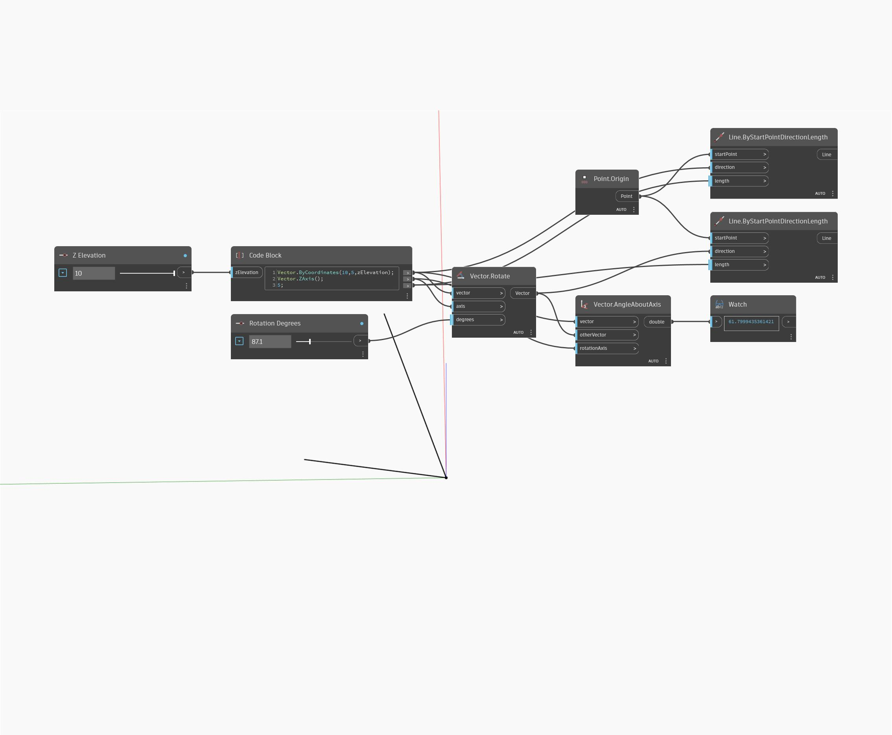

### [Autodesk.DesignScript.Geometry.Vector.AngleWithVector.dyn](assets/Autodesk.DesignScript.Geometry.Vector.AngleWithVector.dyn)

### [Autodesk.DesignScript.Geometry.Vector.AsPoint.dyn](assets/Autodesk.DesignScript.Geometry.Vector.AsPoint.dyn)

### [Autodesk.DesignScript.Geometry.Vector.ByCoordinates(x, y, z).dyn](assets/Autodesk.DesignScript.Geometry.Vector.ByCoordinates(x, y, z).dyn)
_img.jpg)

### [Autodesk.DesignScript.Geometry.Vector.ByTwoPoints.dyn](assets/Autodesk.DesignScript.Geometry.Vector.ByTwoPoints.dyn)
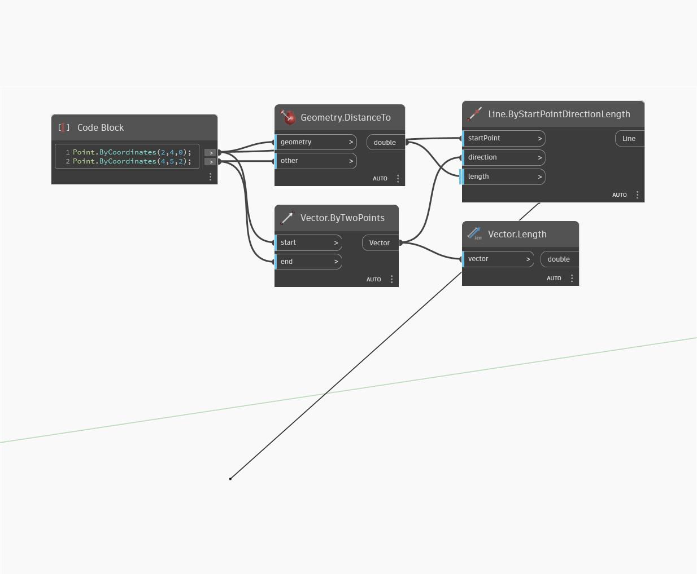

### [Autodesk.DesignScript.Geometry.Vector.Cross.dyn](assets/Autodesk.DesignScript.Geometry.Vector.Cross.dyn)

### [Autodesk.DesignScript.Geometry.Vector.Dot.dyn](assets/Autodesk.DesignScript.Geometry.Vector.Dot.dyn)

### [Autodesk.DesignScript.Geometry.Vector.IsAlmostEqualTo.dyn](assets/Autodesk.DesignScript.Geometry.Vector.IsAlmostEqualTo.dyn)

### [Autodesk.DesignScript.Geometry.Vector.IsParallel.dyn](assets/Autodesk.DesignScript.Geometry.Vector.IsParallel.dyn)

### [Autodesk.DesignScript.Geometry.Vector.Length.dyn](assets/Autodesk.DesignScript.Geometry.Vector.Length.dyn)

### [Autodesk.DesignScript.Geometry.Vector.Normalized.dyn](assets/Autodesk.DesignScript.Geometry.Vector.Normalized.dyn)

### [Autodesk.DesignScript.Geometry.Vector.Reverse.dyn](assets/Autodesk.DesignScript.Geometry.Vector.Reverse.dyn)

### [Autodesk.DesignScript.Geometry.Vector.Rotate(axis, degrees).dyn](assets/Autodesk.DesignScript.Geometry.Vector.Rotate(axis, degrees).dyn)
_img.jpg)

### [Autodesk.DesignScript.Geometry.Vector.Rotate(plane, degrees).dyn](assets/Autodesk.DesignScript.Geometry.Vector.Rotate(plane, degrees).dyn)
_img.jpg)

### [Autodesk.DesignScript.Geometry.Vector.Rotate(vector, axis, degrees).dyn](assets/Autodesk.DesignScript.Geometry.Vector.Rotate(vector, axis, degrees).dyn)
_img.jpg)

### [Autodesk.DesignScript.Geometry.Vector.Scale(scale_factor).dyn](assets/Autodesk.DesignScript.Geometry.Vector.Scale(scale_factor).dyn)
_img.jpg)

### [Autodesk.DesignScript.Geometry.Vector.Scale(vector, scale_factor).dyn](assets/Autodesk.DesignScript.Geometry.Vector.Scale(vector, scale_factor).dyn)
_img.jpg)

### [Autodesk.DesignScript.Geometry.Vector.Subtract.dyn](assets/Autodesk.DesignScript.Geometry.Vector.Subtract.dyn)

### [Autodesk.DesignScript.Geometry.Vector.Transform.dyn](assets/Autodesk.DesignScript.Geometry.Vector.Transform.dyn)

### [Autodesk.DesignScript.Geometry.Vector.X.dyn](assets/Autodesk.DesignScript.Geometry.Vector.X.dyn)

### [Autodesk.DesignScript.Geometry.Vector.XAxis.dyn](assets/Autodesk.DesignScript.Geometry.Vector.XAxis.dyn)
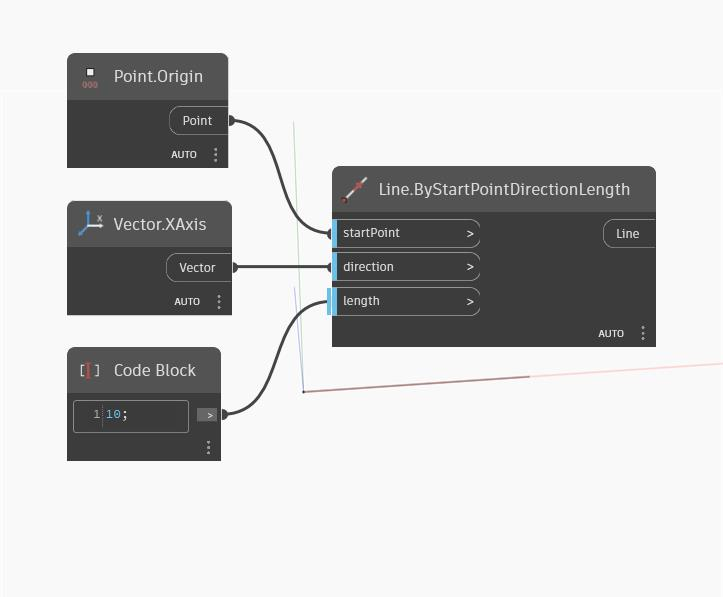

### [Autodesk.DesignScript.Geometry.Vector.Y.dyn](assets/Autodesk.DesignScript.Geometry.Vector.Y.dyn)

### [Autodesk.DesignScript.Geometry.Vector.YAxis.dyn](assets/Autodesk.DesignScript.Geometry.Vector.YAxis.dyn)

### [Autodesk.DesignScript.Geometry.Vector.Z.dyn](assets/Autodesk.DesignScript.Geometry.Vector.Z.dyn)

### [Autodesk.DesignScript.Geometry.Vector.ZAxis.dyn](assets/Autodesk.DesignScript.Geometry.Vector.ZAxis.dyn)

### [Autodesk.DesignScript.Geometry.Vertex.AdjacentEdges.dyn](assets/Autodesk.DesignScript.Geometry.Vertex.AdjacentEdges.dyn)

### [Autodesk.DesignScript.Geometry.Vertex.AdjacentFaces.dyn](assets/Autodesk.DesignScript.Geometry.Vertex.AdjacentFaces.dyn)
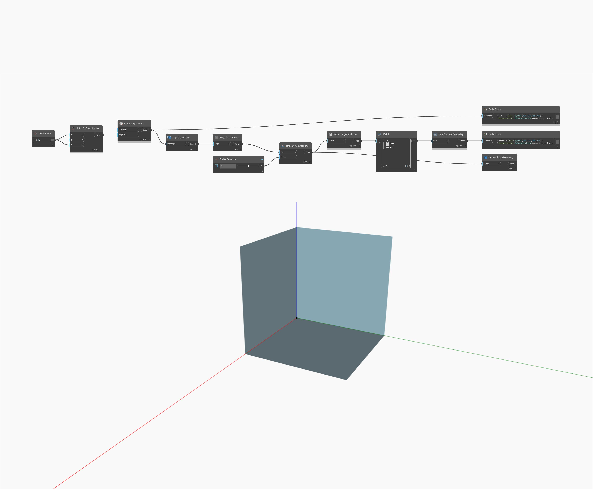

### [Autodesk.DesignScript.Geometry.Vertex.PointGeometry.dyn](assets/Autodesk.DesignScript.Geometry.Vertex.PointGeometry.dyn)

