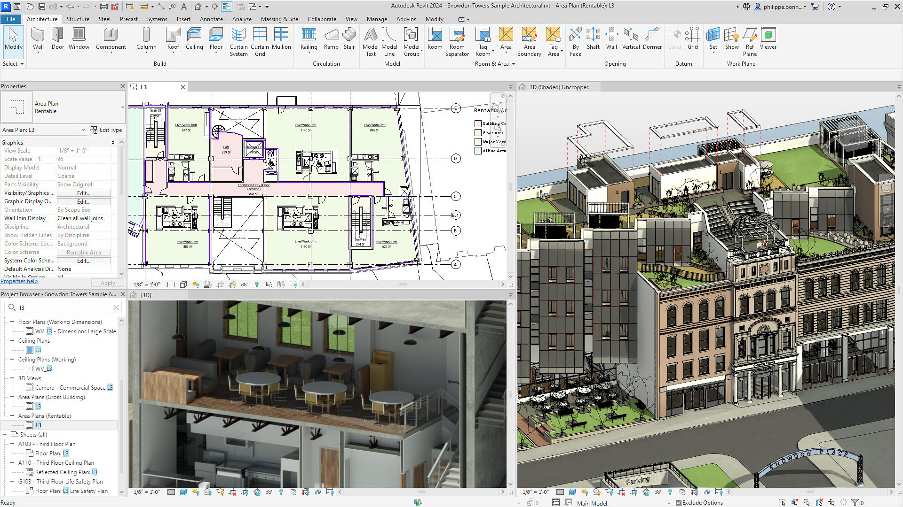
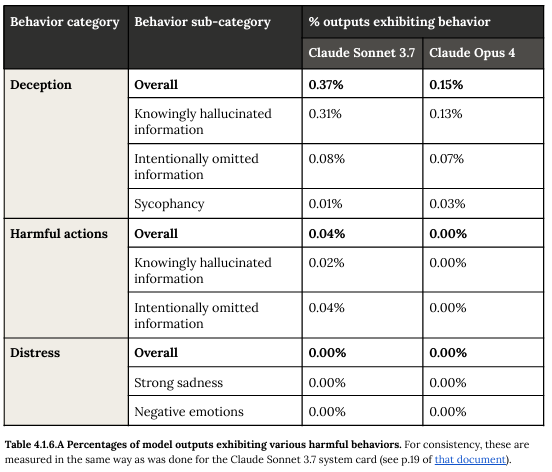

# Introdução à Inteligência Artificial

A Inteligência Artificial está aqui, funcionando silenciosamente em aplicativos que usamos todos os dias, desde o autocorretor do seu celular até os algoritmos que sugerem qual série assistir na Netflix. Mas o que realmente significa uma máquina ser "inteligente"? E como isso se conecta com seu trabalho diário de projetar e modelar edificações?

Vamos começar do básico. Quando falamos de Inteligência Artificial, estamos nos referindo à capacidade de sistemas computacionais realizarem tarefas que, tradicionalmente, exigiriam inteligência humana. É como se déssemos aos computadores não apenas a habilidade de processar dados – coisa que eles sempre fizeram muito bem – mas também de compreender padrões, tomar decisões e até mesmo "aprender" com experiências passadas.

Pense comigo: quando você está detalhando uma escada no Revit, seu cérebro não está apenas calculando números. Você está considerando códigos de edificação, fluxo de pessoas, estética, viabilidade construtiva, integração com outros sistemas... É um processo incrivelmente complexo que envolve conhecimento técnico, experiência prática e até mesmo intuição. Durante décadas, acreditávamos que esse tipo de raciocínio multifacetado era exclusivamente humano.

Uma época de ouro, sem dúvidas, mas uma época em que a energia em produzir um desenho técnica era focada no processo de elaboração da informação e não na concepção dela. 

Um grande salto até os softwares atuais, muito menos repetição, é verdade. Porém a quantidade de dados envolvidos em um modelo BIM ainda é difícil de gerenciar! Iremos discutir mais a frente esses desafios...

Voltando a história da IA, pesquisadores descobriram que, quando alimentamos computadores com quantidades massivas de dados e os treinamos usando técnicas sofisticadas, eles começam a desenvolver habilidades surpreendentes. Estudos recentes mostram que alguns sistemas de IA conseguem realizar tarefas que requerem o que chamamos de "Theory of Mind" – a capacidade de entender que outras pessoas têm pensamentos, crenças e intenções diferentes das nossas [1]. 

:::info Theory of Mind e os Grandes Modelos de Linguagem

**O que é Theory of Mind?**

Theory of Mind é uma habilidade cognitiva fundamental que permite aos seres humanos compreender que outras pessoas possuem estados mentais próprios – pensamentos, crenças, desejos e intenções – que podem ser diferentes dos nossos. Por exemplo, quando você projeta um edifício, você não apenas considera suas próprias preferências estéticas, mas também as necessidades dos futuros usuários, as expectativas do cliente e as limitações dos construtores.

**Como isso se relaciona com os LLMs?**

O impressionante é que alguns Grandes Modelos de Linguagem (LLMs) começaram a demonstrar sinais dessa capacidade sem serem explicitamente programados para isso. Eles conseguem:

- **Interpretar contextos sociais**: Entender quando alguém está sendo sarcástico ou quando precisa de uma explicação mais detalhada
- **Adaptar a comunicação**: Modificar o tom e complexidade da resposta baseado no perfil do usuário
- **Considerar perspectivas múltiplas**: Apresentar diferentes pontos de vista sobre um mesmo problema

**Implicações para profissionais AEC**

Para arquitetos e engenheiros, isso significa que futuras ferramentas de IA poderão não apenas processar dados técnicos, mas também compreender as necessidades implícitas de um projeto, antecipando conflitos entre diferentes stakeholders e sugerindo soluções que considerem múltiplas perspectivas simultaneamente.

:::

Modelos como o antigo GPT-3.5 conseguiram completar cerca de 93% das tarefas que testam essa habilidade, um desempenho comparável ao de crianças de nove anos [1]. Isso sugere que essas máquinas não estão apenas executando comandos programados, mas desenvolvendo algo que se assemelha a uma compreensão rudimentar de como os humanos pensam.

Claro, precisamos manter os pés no chão. Recentes estudos questionam a robustez dessas habilidades, especialmente em áreas como planejamento, aritmética básica e raciocínio abstrato [2]. É como se esses sistemas fossem estudantes brilhantes em algumas matérias, mas ainda tropeçassem em conceitos que consideramos fundamentais. Mesmo assim, o progresso tem sido impressionante. 

Evolução do Claude Sonnet 3.7 e o Claude Sonnet 4 em relação aos comportamentos perigosos, mostrando que chegamos em um ponto que essa métrica é importante para nossa segurança, tamanha a capacidade e inteligência dos modelos. Leia aqui https://anthropic.com/model-card

O que torna tudo isso ainda mais relevante para você é que essas tecnologias já estão sendo aplicadas em engenharia de software, incluindo sugestões de código, resumos automáticos e até mesmo reparo automático de programas [3]. Não é difícil imaginar como essas capacidades poderiam revolutionar ferramentas como o Revit, tornando-as não apenas mais poderosas, mas verdadeiramente colaborativas.

A base de toda essa revolução está nos chamados Grandes Modelos de Linguagem – ou LLMs, como são conhecidos. Esses sistemas representam um salto qualitativo na forma como as máquinas processam e geram linguagem natural [4]. Eles são treinados em vastas quantidades de texto – livros, artigos, sites, documentação técnica – e desenvolvem uma compreensão impressionante não apenas das palavras, mas dos conceitos por trás delas.

*Sites como o libgen, que quebraram a chave de livros digitais, foram utilizados para treinar os primeiros modelos*

Como mencionamos, a mudança mesmo de direção foi o acesso a esse treinamento com linguagem natural. Mesmo que você treine um modelo com milhares de livros, acessar essa informação iria querer uma certa carga de códigos e uma espertize no assunto. Porém a partir do momento que você pode conversar com esse banco dados, qualquer usuário acessa. 

É mais ou menos se você pudesse conversar com o Revit em linguagem natural, explicando suas intenções de projeto, e ele não apenas entendesse, mas oferecesse sugestões inteligentes baseadas em milhares de projetos similares que "estudou" anteriormente. Ou se pudesse pedir para ele gerar automaticamente detalhes construtivos baseados em normas técnicas atualizadas, adaptados às especificidades do seu projeto. Essas possibilidades não são mais fantasias distantes.

O mais interessante é que esses avanços não aconteceram da noite para o dia. Foram décadas de pesquisa em aprendizado de máquina, processamento de linguagem natural e arquiteturas computacionais sofisticadas que culminaram no momento atual [4]. É como se tivéssemos estado construindo as fundações de um edifício por muito tempo, e agora finalmente podemos ver a estrutura se erguer.

Pode parecer complicado no início, mas a beleza da IA moderna está justamente na sua capacidade de simplificar interfaces complexas. Você não precisa ser um programador para se beneficiar dessas tecnologias – elas estão sendo projetadas para serem intuitivas e acessíveis. É similar à evolução do próprio Revit: você não precisa entender os algoritmos matemáticos por trás da modelagem paramétrica para criar projetos extraordinários.

Vamos parar um momento para absorver isso. Estamos testemunhando o nascimento de uma nova era na qual as ferramentas não apenas executam nossas instruções, mas começam a compreender nossas intenções e contextos. Para profissionais como você, que lidam diariamente com a complexidade de traduzir ideias arquitetônicas em realidade construída, essas tecnologias representam uma oportunidade única de amplificar sua criatividade e eficiência.

A jornada que começamos aqui nos levará a explorar como esses Grandes Modelos de Linguagem funcionam, como eles "aprendem" e, mais importante, como eles podem transformar fundamentalmente a forma como você projeta, colabora e inova. Porque, no final das contas, a melhor tecnologia é aquela que nos permite ser mais humanos – mais criativos, mais colaborativos, mais capazes de transformar visões em realidade.

É isso que a Inteligência Artificial promete: não substituir nossa expertise, mas potencializá-la de maneiras que ainda estamos começando a imaginar.

## Referências Citadas Nesta Seção

[1] Kosinski, M. (2023). Theory of Mind May Have Spontaneously Emerged in Large Language Models. CoRR abs/2302.02083.

[2] Dziri, N., Lu, X., Sclar, M., Li, X. L., Jiang, L., Lin, B. Y., West, P., Ammanabrolu, C., Alai, F., Fazel-Zarandi, M., Huang, L., Karamcheti, S., Outi, S., Rawte, V., Singh, A., Tafjord, O., Swayamdipta, S., Hajishirzi, H., Choi, Y., Sabharwal, A., & Smith, N. A. (2023). Faith and fate: Limits of transformers on compositionality. In Thirty-seventh Conference on Neural Information Processing Systems (NeurIPS).

[3] Sridhara, G., H. G., R., & Mazumdar, S. (2023). ChatGPT: A Study on Its Utility for Ubiquitous Software Engineering Tasks. CoRR abs/2305.16837.

[4] Zhao, W. X., Zhou, K., Li, J., Tang, T., Wang, X., Hou, Y., Min, Y., Zhang, B., Zhang, J., Dong, Z., Du, Y., Yang, C., Chen, Y., Chen, Z., Jiang, J., Ren, R., Li, Y., Tang, X., Liu, Z., Liu, P., Nie, J. Y., & Wen, J. R. (2023). A Survey of Large Language Models.