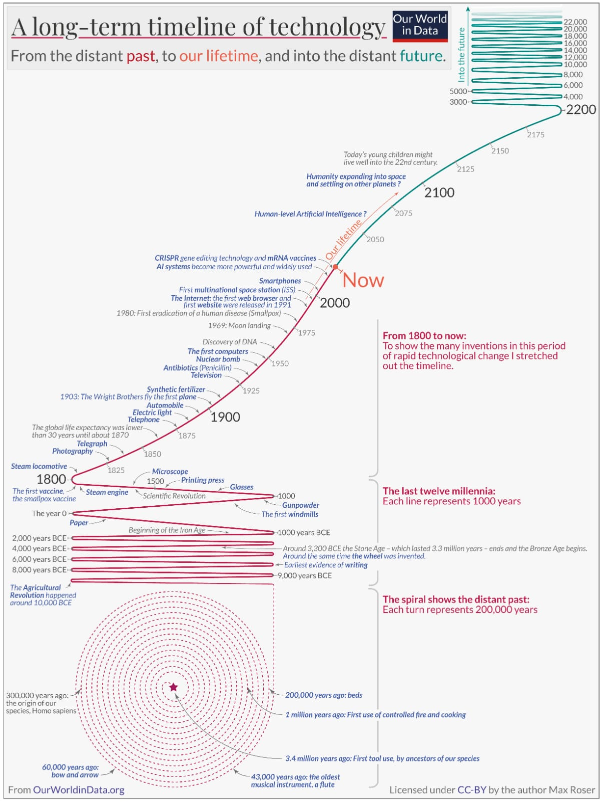

# Artificial Intelligence

Artificial Intelligence is here, working silently in applications we use every day, from your phone's autocorrect to the algorithms that suggest which series to watch on Netflix. But what does it really mean for a machine to be "intelligent"? And how does this connect with your daily work of designing and modeling buildings?

Let's start with the basics. When we talk about Artificial Intelligence, we are referring to the ability of computer systems to perform tasks that would traditionally require human intelligence. It's as if we are giving computers not only the ability to process data—something they have always done very well—but also to understand patterns, make decisions, and even "learn" from past experiences.

Consider this: when you are detailing a staircase in Revit, your brain isn't just calculating numbers. You are considering building codes, people flow, aesthetics, constructability, integration with other systems... It's an incredibly complex process that involves technical knowledge, practical experience, and even intuition. For decades, we believed that this type of multifaceted reasoning was exclusively human.

A golden age, no doubt, but one where the energy put into producing a technical drawing was focused on the process of creating the information, not on its conception.

A great leap to current software, with much less repetition, it's true. However, the amount of data involved in a BIM model is still difficult to manage! We will discuss these challenges later...

Returning to the history of AI, researchers discovered that when we feed computers massive amounts of data and train them using sophisticated techniques, they begin to develop surprising abilities. Recent studies show that some AI systems can perform tasks that require what we call "Theory of Mind"—the ability to understand that other people have thoughts, beliefs, and intentions different from our own [1].

:::info Theory of Mind and Large Language Models

**What is Theory of Mind?**

Theory of Mind is a fundamental cognitive ability that allows humans to understand that other people have their own mental states—thoughts, beliefs, desires, and intentions—that may differ from our own. For example, when you design a building, you not only consider your own aesthetic preferences but also the needs of future users, the client's expectations, and the builders' limitations.

**How does this relate to LLMs?**

What's impressive is that some Large Language Models (LLMs) have begun to show signs of this ability without being explicitly programmed for it. They can:

- **Interpret social contexts**: Understand when someone is being sarcastic or needs a more detailed explanation.
- **Adapt communication**: Modify the tone and complexity of the response based on the user's profile.
- **Consider multiple perspectives**: Present different points of view on the same problem.

**Implications for AEC Professionals**

For architects and engineers, this means that future AI tools may not only process technical data but also understand the implicit needs of a project, anticipating conflicts between different stakeholders and suggesting solutions that consider multiple perspectives simultaneously.

:::

Models like the former GPT-3.5 managed to complete about 93% of the tasks that test this ability, a performance comparable to that of nine-year-old children [1]. This suggests that these machines are not just executing programmed commands, but developing something that resembles a rudimentary understanding of how humans think.

Of course, we need to keep our feet on the ground. Recent studies question the robustness of these abilities, especially in areas like planning, basic arithmetic, and abstract reasoning [2]. It's as if these systems are brilliant students in some subjects but still stumble on concepts we consider fundamental. Even so, the progress has been impressive.

The evolution of models like Claude 3.5 Sonnet and Claude 3 Opus regarding harmful behaviors shows we've reached a point where this safety metric is crucial, given the models' immense capability and intelligence. Read more here: https://anthropic.com/model-card

*The accelerated evolution of AI models demonstrates exponential growth in capabilities, from basic text processing to complex reasoning and multimodality. This progression illustrates how quickly we are transitioning from auxiliary tools to true cognitive partners.*

What makes all this even more relevant to you is that these technologies are already being applied in software engineering, including code suggestions, automatic summaries, and even automatic program repair [3]. It's not hard to imagine how these capabilities could revolutionize tools like Revit, making them not just more powerful, but truly collaborative.

The foundation of this entire revolution lies in what are known as Large Language Models—or LLMs, as they are commonly called. These systems represent a qualitative leap in how machines process and generate natural language [4]. They are trained on vast amounts of text—books, articles, websites, technical documentation—and develop an impressive understanding not just of the words, but of the concepts behind them.

*Sites like LibGen, which unlocked vast digital libraries, were used to train the early models.*

As we mentioned, the real directional shift was the ability to access this training through natural language. Even if you train a model with thousands of books, accessing that information would require a certain amount of code and expertise in the subject. However, from the moment you can converse with this database, any user can access it.

It's as if you could talk to Revit in natural language, explaining your design intentions, and it would not only understand but also offer intelligent suggestions based on thousands of similar projects it has "studied" previously. Or if you could ask it to automatically generate construction details based on updated technical standards, adapted to the specifics of your project. These possibilities are no longer distant fantasies.

What's most interesting is that these advances didn't happen overnight. They are the culmination of decades of research in machine learning, natural language processing, and sophisticated computational architectures [4]. It's as if we have been building the foundations of a building for a long time, and now we can finally see the structure rise.

It might seem complicated at first, but the beauty of modern AI lies precisely in its ability to simplify complex interfaces. You don't need to be a programmer to benefit from these technologies—they are being designed to be intuitive and accessible. It's similar to the evolution of Revit itself: you don't need to understand the mathematical algorithms behind parametric modeling to create extraordinary projects.

Let's pause for a moment to absorb this. We are witnessing the birth of a new era in which tools not only execute our instructions but begin to understand our intentions and contexts. For professionals like you, who deal daily with the complexity of translating architectural ideas into built reality, these technologies represent a unique opportunity to amplify your creativity and efficiency.

The journey we begin here will lead us to explore how these Large Language Models work, how they "learn," and, more importantly, how they can fundamentally transform the way you design, collaborate, and innovate. Because, at the end of the day, the best technology is that which allows us to be more human—more creative, more collaborative, more capable of turning visions into reality.

This is what Artificial Intelligence promises: not to replace our expertise, but to enhance it in ways we are just beginning to imagine.

## References Cited in This Section

[1] Kosinski, M. (2023). Theory of Mind May Have Spontaneously Emerged in Large Language Models. CoRR abs/2302.02083.

[2] Dziri, N., Lu, X., Sclar, M., Li, X. L., Jiang, L., Lin, B. Y., West, P., Ammanabrolu, C., Alai, F., Fazel-Zarandi, M., Huang, L., Karamcheti, S., Outi, S., Rawte, V., Singh, A., Tafjord, O., Swayamdipta, S., Hajishirzi, H., Choi, Y., Sabharwal, A., & Smith, N. A. (2023). Faith and fate: Limits of transformers on compositionality. In Thirty-seventh Conference on Neural Information Processing Systems (NeurIPS).

[3] Sridhara, G., H. G., R., & Mazumdar, S. (2023). ChatGPT: A Study on Its Utility for Ubiquitous Software Engineering Tasks. CoRR abs/2305.16837.

[4] Zhao, W. X., Zhou, K., Li, J., Tang, T., Wang, X., Hou, Y., Min, Y., Zhang, B., Zhang, J., Dong, Z., Du, Y., Yang, C., Chen, Y., Chen, Z., Jiang, J., Ren, R., Li, Y., Tang, X., Liu, Z., Liu, P., Nie, J. Y., & Wen, J. R. (2023). A Survey of Large Language Models.