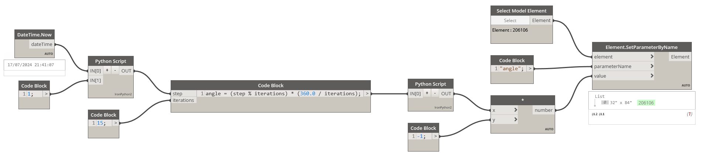

# Scripts Dinâmicos no Dynamo para Revit



<div style={{textAlign: 'center', marginBottom: '2rem'}}>


</div>

## Visão Geral do Script

:::info Conceito
Este tutorial explora como criar scripts dinâmicos no Dynamo que utilizam data e hora atuais para automatizar parâmetros de elementos no Revit, demonstrando aplicações práticas de automação temporal.
:::

O script utiliza os seguintes componentes principais:

1. **Data e Hora Atual**: Utilizamos o nó `DateTime.Now` para obter a data e hora atuais, fornecendo um contexto temporal à operação.
2. **Scripts Python**: Dois scripts Python são empregados para realizar cálculos personalizados.
3. **Iterações e Ângulos**: Um bloco de código calcula o ângulo baseado em iterações, gerando uma sequência de valores.
4. **Seleção de Elemento**: O nó `Select Model Element` permite escolher o elemento específico que terá seus parâmetros alterados.
5. **Definição de Parâmetros**: Finalmente, o nó `Element.SetParameterByName` atualiza o parâmetro do elemento selecionado com o valor calculado.

## Aplicações Práticas

:::tip Casos de Uso
- Ajuste automático de parâmetros de iluminação baseado na hora do dia
- Atualização de ângulos ou posições em elementos estruturais para simulações
- Qualquer cenário onde a automação pode reduzir erros manuais e aumentar a eficiência
:::

## Código e Lógica

### Script Python 1 - Processamento de Tempo

```python
import clr
clr.AddReference('ProtoGeometry')
from Autodesk.DesignScript.Geometry import *

import datetime

# Coleta a hora atual
hora_atual = IN[0]  # Entrada do nó "DateTime.Now"
multiplicador_divisor = IN[1]  # Entrada do valor de multiplicação/divisão (Slider)

# Extrair o valor dos segundos atuais
segundos = hora_atual.Second

# Função para multiplicar e dividir os segundos
def processar_segundos(segundos, valor):
    multiplicado = segundos * valor
    dividido = segundos / valor if valor != 0 else None  # Evitar divisão por zero
    return multiplicado, dividido

# Processa os segundos
resultado_multiplicado, resultado_dividido = processar_segundos(segundos, multiplicador_divisor)

# Assign your output to the OUT variable
OUT = resultado_multiplicado
```

### Script Python 2 - Ajuste de Valores

```python
# Load the Python Standard and DesignScript Libraries
import sys
import clr
clr.AddReference('ProtoGeometry')
from Autodesk.DesignScript.Geometry import *

# The inputs to this node will be stored as a list in the IN variables.
valores_originais = IN[0]

# Place your code below this line
def ajustar_valores(valores):
    # Verifica se a entrada é uma lista, se não for, converte para uma lista
    if not isinstance(valores, list):
        valores = [valores]
        
    valores_ajustados = []
    for valor in valores:
        if valor > 90:
            valores_ajustados.append(90)
        else:
            valores_ajustados.append(valor)
    return valores_ajustados

# Exemplo de uso:
valores_ajustados = ajustar_valores(valores_originais)

# Assign your output to the OUT variable.
OUT = valores_ajustados
```

## Fluxo de Trabalho

:::note Processo
1. **Captura Temporal**: O script captura a hora atual usando `DateTime.Now`
2. **Processamento**: Os segundos são extraídos e processados através de operações matemáticas
3. **Ajuste de Valores**: Os valores são limitados a um máximo de 90 graus
4. **Aplicação**: O valor final é aplicado ao parâmetro do elemento selecionado no Revit
:::

Este exemplo demonstra como o Dynamo pode ser usado para criar automações baseadas em tempo, abrindo possibilidades para simulações mais realistas e dinâmicas no Revit.
