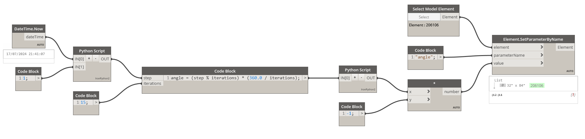

# Dynamic Scripts in Dynamo for Revit



<div style={{textAlign: 'center', marginBottom: '2rem'}}>


</div>

## Script Overview

:::info Concept
This tutorial explores how to create dynamic scripts in Dynamo that use the current date and time to automate element parameters in Revit, demonstrating practical applications of time-based automation.
:::

The script uses the following main components:

1.  **Current Date and Time**: We use the `DateTime.Now` node to get the current date and time, providing a temporal context to the operation.
2.  **Python Scripts**: Two Python scripts are used to perform custom calculations.
3.  **Iterations and Angles**: A code block calculates the angle based on iterations, generating a sequence of values.
4.  **Element Selection**: The `Select Model Element` node allows you to choose the specific element whose parameters will be changed.
5.  **Parameter Setting**: Finally, the `Element.SetParameterByName` node updates the parameter of the selected element with the calculated value.

## Practical Applications

:::tip Use Cases
- Automatic adjustment of lighting parameters based on the time of day.
- Updating angles or positions in structural elements for simulations.
- Any scenario where automation can reduce manual errors and increase efficiency.
:::

## Code and Logic

### Python Script 1 - Time Processing

```python
import clr
clr.AddReference('ProtoGeometry')
from Autodesk.DesignScript.Geometry import *

import datetime

# Collect the current time
hora_atual = IN[0]  # Input from the "DateTime.Now" node
multiplicador_divisor = IN[1]  # Input for the multiplication/division value (Slider)

# Extract the current seconds value
segundos = hora_atual.Second

# Function to multiply and divide the seconds
def processar_segundos(segundos, valor):
    multiplicado = segundos * valor
    dividido = segundos / valor if valor != 0 else None  # Avoid division by zero
    return multiplicado, dividido

# Process the seconds
resultado_multiplicado, resultado_dividido = processar_segundos(segundos, multiplicador_divisor)

# Assign your output to the OUT variable
OUT = resultado_multiplicado
```

### Python Script 2 - Value Adjustment

```python
# Load the Python Standard and DesignScript Libraries
import sys
import clr
clr.AddReference('ProtoGeometry')
from Autodesk.DesignScript.Geometry import *

# The inputs to this node will be stored as a list in the IN variables.
valores_originais = IN[0]

# Place your code below this line
def ajustar_valores(valores):
    # Checks if the input is a list; if not, converts it to a list
    if not isinstance(valores, list):
        valores = [valores]
        
    valores_ajustados = []
    for valor in valores:
        if valor > 90:
            valores_ajustados.append(90)
        else:
            valores_ajustados.append(valor)
    return valores_ajustados

# Example of use:
valores_ajustados = ajustar_valores(valores_originais)

# Assign your output to the OUT variable.
OUT = valores_ajustados
```

## Workflow

:::note Process
1.  **Time Capture**: The script captures the current time using `DateTime.Now`.
2.  **Processing**: The seconds are extracted and processed through mathematical operations.
3.  **Value Adjustment**: The values are limited to a maximum of 90 degrees.
4.  **Application**: The final value is applied to the parameter of the selected element in Revit.
:::

This example demonstrates how Dynamo can be used to create time-based automations, opening up possibilities for more realistic and dynamic simulations in Revit.
```