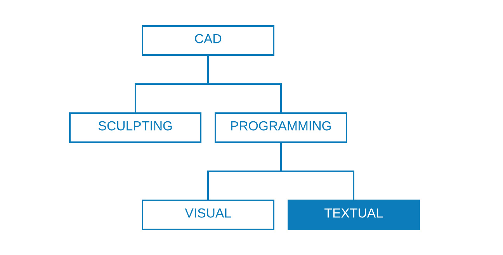

# Modern Scripting Strategies in Dynamo

:::info Original Source & AI Enhancement
This content is based on the [Dynamo Primer - Scripting Strategies](https://primer.dynamobim.org/13_Best-Practice/13-1_Scripting-Strategies.html) and updated with modern AI-assisted development practices.
:::

Text-based scripting within the visual programming environment enables powerful and visual relationships using **DesignScript**, **Python**, and **ZeroTouch (C#)**. Users can expose elements such as input sliders, condense large operations into DesignScript, and access powerful tools and libraries through Python or C# - all within the same workspace.

In today's AI-powered development landscape, these capabilities are significantly enhanced by AI assistants like **ChatGPT**, **GitHub Copilot**, and **Claude**, which can help generate, debug, and optimize code in real-time. This guide covers both traditional best practices and modern AI-assisted workflows.



## Know When to Script

Text-scripting can establish relationships of higher complexity than visual programming, yet their capabilities also overlap significantly. This makes sense because nodes are effectively pre-packaged code, and we could probably write an entire Dynamo program in DesignScript or Python. However, we use visual-scripting because the interface of nodes and wires creates an intuitive flow of graphic information.

### Traditional Use Cases for Text-Scripting

Use text-scripting for:

- **Looping** - Complex iterations beyond simple node repetition
- **Recursion** - Self-referencing algorithms
- **Accessing external libraries** - Third-party Python packages, .NET assemblies
- **Complex data manipulation** - Advanced list operations, filtering, sorting
- **Mathematical computations** - Complex algorithms and calculations

### Language Comparison

| Feature | DesignScript | Python | ZeroTouch (C#) |
|---------|-------------|--------|----------------|
| Looping | ✅ Yes | ✅ Yes | ❌ No |
| Recursion | ✅ Yes | ✅ Yes | ❌ No |
| Condense Nodes | ✅ Yes | ⚠️ Partially | ❌ No |
| External Libraries | ❌ No | ✅ Yes | ✅ Yes |
| Shorthand Syntax | ✅ Yes | ❌ No | ❌ No |

:::tip AI-Assisted Development
With modern AI tools like **ChatGPT** and **GitHub Copilot**, you can now generate complex scripts by simply describing what you want to achieve. For example:
- "Create a Python script that generates a spiral staircase with parametric steps"
- "Write DesignScript code to optimize panel placement on a curved surface"
- "Generate C# code to read Excel data and create Dynamo geometry"
:::

## AI-Enhanced Scripting Workflow

### 1. Problem Definition with AI Assistance

Modern development starts with clearly describing your problem to an AI assistant:

```
Prompt: "I need to create a Python script in Dynamo that:
- Takes a surface as input
- Divides it into panels based on UV coordinates
- Optimizes panel sizes to minimize waste
- Outputs panel geometry and cutting data"
```

### 2. AI-Generated Code Templates

AI can provide complete working templates that you can customize:

```python
# AI-generated template for surface panelization
import clr
clr.AddReference('ProtoGeometry')
from Autodesk.DesignScript.Geometry import *
import math

# Input parameters
surface = IN[0]
u_divisions = IN[1]
v_divisions = IN[2]

# AI can help generate the complete algorithm
def panelize_surface(surf, u_div, v_div):
    panels = []
    for i in range(u_div):
        for j in range(v_div):
            # UV parameters
            u_start = i / u_div
            u_end = (i + 1) / u_div
            v_start = j / v_div
            v_end = (j + 1) / v_div
            
            # Create panel surface
            panel = surf.TrimByUVParameters(u_start, u_end, v_start, v_end)
            panels.append(panel)
    
    return panels

OUT = panelize_surface(surface, u_divisions, v_divisions)
```

### 3. Iterative Development with AI

Modern workflows involve continuous collaboration with AI:

```
Initial Prompt: "Create a basic surface walker"
Follow-up: "Add collision detection"
Refinement: "Optimize for performance with large datasets"
Enhancement: "Add visualization and data export"
```

## Think Parametrically

When scripting in Dynamo, an inevitably parametric environment, it is wise to structure your code relative to the framework of nodes and wires it will be living in. Consider the node containing your text-script as though it is any other node in the program with a few specific inputs, a function, and an expected output.

### Identify External Variables

Try to determine the given parameters in your design problem so that you can construct a model that directly builds off that data.

**Before writing code, identify:**
- A minimal set of inputs
- The intended output
- Constants
- Variables

:::info AI Prompting for Parameter Identification
You can ask AI to help identify parameters:
```
"Analyze this design problem and suggest optimal input parameters: 
[describe your problem]"
```
:::

### Design Internal Relationships

Parametricism allows certain parameters or variables to be edited to manipulate or alter the end result of an equation or system.

**Key principles:**
- Whenever entities in your script are logically related, define them as functions of each other
- When one is modified, the other can update proportionally
- Minimize inputs by only exposing key parameters

### Don't Repeat Yourself (DRY Principle)

When you have multiple ways to express the same thing in your script, duplicate representations will eventually fall out of sync, leading to maintenance issues.

**The DRY principle states:** *"Every piece of knowledge must have a single, unambiguous, authoritative representation within a system"*

#### BAD Example
```python
for i in range(4):
  for j in range(4):
    point = Point.ByCoordinates(3*i, 3*j, 0)
    points.append(point)
```

#### GOOD Example
```python
count = IN[0]
pDist = IN[1]

for i in range(count):
  for j in range(count):
    point = Point.ByCoordinates(pDist*i, pDist*j, 0)
    points.append(point)
```

:::tip AI Code Refactoring
AI can help you refactor code to follow DRY principles:
```
"Refactor this code to eliminate duplication and make it more parametric: 
[paste your code]"
```
:::

## Structure Modularly

As your code gets longer and more complex, the "big idea" or overarching algorithm becomes increasingly illegible. It also becomes more difficult to keep track of what (and where) specific things happen, find bugs when things go wrong, integrate other code, and assign development tasks.

### Write Code in Modules

A "module" is a group of code that performs a specific task, similar to a Dynamo Node in the workspace.

**Benefits of modular design:**
- Visual separation of different functionalities
- Easier debugging and maintenance
- Code reusability across projects
- Better collaboration with team members

### AI-Assisted Module Development

Modern AI tools can help you structure your code modularly:

```
Prompt: "Break down this complex algorithm into modular functions:
[describe your algorithm or paste existing code]"
```

### Forms of Modularization

#### Code Grouping:

```python
# IMPORT LIBRARIES
import random
import math
import clr
clr.AddReference('ProtoGeometry')
from Autodesk.DesignScript.Geometry import *

# DEFINE PARAMETER INPUTS
surfIn = IN[0]
maxSteps = IN[1]
```

#### Functions:

```python
def get_step_size(surface):
    """Calculate optimal step size based on surface area"""
    area = surface.Area
    stepSize = math.sqrt(area) / 100
    return stepSize

def validate_inputs(surface, steps):
    """Validate input parameters before processing"""
    if surface is None:
        raise ValueError("Surface cannot be None")
    if steps <= 0:
        raise ValueError("Steps must be positive")
    return True
```

#### Classes:

```python
class SurfaceAgent:
    """AI-generated class for surface navigation"""
    def __init__(self, start_point, surface, step_size=1.0):
        self.position = start_point
        self.surface = surface
        self.step_size = step_size
        self.trail = [start_point]
        self.active = True
    
    def find_steepest_direction(self):
        """AI can generate complex gradient calculation"""
        # Implementation would go here
        pass
    
    def move_step(self):
        """Move agent one step in steepest direction"""
        if not self.active:
            return False
        
        direction = self.find_steepest_direction()
        new_position = self.calculate_new_position(direction)
        
        if self.is_valid_position(new_position):
            self.position = new_position
            self.trail.append(new_position)
            return True
        else:
            self.active = False
            return False
    
    def get_trail_geometry(self):
        """Convert trail points to PolyCurve"""
        if len(self.trail) < 2:
            return None
        return PolyCurve.ByPoints(self.trail)
```

:::tip AI-Generated Classes
You can ask AI to create complete classes:
```
"Create a Python class for a surface-walking agent in Dynamo that:
- Tracks its position and movement history
- Can find the steepest descent direction
- Has methods for stepping and trail generation"
```
:::

## Test Continuously with AI Assistance

While developing text-scripts in Dynamo, constantly ensure that what is being created aligns with expectations. Modern AI tools can help with testing strategies and edge case identification.

### AI-Enhanced Testing

```python
# AI can help generate comprehensive test cases
def test_surface_agent():
    """AI-generated test function"""
    # Create test surface
    test_surface = Surface.ByPerimeterPoints([
        Point.ByCoordinates(0, 0, 0),
        Point.ByCoordinates(10, 0, 5),
        Point.ByCoordinates(10, 10, 0),
        Point.ByCoordinates(0, 10, 2)
    ])
    
    # Test agent creation
    start_point = Point.ByCoordinates(5, 5, 3)
    agent = SurfaceAgent(start_point, test_surface)
    
    # Test movement
    initial_position = agent.position
    success = agent.move_step()
    
    # Validate results
    assert success or not agent.active
    assert len(agent.trail) >= 1
    
    return "Tests passed"

# Include test in output for verification
test_result = test_surface_agent()
```

### Edge Case Detection with AI

Ask AI to help identify potential issues:

```
Prompt: "What edge cases should I test for in this surface navigation algorithm:
- Flat surfaces with no gradient
- Surfaces with holes or gaps  
- Very small or very large surfaces
- Invalid input parameters"
```

## Debug Efficiently with AI

Debugging is the process of eliminating "bugs" from your script. Modern AI assistants can significantly speed up the debugging process.

### AI-Powered Debugging Workflow

1. **Describe the problem to AI:**
```
"My Dynamo Python script is returning None instead of geometry. 
Here's the code: [paste code]
The inputs are: [describe inputs]
Expected output: [describe expected result]"
```

2. **AI-assisted error analysis:**
```python
# AI can suggest adding debug prints
print(f"Surface type: {type(surface)}")
print(f"Surface area: {surface.Area if surface else 'None'}")
print(f"Agent count: {len(agents)}")

# AI can recommend validation checks
if surface is None:
    OUT = "Error: No surface provided"
elif surface.Area < 0.1:
    OUT = "Warning: Surface too small"
else:
    OUT = process_surface(surface)
```

3. **AI code review:**
```
"Review this code for potential bugs and suggest improvements:
[paste your code]"
```

### Common AI-Suggested Debug Techniques

```python
# 1. Incremental output assignment
# Test each step by assigning to OUT
OUT = surface  # Step 1: Check surface input
# OUT = agents  # Step 2: Check agent creation  
# OUT = trails  # Step 3: Check trail generation

# 2. Comprehensive error handling
try:
    result = complex_operation(inputs)
    OUT = result
except Exception as e:
    OUT = f"Error: {str(e)}"

# 3. Data validation
def validate_and_process(data):
    """AI-generated validation function"""
    if not data:
        return "No data provided"
    
    if not isinstance(data, (list, tuple)):
        return "Data must be a list or tuple"
    
    if len(data) == 0:
        return "Data list is empty"
    
    return process_data(data)
```

## Practical AI Prompting Examples

### For Complex Geometry Operations
```
"Create a Python script in Dynamo that generates a parametric facade system:
- Input: Building surface, panel width, panel height
- Generate adaptive panels that follow surface curvature  
- Include mounting points and connection details
- Output: Panel geometry, mounting points, cut sheets"
```

### For Data Processing
```
"Write a script that processes Excel data in Dynamo:
- Read room data from Excel (name, area, function)
- Create room geometries based on coordinates
- Apply materials based on room function
- Generate reports with area calculations"
```

### For Optimization Problems
```
"Develop an algorithm that optimizes parking lot layout:
- Input: Site boundary, car dimensions, circulation requirements
- Maximize parking spaces while meeting code requirements
- Include accessible parking distribution
- Output: Parking layout, space count, efficiency metrics"
```

## Best Practices Summary

### Traditional Principles (Still Valid)
1. **Know when to script** - Use text for complex logic, loops, and external libraries
2. **Think parametrically** - Design for flexibility and reusability
3. **Structure modularly** - Break complex problems into smaller, manageable pieces
4. **Test continuously** - Validate outputs at each development stage
5. **Debug systematically** - Use methodical approaches to find and fix issues

### Modern AI-Enhanced Practices
1. **Start with AI consultation** - Describe your problem clearly to get better solutions
2. **Iterate with AI feedback** - Use AI for code review, optimization, and debugging
3. **Leverage AI for learning** - Ask AI to explain complex concepts and algorithms
4. **Use AI for documentation** - Generate comments, docstrings, and user guides
5. **Combine human creativity with AI efficiency** - Focus on design intent while AI handles implementation details

:::warning Important Note
While AI can generate sophisticated code quickly, always:
- Understand what the code does before using it
- Test thoroughly with your specific data
- Validate results against expected outcomes
- Consider performance implications for large datasets
:::

## Conclusion

The integration of AI into Dynamo scripting workflows represents a paradigm shift in how we approach computational design. By combining traditional best practices with modern AI assistance, developers can create more sophisticated, robust, and maintainable scripts in less time.

The key is to use AI as a collaborative partner rather than a replacement for understanding. AI excels at generating code templates, suggesting optimizations, and helping with debugging, while human expertise remains crucial for design intent, validation, and creative problem-solving.

As AI tools continue to evolve, staying current with both traditional programming principles and modern AI-assisted workflows will be essential for maximizing productivity in Dynamo development.
