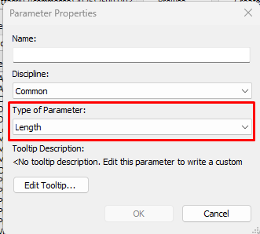
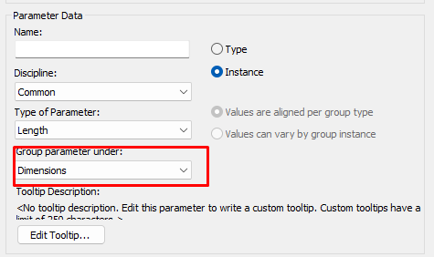
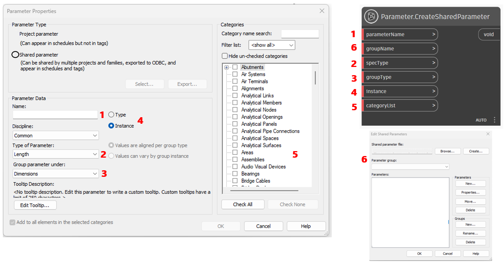
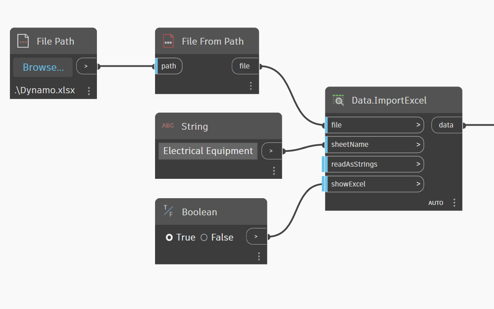
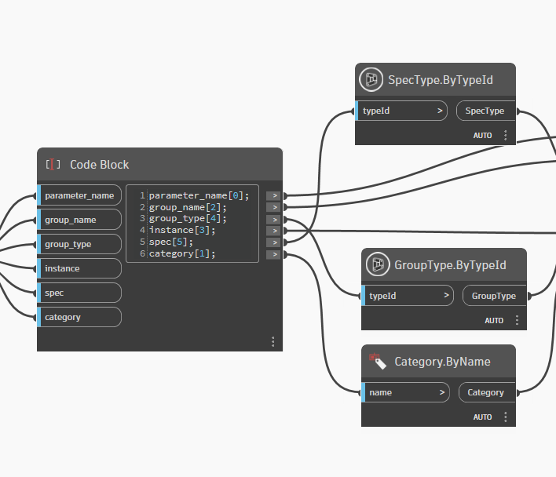
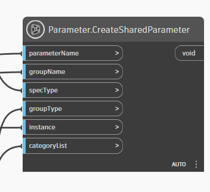

# Automatic Shared Parameter Builder

This practical guide teaches you how to create shared parameters using Dynamo and Revit. While this is a well-established topic with many available plugins and scripts, the main challenge lies in properly configuring the **Spec Types** and **Group Types**, since these are not simple text strings but require specific data types that Revit can understand.

## Understanding Parameter Types

### Spec Type (Type of Parameter)
The Spec Type defines what kind of data the parameter will store - whether it's text, numbers, measurements, electrical values, etc.



### Group Type 
The Group Type determines which section the parameter will appear in within Revit's Properties panel - such as Dimensions, Identity Data, Electrical, Mechanical, etc.



## The Dynamo Approach

Creating a shared parameter with Dynamo is straightforward - you just need to find the right node. Here's an overview of the parameters we need to consider: 



### Script Workflow (Left to Right)

This workflow breaks down the process into 5 clear steps, each handling a specific part of the parameter creation process:

#### 1️⃣ **Data Input (File Path)**
- **What it does**: Locates your Excel file containing parameter definitions
- **For you**: Simply paste the complete file path to your Excel file
- **Example**: `C:\Users\YourName\Desktop\MyParameters.xlsx`
- **Important**: Make sure the Excel file is closed before running the script



#### 2️⃣ **Excel Reading (Data.ImportExcel)**
- **What it does**: Reads all rows and columns from your Excel spreadsheet
- **Important**: All data comes out as **plain text** (strings)
- **Why this matters**: Revit needs specific object types, not just text strings
- **Result**: Raw data that needs to be converted to Revit-compatible formats

#### 3️⃣ **Data Conversion (List.Deconstruct + List.Transpose)**
- **What it does**: Separates each Excel column into individual lists for processing
- **For you**: No configuration needed - this works automatically
- **Result**: 6 separate lists (one for each column: name, category, group, instance/type, grouptype, spectype)
- **Why needed**: Dynamo processes lists more efficiently than tables


#### 4️⃣ **Forge Conversion (TypeId Nodes)**
- **What it does**: Converts Excel text strings into proper Revit object types
- **SpecType.ByTypeId**: Converts spec type strings (like "autodesk.spec:spec.string-2.0.0") into SpecTypeId objects
- **GroupType.ByTypeId**: Converts group type strings into GroupTypeId objects  
- **Category.ByName**: Converts category names (like "Walls") into Category objects



:::warning Why Do We Need Forge Conversion?
Excel stores everything as text, but Revit's API requires specific object types. For example:
- **Excel stores**: `"autodesk.spec:spec.string-2.0.0"` (just text)
- **Revit needs**: A proper `SpecTypeId` object

The Forge nodes do this "translation" automatically, converting text strings into the proper Revit API objects!
:::

#### 5️⃣ **Parameter Creation (Parameter.CreateSharedParameter)**
- **What it does**: Finally creates the actual Shared Parameters in your Revit project
- **Receives**: All the converted data from the previous steps (proper Revit objects, not text)
- **Result**: Parameters appear in your Revit project and Properties panel
- **Success indicator**: Parameters will be visible in the Revit interface immediately



### Key Nodes Explained

Understanding each node's role will help you troubleshoot and customize the workflow:

| Node | Function | Why It's Critical |
|------|----------|-------------------|
| `Data.ImportExcel` | Reads Excel file data | **Entry point** - all your parameter definitions start here |
| `List.Deconstruct` | Separates columns into individual lists | **Data organization** - prepares data for parallel processing |
| `List.Transpose` | Reorganizes list structure | **Data alignment** - ensures proper data flow to conversion nodes |
| `SpecType.ByTypeId` | Converts spec type text to Revit objects | **Critical conversion** - wrong spec = parameter won't work |
| `GroupType.ByTypeId` | Converts group text to Revit objects | **UI placement** - determines where parameter appears in Properties |
| `Category.ByName` | Converts category names to Revit objects | **Element targeting** - defines which Revit elements get the parameter |
| `Parameter.CreateSharedParameter` | Creates the actual parameters | **Final execution** - the moment parameters are born in Revit |

---

## ① Quick Start Guide

Follow these steps to create your first shared parameters:

1. **Prepare your data**: Copy the **Blank Template** (section ③) into a new Excel file
2. **Fill parameter details**: Add your parameter information row by row. Use the **Forge ID Reference Guide** (section ⑤) to find valid *groupType* and *specType* values
3. **Save and locate**: Save your Excel file and copy its complete file path
4. **Configure Dynamo**: Paste the file path into the **File Path** node in the Dynamo script
5. **Execute**: Press **Run** in Dynamo - your Shared Parameters will immediately appear in Revit

**Pro tip**: Start with just 1-2 parameters to test the workflow before creating larger batches.

---

## ② Column Definitions

Your Excel file must have exactly these 6 columns in this exact order:

| Column | Purpose | Examples | Notes |
| ------------------- | ----------------------------------------------------------- | ----------------------------------------------------------- | ----------------------------------------------------------- |
| **parameter_Name** | The exact name that will appear in Revit's Properties panel | `ELEC_PANEL_RATING`, `STRUCT_BEAM_CAPACITY` | **No spaces in middle recommended** - use underscores |
| **category** | Which Revit elements will get this parameter | `Walls`, `Doors`, `Electrical Equipment` | **Multiple categories**: separate with `;` like `Walls;Doors;Windows` |
| **groupName** | Custom folder name in the Properties palette | `Electrical Analysis`, `Custom Dimensions` | **Creates new sections** in Properties panel |
| **instance/Type** | Parameter applies to individual elements or element types | `TRUE` → Instance parameter<br/>`FALSE` → Type parameter | **Instance**: varies per element<br/>**Type**: shared across all elements of same type |
| **grouptype** | Predefined Revit property section | `autodesk.parameter.group:electrical-1.0.0` | **Must be exact match** from Forge list - controls where parameter appears |
| **spectype** | Data type and units the parameter will store | `autodesk.spec:spec.string-2.0.0` (text)<br/>`autodesk.spec.aec:length-2.0.0` (length) | **Must be exact match** from Forge list - determines what data types are allowed |

---

## ③ Blank Template - Copy to Excel

Copy this header row into your Excel file exactly as shown (tab-separated):

```text
parameter_Name	category	groupName	instance/Type	grouptype	spectype
```

**Important**: Make sure to use **Tab** characters between columns, not spaces.

---

## ④ Complete Working Example

Here's a ready-to-use example for elevator equipment parameters. Copy this into Excel to test the workflow:

```text
parameter_Name	category	groupName	instance/Type	grouptype	spectype
SRE_ELEVATOR_TYPE	Specialty Equipment	Specialty Equipment_SRE	FALSE	autodesk.parameter.group:identityData-1.0.0	autodesk.spec:spec.string-2.0.0
SRE_ELEVATOR_DRIVE_TYPE	Specialty Equipment	Specialty Equipment_SRE	FALSE	autodesk.parameter.group:identityData-1.0.0	autodesk.spec:spec.string-2.0.0
SRE_ELEVATOR_STOPS	Specialty Equipment	Specialty Equipment_SRE	TRUE	autodesk.parameter.group:identityData-1.0.0	autodesk.spec.aec:number-2.0.0
SRE_ELEVATOR_DOORS	Specialty Equipment	Specialty Equipment_SRE	TRUE	autodesk.parameter.group:identityData-1.0.0	autodesk.spec.aec:number-2.0.0
SRE_ELEVATOR_LOAD	Specialty Equipment	Specialty Equipment_SRE	FALSE	autodesk.parameter.group:identityData-1.0.0	autodesk.spec.aec:number-2.0.0
```

**What this creates**:
- 5 parameters for Specialty Equipment category
- Custom group called "Specialty Equipment_SRE" in Properties panel
- Mix of text (TYPE, DRIVE_TYPE) and numeric (STOPS, DOORS, LOAD) parameters
- Some instance-level (STOPS, DOORS) and some type-level (TYPE, DRIVE_TYPE, LOAD) parameters

---

## ⑤ Complete Forge ID Reference Guide

This section provides all the valid **SpecType** and **GroupType** identifiers you need. Always copy these exactly as shown - they're case-sensitive and must match perfectly.

### 📋 Quick Reference Table (SpecType + GroupType)

| SpecType | GroupType | Description |
|----------|-----------|-------------|
| `autodesk.spec.aec.electrical:apparentPower-2.0.0` | `autodesk.parameter.group:electrical-1.0.0` | Electrical apparent power |
| `autodesk.spec.aec.electrical:current-2.0.0` | `autodesk.parameter.group:electrical-1.0.0` | Electrical current |
| `autodesk.spec.aec.electrical:power-2.0.0` | `autodesk.parameter.group:electrical-1.0.0` | Electrical power |
| `autodesk.spec.aec.hvac:airFlow-2.0.0` | `autodesk.parameter.group:mechanical-1.0.0` | HVAC air flow |
| `autodesk.spec.aec.hvac:temperature-2.0.0` | `autodesk.parameter.group:mechanical-1.0.0` | Temperature |
| `autodesk.spec.aec.piping:flow-2.0.0` | `autodesk.parameter.group:mechanical-1.0.0` | Piping flow |
| `autodesk.spec.aec.structural:force-2.0.0` | `autodesk.parameter.group:identityData-1.0.0` | Structural force |
| `autodesk.spec.aec:area-2.0.0` | `autodesk.parameter.group:dimensions-1.0.0` | Area measurement |
| `autodesk.spec.aec:length-2.0.0` | `autodesk.parameter.group:dimensions-1.0.0` | Length measurement |
| `autodesk.spec.aec:volume-2.0.0` | `autodesk.parameter.group:dimensions-1.0.0` | Volume measurement |
| `autodesk.spec.aec:number-2.0.0` | `autodesk.parameter.group:identityData-1.0.0` | Numeric value |
| `autodesk.spec:spec.string-2.0.0` | `autodesk.parameter.group:identityData-1.0.0` | Text string |
| `autodesk.spec:spec.bool-1.0.0` | `autodesk.parameter.group:identityData-1.0.0` | True/False |

<details>
<summary><strong>All Available GroupTypes</strong></summary>

```text
autodesk.parameter.group:identityData-1.0.0
autodesk.parameter.group:dimensions-1.0.0
autodesk.parameter.group:constraints-1.0.0
autodesk.parameter.group:electrical-1.0.0
autodesk.parameter.group:mechanical-1.0.0
autodesk.parameter.group:mechanicalAirflow-1.0.0
autodesk.parameter.group:ifc-1.0.0
autodesk.parameter.group:materials-1.0.0
```

</details>

<details>
<summary><strong>Complete SpecType List - All Categories</strong></summary>

```text
autodesk.spec.aec.electrical:apparentPower-2.0.0
autodesk.spec.aec.electrical:apparentPowerDensity-1.0.0
autodesk.spec.aec.electrical:cableTraySize-2.0.0
autodesk.spec.aec.electrical:colorTemperature-2.0.0
autodesk.spec.aec.electrical:conduitSize-2.0.0
autodesk.spec.aec.electrical:costRateEnergy-2.0.0
autodesk.spec.aec.electrical:costRatePower-2.0.0
autodesk.spec.aec.electrical:current-2.0.0
autodesk.spec.aec.electrical:demandFactor-2.0.0
autodesk.spec.aec.electrical:efficacy-2.0.0
autodesk.spec.aec.electrical:frequency-2.0.0
autodesk.spec.aec.electrical:illuminance-2.0.0
autodesk.spec.aec.electrical:luminance-2.0.0
autodesk.spec.aec.electrical:luminousFlux-2.0.0
autodesk.spec.aec.electrical:luminousIntensity-2.0.0
autodesk.spec.aec.electrical:potential-2.0.0
autodesk.spec.aec.electrical:power-2.0.0
autodesk.spec.aec.electrical:powerDensity-2.0.0
autodesk.spec.aec.electrical:powerPerLength-2.0.0
autodesk.spec.aec.electrical:resistivity-2.0.0
autodesk.spec.aec.electrical:temperature-2.0.0
autodesk.spec.aec.electrical:temperatureDifference-2.0.0
autodesk.spec.aec.electrical:wattage-2.0.0
autodesk.spec.aec.electrical:wireDiameter-2.0.0
autodesk.spec.aec.electrical:loadClassification-1.0.0
autodesk.spec.aec.energy:energy-2.0.0
autodesk.spec.aec.energy:heatCapacityPerArea-2.0.0
autodesk.spec.aec.energy:heatTransferCoefficient-2.0.0
autodesk.spec.aec.energy:isothermalMoistureCapacity-2.0.0
autodesk.spec.aec.energy:permeability-2.0.0
autodesk.spec.aec.energy:specificHeat-2.0.0
autodesk.spec.aec.energy:specificHeatOfVaporization-2.0.0
autodesk.spec.aec.energy:thermalConductivity-2.0.0
autodesk.spec.aec.energy:thermalGradientCoefficientForMoistureCapacity-2.0.0
autodesk.spec.aec.energy:thermalMass-2.0.0
autodesk.spec.aec.energy:thermalResistance-2.0.0
autodesk.spec.aec.hvac:airFlow-2.0.0
autodesk.spec.aec.hvac:airFlowDensity-2.0.0
autodesk.spec.aec.hvac:airFlowDividedByCoolingLoad-2.0.0
autodesk.spec.aec.hvac:airFlowDividedByVolume-2.0.0
autodesk.spec.aec.hvac:angularSpeed-2.0.0
autodesk.spec.aec.hvac:areaDividedByCoolingLoad-2.0.0
autodesk.spec.aec.hvac:areaDividedByHeatingLoad-2.0.0
autodesk.spec.aec.hvac:coolingLoad-2.0.0
autodesk.spec.aec.hvac:coolingLoadDividedByArea-2.0.0
autodesk.spec.aec.hvac:coolingLoadDividedByVolume-2.0.0
autodesk.spec.aec.hvac:crossSection-2.0.0
autodesk.spec.aec.hvac:density-2.0.0
autodesk.spec.aec.hvac:diffusivity-2.0.0
autodesk.spec.aec.hvac:ductInsulationThickness-2.0.0
autodesk.spec.aec.hvac:ductLiningThickness-2.0.0
autodesk.spec.aec.hvac:ductSize-2.0.0
autodesk.spec.aec.hvac:factor-2.0.0
autodesk.spec.aec.hvac:flowPerPower-2.0.0
autodesk.spec.aec.hvac:friction-2.0.0
autodesk.spec.aec.hvac:heatGain-2.0.0
autodesk.spec.aec.hvac:heatingLoad-2.0.0
autodesk.spec.aec.hvac:heatingLoadDividedByArea-2.0.0
autodesk.spec.aec.hvac:heatingLoadDividedByVolume-2.0.0
autodesk.spec.aec.hvac:massPerTime-2.0.0
autodesk.spec.aec.hvac:power-2.0.0
autodesk.spec.aec.hvac:powerDensity-2.0.0
autodesk.spec.aec.hvac:powerPerFlow-2.0.0
autodesk.spec.aec.hvac:pressure-2.0.0
autodesk.spec.aec.hvac:roughness-2.0.0
autodesk.spec.aec.hvac:slope-2.0.0
autodesk.spec.aec.hvac:temperature-2.0.0
autodesk.spec.aec.hvac:temperatureDifference-2.0.0
autodesk.spec.aec.hvac:velocity-2.0.0
autodesk.spec.aec.hvac:viscosity-2.0.0
autodesk.spec.aec.infrastructure:stationing-2.0.0
autodesk.spec.aec.infrastructure:stationingInterval-2.0.0
autodesk.spec.aec.piping:density-2.0.0
autodesk.spec.aec.piping:flow-2.0.0
autodesk.spec.aec.piping:friction-2.0.0
autodesk.spec.aec.piping:mass-2.0.0
autodesk.spec.aec.piping:massPerTime-2.0.0
autodesk.spec.aec.piping:pipeDimension-2.0.0
autodesk.spec.aec.piping:pipeInsulationThickness-2.0.0
autodesk.spec.aec.piping:pipeMassPerUnitLength-2.0.0
autodesk.spec.aec.piping:pipeSize-2.0.0
autodesk.spec.aec.piping:pressure-2.0.0
autodesk.spec.aec.piping:roughness-2.0.0
autodesk.spec.aec.piping:slope-2.0.0
autodesk.spec.aec.piping:temperature-2.0.0
autodesk.spec.aec.piping:temperatureDifference-2.0.0
autodesk.spec.aec.piping:velocity-2.0.0
autodesk.spec.aec.piping:viscosity-2.0.0
autodesk.spec.aec.piping:volume-2.0.0
autodesk.spec.aec.structural:acceleration-2.0.0
autodesk.spec.aec.structural:areaForce-2.0.0
autodesk.spec.aec.structural:areaForceScale-2.0.0
autodesk.spec.aec.structural:areaSpringCoefficient-2.0.0
autodesk.spec.aec.structural:barDiameter-2.0.0
autodesk.spec.aec.structural:crackWidth-2.0.0
autodesk.spec.aec.structural:displacement-2.0.0
autodesk.spec.aec.structural:energy-2.0.0
autodesk.spec.aec.structural:force-2.0.0
autodesk.spec.aec.structural:forceScale-2.0.0
autodesk.spec.aec.structural:frequency-2.0.0
autodesk.spec.aec.structural:lineSpringCoefficient-2.0.0
autodesk.spec.aec.structural:linearForce-2.0.0
autodesk.spec.aec.structural:linearForceScale-2.0.0
autodesk.spec.aec.structural:linearMoment-2.0.0
autodesk.spec.aec.structural:linearMomentScale-2.0.0
autodesk.spec.aec.structural:mass-2.0.0
autodesk.spec.aec.structural:massPerUnitArea-2.0.0
autodesk.spec.aec.structural:massPerUnitLength-2.0.0
autodesk.spec.aec.structural:moment-2.0.0
autodesk.spec.aec.structural:momentOfInertia-2.0.0
autodesk.spec.aec.structural:momentScale-2.0.0
autodesk.spec.aec.structural:period-2.0.0
autodesk.spec.aec.structural:pointSpringCoefficient-2.0.0
autodesk.spec.aec.structural:pulsation-2.0.0
autodesk.spec.aec.structural:reinforcementArea-2.0.0
autodesk.spec.aec.structural:reinforcementAreaPerUnitLength-2.0.0
autodesk.spec.aec.structural:reinforcementCover-2.0.0
autodesk.spec.aec.structural:reinforcementLength-2.0.0
autodesk.spec.aec.structural:reinforcementSpacing-2.0.0
autodesk.spec.aec.structural:reinforcementVolume-2.0.0
autodesk.spec.aec.structural:rotation-2.0.0
autodesk.spec.aec.structural:rotationalLineSpringCoefficient-2.0.0
autodesk.spec.aec.structural:rotationalPointSpringCoefficient-2.0.0
autodesk.spec.aec.structural:sectionArea-2.0.0
autodesk.spec.aec.structural:sectionDimension-2.0.0
autodesk.spec.aec.structural:sectionModulus-2.0.0
autodesk.spec.aec.structural:sectionProperty-2.0.0
autodesk.spec.aec.structural:stress-2.0.0
autodesk.spec.aec.structural:surfaceAreaPerUnitLength-2.0.0
autodesk.spec.aec.structural:thermalExpansionCoefficient-2.0.0
autodesk.spec.aec.structural:unitWeight-2.0.0
autodesk.spec.aec.structural:velocity-2.0.0
autodesk.spec.aec.structural:warpingConstant-2.0.0
autodesk.spec.aec.structural:weight-2.0.0
autodesk.spec.aec.structural:weightPerUnitLength-2.0.0
autodesk.spec.aec:angle-2.0.0
autodesk.spec.aec:area-2.0.0
autodesk.spec.aec:costPerArea-2.0.0
autodesk.spec.aec:decimalSheetLength-2.0.0
autodesk.spec.aec:distance-2.0.0
autodesk.spec.aec:length-2.0.0
autodesk.spec.aec:massDensity-2.0.0
autodesk.spec.aec:number-2.0.0
autodesk.spec.aec:rotationAngle-2.0.0
autodesk.spec.aec:sheetLength-2.0.0
autodesk.spec.aec:siteAngle-2.0.0
autodesk.spec.aec:slope-2.0.0
autodesk.spec.aec:speed-2.0.0
autodesk.spec.aec:time-2.0.0
autodesk.spec.aec:volume-2.0.0
autodesk.spec.aec:material-1.0.0
autodesk.spec.aec:numberOfPoles-2.0.0
autodesk.spec.aec:multilineText-2.0.0
autodesk.spec.aec:fillPattern-1.0.0
autodesk.spec.measurable:currency-2.0.0
autodesk.spec:spec.int64-2.0.0
autodesk.spec:spec.string-2.0.0
autodesk.spec:spec.bool-1.0.0
autodesk.spec.string:url-2.0.0
autodesk.spec.reference:image-1.0.0
```

</details>

---

---

## 📊 Expanded Templates & Examples

### Template Collection - Ready to Use

<details>
<summary><strong>🏗️ Structural Parameters Template</strong></summary>

```text
parameter_Name	category	groupName	instance/Type	grouptype	spectype
STRUCT_BEAM_CAPACITY	Structural Framing	Structural Analysis	FALSE	autodesk.parameter.group:identityData-1.0.0	autodesk.spec.aec.structural:force-2.0.0
STRUCT_COLUMN_LOAD	Structural Columns	Structural Analysis	TRUE	autodesk.parameter.group:identityData-1.0.0	autodesk.spec.aec.structural:force-2.0.0
STRUCT_FOUNDATION_TYPE	Structural Foundations	Structural Analysis	FALSE	autodesk.parameter.group:identityData-1.0.0	autodesk.spec:spec.string-2.0.0
STRUCT_REINFORCEMENT_GRADE	Structural Framing	Materials	FALSE	autodesk.parameter.group:materials-1.0.0	autodesk.spec:spec.string-2.0.0
STRUCT_MOMENT_CAPACITY	Structural Framing	Structural Analysis	FALSE	autodesk.parameter.group:identityData-1.0.0	autodesk.spec.aec.structural:moment-2.0.0
```

</details>

<details>
<summary><strong>⚡ Electrical Parameters Template</strong></summary>

```text
parameter_Name	category	groupName	instance/Type	grouptype	spectype
ELEC_PANEL_RATING	Electrical Equipment	Electrical Analysis	FALSE	autodesk.parameter.group:electrical-1.0.0	autodesk.spec.aec.electrical:current-2.0.0
ELEC_CIRCUIT_BREAKER	Electrical Equipment	Electrical Analysis	TRUE	autodesk.parameter.group:electrical-1.0.0	autodesk.spec:spec.string-2.0.0
ELEC_POWER_CONSUMPTION	Electrical Equipment	Electrical Analysis	TRUE	autodesk.parameter.group:electrical-1.0.0	autodesk.spec.aec.electrical:power-2.0.0
ELEC_VOLTAGE_RATING	Electrical Equipment	Electrical Analysis	FALSE	autodesk.parameter.group:electrical-1.0.0	autodesk.spec.aec.electrical:potential-2.0.0
ELEC_CONDUIT_SIZE	Conduit Fittings	Electrical Analysis	FALSE	autodesk.parameter.group:electrical-1.0.0	autodesk.spec.aec.electrical:conduitSize-2.0.0
```

</details>

<details>
<summary><strong>🌡️ HVAC Parameters Template</strong></summary>

```text
parameter_Name	category	groupName	instance/Type	grouptype	spectype
HVAC_AIR_FLOW_RATE	Mechanical Equipment	HVAC Analysis	TRUE	autodesk.parameter.group:mechanical-1.0.0	autodesk.spec.aec.hvac:airFlow-2.0.0
HVAC_COOLING_CAPACITY	Mechanical Equipment	HVAC Analysis	FALSE	autodesk.parameter.group:mechanical-1.0.0	autodesk.spec.aec.hvac:coolingLoad-2.0.0
HVAC_HEATING_CAPACITY	Mechanical Equipment	HVAC Analysis	FALSE	autodesk.parameter.group:mechanical-1.0.0	autodesk.spec.aec.hvac:heatingLoad-2.0.0
HVAC_DUCT_SIZE	Ducts	HVAC Analysis	FALSE	autodesk.parameter.group:mechanical-1.0.0	autodesk.spec.aec.hvac:ductSize-2.0.0
HVAC_TEMPERATURE_SETPOINT	Spaces	HVAC Analysis	TRUE	autodesk.parameter.group:mechanical-1.0.0	autodesk.spec.aec.hvac:temperature-2.0.0
```

</details>

<details>
<summary><strong>🚿 Plumbing Parameters Template</strong></summary>

```text
parameter_Name	category	groupName	instance/Type	grouptype	spectype
PLUMB_PIPE_SIZE	Pipes	Plumbing Analysis	FALSE	autodesk.parameter.group:mechanical-1.0.0	autodesk.spec.aec.piping:pipeSize-2.0.0
PLUMB_FLOW_RATE	Plumbing Fixtures	Plumbing Analysis	TRUE	autodesk.parameter.group:mechanical-1.0.0	autodesk.spec.aec.piping:flow-2.0.0
PLUMB_PRESSURE_RATING	Pipes	Plumbing Analysis	FALSE	autodesk.parameter.group:mechanical-1.0.0	autodesk.spec.aec.piping:pressure-2.0.0
PLUMB_FIXTURE_TYPE	Plumbing Fixtures	Plumbing Analysis	FALSE	autodesk.parameter.group:identityData-1.0.0	autodesk.spec:spec.string-2.0.0
PLUMB_WATER_TEMPERATURE	Plumbing Fixtures	Plumbing Analysis	TRUE	autodesk.parameter.group:mechanical-1.0.0	autodesk.spec.aec.piping:temperature-2.0.0
```

</details>

<details>
<summary><strong>📐 General Dimensions Template</strong></summary>

```text
parameter_Name	category	groupName	instance/Type	grouptype	spectype
DIM_CUSTOM_LENGTH	Walls;Floors;Roofs	Custom Dimensions	TRUE	autodesk.parameter.group:dimensions-1.0.0	autodesk.spec.aec:length-2.0.0
DIM_CUSTOM_AREA	Walls;Floors;Roofs	Custom Dimensions	TRUE	autodesk.parameter.group:dimensions-1.0.0	autodesk.spec.aec:area-2.0.0
DIM_CUSTOM_VOLUME	Rooms;Spaces	Custom Dimensions	TRUE	autodesk.parameter.group:dimensions-1.0.0	autodesk.spec.aec:volume-2.0.0
DIM_CUSTOM_ANGLE	Generic Models	Custom Dimensions	TRUE	autodesk.parameter.group:dimensions-1.0.0	autodesk.spec.aec:angle-2.0.0
DIM_CUSTOM_COUNT	Generic Models	Custom Dimensions	TRUE	autodesk.parameter.group:identityData-1.0.0	autodesk.spec.aec:number-2.0.0
```

</details>

<details>
<summary><strong>🏢 Specialty Equipment Template (Complete Example)</strong></summary>

```text
parameter_Name	category	groupName	instance/Type	grouptype	spectype
SRE_ELEVATOR_TYPE	Specialty Equipment	Specialty Equipment_SRE	FALSE	autodesk.parameter.group:identityData-1.0.0	autodesk.spec:spec.string-2.0.0
SRE_ELEVATOR_DRIVE_TYPE	Specialty Equipment	Specialty Equipment_SRE	FALSE	autodesk.parameter.group:identityData-1.0.0	autodesk.spec:spec.string-2.0.0
SRE_ELEVATOR_STOPS	Specialty Equipment	Specialty Equipment_SRE	TRUE	autodesk.parameter.group:identityData-1.0.0	autodesk.spec.aec:number-2.0.0
SRE_ELEVATOR_DOORS	Specialty Equipment	Specialty Equipment_SRE	TRUE	autodesk.parameter.group:identityData-1.0.0	autodesk.spec.aec:number-2.0.0
SRE_ELEVATOR_LOAD	Specialty Equipment	Specialty Equipment_SRE	FALSE	autodesk.parameter.group:identityData-1.0.0	autodesk.spec.aec:number-2.0.0
SRE_ELEVATOR_SPEED	Specialty Equipment	Specialty Equipment_SRE	FALSE	autodesk.parameter.group:identityData-1.0.0	autodesk.spec.aec:speed-2.0.0
SRE_ELEVATOR_MANUFACTURER	Specialty Equipment	Specialty Equipment_SRE	FALSE	autodesk.parameter.group:identityData-1.0.0	autodesk.spec:spec.string-2.0.0
SRE_ELEVATOR_MODEL	Specialty Equipment	Specialty Equipment_SRE	FALSE	autodesk.parameter.group:identityData-1.0.0	autodesk.spec:spec.string-2.0.0
SRE_ELEVATOR_POWER_REQUIRED	Specialty Equipment	Specialty Equipment_SRE	FALSE	autodesk.parameter.group:electrical-1.0.0	autodesk.spec.aec.electrical:power-2.0.0
SRE_ELEVATOR_IS_ACCESSIBLE	Specialty Equipment	Specialty Equipment_SRE	FALSE	autodesk.parameter.group:identityData-1.0.0	autodesk.spec:spec.bool-1.0.0
```

</details>

### 🎯 Common Parameter Combinations

| Parameter Type | Recommended SpecType | Recommended GroupType |
|----------------|---------------------|---------------------|
| **Text Description** | `autodesk.spec:spec.string-2.0.0` | `autodesk.parameter.group:identityData-1.0.0` |
| **Numeric Count** | `autodesk.spec.aec:number-2.0.0` | `autodesk.parameter.group:identityData-1.0.0` |
| **Yes/No Choice** | `autodesk.spec:spec.bool-1.0.0` | `autodesk.parameter.group:identityData-1.0.0` |
| **Length/Distance** | `autodesk.spec.aec:length-2.0.0` | `autodesk.parameter.group:dimensions-1.0.0` |
| **Area** | `autodesk.spec.aec:area-2.0.0` | `autodesk.parameter.group:dimensions-1.0.0` |
| **Volume** | `autodesk.spec.aec:volume-2.0.0` | `autodesk.parameter.group:dimensions-1.0.0` |
| **Electrical Power** | `autodesk.spec.aec.electrical:power-2.0.0` | `autodesk.parameter.group:electrical-1.0.0` |
| **Temperature** | `autodesk.spec.aec.hvac:temperature-2.0.0` | `autodesk.parameter.group:mechanical-1.0.0` |
| **Structural Force** | `autodesk.spec.aec.structural:force-2.0.0` | `autodesk.parameter.group:identityData-1.0.0` |

---

### 🆘 Need Help?

**Troubleshooting Resources:**
* **Check in-line comments**: Inside the Dynamo graph for node-by-node explanations
* **Forge documentation**: Look up **Revit API → ForgeTypeId** for official references
* **Test incrementally**: Start with 1-2 parameters before creating large batches
* **Verify Excel format**: Ensure tab-separated values and exact column headers

**Contact:**
* **Paulo Giavoni – BIM Specialist** for technical assistance

---

## 🚀 Tips for Beginners

### ✅ Pre-Run Checklist
- [ ] Excel file saved and closed
- [ ] Correct file path in "File Path" node
- [ ] Data filled following template exactly
- [ ] Revit open with an active project

### ⚠️ Common Errors
1. **"Cannot find file"**: Check if the path is correct
2. **"Invalid SpecType"**: Use exactly the codes from Forge list
3. **"Parameter already exists"**: Parameter was already created before
4. **"Invalid Category"**: Category name must be in English

### 💡 Advanced Tips

**Data Management:**
- **Multiple categories**: Separate with semicolons: `"Walls;Doors;Windows"`
- **Unique naming**: Use prefixes to avoid conflicts: `"SRE_"`, `"MEP_"`, `"STRUCT_"`
- **Test incrementally**: Start with 1-2 parameters before creating large batches

**Best Practices:**
- **Always backup**: Save your Revit project before running the script
- **Close Excel**: Make sure your Excel file is closed when running Dynamo
- **Validate data**: Double-check SpecType and GroupType values against the reference lists
- **Document changes**: Keep a record of parameters created for future reference

---

*Version 1.1 • Last updated: June 12, 2025*
