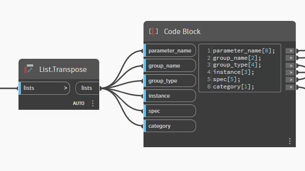

# Shared Parameter Builder – One‑Page Guide

> Quickly create Revit Shared Parameters from Excel using the Dynamo graph.
> Everything you need – instructions, blank template, sample data and Forge IDs – in one place.

---

## 🔧 How the Dynamo Script Works

:::info For Beginners
This script automates the creation of Shared Parameters in Revit by reading data from Excel. Don't worry if you're new to Dynamo - we'll explain every step!
:::

### Script Workflow (left to right)


#### 1️⃣ **Data Input (File Path)**
- **What it does**: Locates your Excel file with parameter data
- **For you**: Paste the complete path to your Excel file here
- **Example**: `C:\Users\YourName\Desktop\MyParameters.xlsx`


#### 2️⃣ **Excel Reading (Data.ImportExcel)**
- **What it does**: Reads all rows and columns from Excel
- **Important**: Data comes out as **plain text** (strings)
- **Why this matters**: Revit needs specific codes, not common text

#### 3️⃣ **Data Conversion (List.Deconstruct + List.Transpose)**
- **What it does**: Separates each Excel column into individual lists
- **For you**: No need to touch this - works automatically
- **Result**: 6 separate lists (one for each column)



#### 4️⃣ **Forge Conversion (TypeId Nodes)**
- **What it does**: Converts Excel text into codes Revit understands
- **SpecType.ByTypeId**: Converts data types (text, number, etc.)
- **GroupType.ByTypeId**: Converts property groups
- **Category.ByName**: Converts category names


:::warning Why Do We Need Forge?
Excel stores everything as text, but Revit needs specific identifiers. For example:
- Excel: `"autodesk.spec:spec.string-2.0.0"` (text)
- Revit: `SpecTypeId` (specific object)

Forge does this "translation" automatically!
:::

#### 5️⃣ **Parameter Creation (Parameter.CreateSharedParameter)**
- **What it does**: Finally creates the Shared Parameters in Revit
- **Receives**: All converted data from previous steps
- **Result**: Parameters appear in your Revit project


### Key Nodes Explained

| Node | Function | Why It's Important |
|------|----------|-------------------|
| `Data.ImportExcel` | Reads Excel file | User data input |
| `List.Deconstruct` | Separates columns | Organizes data for processing |
| `List.Transpose` | Reorganizes lists | Prepares data in correct order |
| `SpecType.ByTypeId` | Converts data type | Revit understands parameter format |
| `GroupType.ByTypeId` | Converts group | Revit knows where to show parameter |
| `Category.ByName` | Converts category | Revit knows which objects to apply to |
| `Parameter.CreateSharedParameter` | Creates parameter | Final result in Revit |

---

## ① Quick Start

1. **Copy** the **Blank Template** (section ③) into a new Excel sheet.
2. **Fill** the rows with your parameters. Use the **Forge ID Cheat‑Sheet** (section ⑤) to copy valid *groupType* and *specType* values.
3. **Save** the file and point the **File Path** node in Dynamo to it.
4. Press **Run** – your Shared Parameters will appear in Revit.

---

## ② Column Definitions

| Column              | Purpose                                                     |
| ------------------- | ----------------------------------------------------------- |
| **parameter\_Name** | Exact name of the new Shared Parameter.                     |
| **category**        | Target Revit category (single or several separated by `;`). |
| **groupName**       | Folder name shown in the Properties palette.                |
| **instance/Type**   | `TRUE` → Instance   `FALSE` → Type                          |
| **grouptype**       | Copy one string from *GroupTypeId* list.                    |
| **spectype**        | Copy one string from *SpecTypeId* list.                     |

---

## ③ Blank Template   *copy ↓ into Excel*

```text
parameter_Name	category	groupName	instance/Type	grouptype	spectype
```

---

## ④ Worked Example   *paste ready‑to‑run*

```text
parameter_Name	category	groupName	instance/Type	grouptype	spectype
SRE_ELEVATOR_TYPE	Specialty Equipment	Specialty Equipment_SRE	FALSE	autodesk.parameter.group:identityData-1.0.0	autodesk.spec:spec.string-2.0.0
SRE_ELEVATOR_DRIVE_TYPE	Specialty Equipment	Specialty Equipment_SRE	FALSE	autodesk.parameter.group:identityData-1.0.0	autodesk.spec:spec.string-2.0.0
SRE_ELEVATOR_STOPS	Specialty Equipment	Specialty Equipment_SRE	TRUE	autodesk.parameter.group:identityData-1.0.0	autodesk.spec.aec:number-2.0.0
SRE_ELEVATOR_DOORS	Specialty Equipment	Specialty Equipment_SRE	TRUE	autodesk.parameter.group:identityData-1.0.0	autodesk.spec.aec:number-2.0.0
SRE_ELEVATOR_LOAD	Specialty Equipment	Specialty Equipment_SRE	FALSE	autodesk.parameter.group:identityData-1.0.0	autodesk.spec.aec:number-2.0.0
```

---

## ⑤ Complete Forge ID Reference Guide

### 📋 Quick Reference Table (SpecType + GroupType)

| SpecType | GroupType | Description |
|----------|-----------|-------------|
| `autodesk.spec.aec.electrical:apparentPower-2.0.0` | `autodesk.parameter.group:electrical-1.0.0` | Electrical apparent power |
| `autodesk.spec.aec.electrical:current-2.0.0` | `autodesk.parameter.group:electrical-1.0.0` | Electrical current |
| `autodesk.spec.aec.electrical:power-2.0.0` | `autodesk.parameter.group:electrical-1.0.0` | Electrical power |
| `autodesk.spec.aec.hvac:airFlow-2.0.0` | `autodesk.parameter.group:mechanical-1.0.0` | HVAC air flow |
| `autodesk.spec.aec.hvac:temperature-2.0.0` | `autodesk.parameter.group:mechanical-1.0.0` | Temperature |
| `autodesk.spec.aec.piping:flow-2.0.0` | `autodesk.parameter.group:mechanical-1.0.0` | Piping flow |
| `autodesk.spec.aec.structural:force-2.0.0` | `autodesk.parameter.group:identityData-1.0.0` | Structural force |
| `autodesk.spec.aec:area-2.0.0` | `autodesk.parameter.group:dimensions-1.0.0` | Area measurement |
| `autodesk.spec.aec:length-2.0.0` | `autodesk.parameter.group:dimensions-1.0.0` | Length measurement |
| `autodesk.spec.aec:volume-2.0.0` | `autodesk.parameter.group:dimensions-1.0.0` | Volume measurement |
| `autodesk.spec.aec:number-2.0.0` | `autodesk.parameter.group:identityData-1.0.0` | Numeric value |
| `autodesk.spec:spec.string-2.0.0` | `autodesk.parameter.group:identityData-1.0.0` | Text string |
| `autodesk.spec:spec.bool-1.0.0` | `autodesk.parameter.group:identityData-1.0.0` | True/False |

<details>
<summary><strong>All Available GroupTypes</strong></summary>

```text
autodesk.parameter.group:identityData-1.0.0
autodesk.parameter.group:dimensions-1.0.0
autodesk.parameter.group:constraints-1.0.0
autodesk.parameter.group:electrical-1.0.0
autodesk.parameter.group:mechanical-1.0.0
autodesk.parameter.group:mechanicalAirflow-1.0.0
autodesk.parameter.group:ifc-1.0.0
autodesk.parameter.group:materials-1.0.0
```

</details>

<details>
<summary><strong>Complete SpecType List - All Categories</strong></summary>

```text
autodesk.spec.aec.electrical:apparentPower-2.0.0
autodesk.spec.aec.electrical:apparentPowerDensity-1.0.0
autodesk.spec.aec.electrical:cableTraySize-2.0.0
autodesk.spec.aec.electrical:colorTemperature-2.0.0
autodesk.spec.aec.electrical:conduitSize-2.0.0
autodesk.spec.aec.electrical:costRateEnergy-2.0.0
autodesk.spec.aec.electrical:costRatePower-2.0.0
autodesk.spec.aec.electrical:current-2.0.0
autodesk.spec.aec.electrical:demandFactor-2.0.0
autodesk.spec.aec.electrical:efficacy-2.0.0
autodesk.spec.aec.electrical:frequency-2.0.0
autodesk.spec.aec.electrical:illuminance-2.0.0
autodesk.spec.aec.electrical:luminance-2.0.0
autodesk.spec.aec.electrical:luminousFlux-2.0.0
autodesk.spec.aec.electrical:luminousIntensity-2.0.0
autodesk.spec.aec.electrical:potential-2.0.0
autodesk.spec.aec.electrical:power-2.0.0
autodesk.spec.aec.electrical:powerDensity-2.0.0
autodesk.spec.aec.electrical:powerPerLength-2.0.0
autodesk.spec.aec.electrical:resistivity-2.0.0
autodesk.spec.aec.electrical:temperature-2.0.0
autodesk.spec.aec.electrical:temperatureDifference-2.0.0
autodesk.spec.aec.electrical:wattage-2.0.0
autodesk.spec.aec.electrical:wireDiameter-2.0.0
autodesk.spec.aec.electrical:loadClassification-1.0.0
autodesk.spec.aec.energy:energy-2.0.0
autodesk.spec.aec.energy:heatCapacityPerArea-2.0.0
autodesk.spec.aec.energy:heatTransferCoefficient-2.0.0
autodesk.spec.aec.energy:isothermalMoistureCapacity-2.0.0
autodesk.spec.aec.energy:permeability-2.0.0
autodesk.spec.aec.energy:specificHeat-2.0.0
autodesk.spec.aec.energy:specificHeatOfVaporization-2.0.0
autodesk.spec.aec.energy:thermalConductivity-2.0.0
autodesk.spec.aec.energy:thermalGradientCoefficientForMoistureCapacity-2.0.0
autodesk.spec.aec.energy:thermalMass-2.0.0
autodesk.spec.aec.energy:thermalResistance-2.0.0
autodesk.spec.aec.hvac:airFlow-2.0.0
autodesk.spec.aec.hvac:airFlowDensity-2.0.0
autodesk.spec.aec.hvac:airFlowDividedByCoolingLoad-2.0.0
autodesk.spec.aec.hvac:airFlowDividedByVolume-2.0.0
autodesk.spec.aec.hvac:angularSpeed-2.0.0
autodesk.spec.aec.hvac:areaDividedByCoolingLoad-2.0.0
autodesk.spec.aec.hvac:areaDividedByHeatingLoad-2.0.0
autodesk.spec.aec.hvac:coolingLoad-2.0.0
autodesk.spec.aec.hvac:coolingLoadDividedByArea-2.0.0
autodesk.spec.aec.hvac:coolingLoadDividedByVolume-2.0.0
autodesk.spec.aec.hvac:crossSection-2.0.0
autodesk.spec.aec.hvac:density-2.0.0
autodesk.spec.aec.hvac:diffusivity-2.0.0
autodesk.spec.aec.hvac:ductInsulationThickness-2.0.0
autodesk.spec.aec.hvac:ductLiningThickness-2.0.0
autodesk.spec.aec.hvac:ductSize-2.0.0
autodesk.spec.aec.hvac:factor-2.0.0
autodesk.spec.aec.hvac:flowPerPower-2.0.0
autodesk.spec.aec.hvac:friction-2.0.0
autodesk.spec.aec.hvac:heatGain-2.0.0
autodesk.spec.aec.hvac:heatingLoad-2.0.0
autodesk.spec.aec.hvac:heatingLoadDividedByArea-2.0.0
autodesk.spec.aec.hvac:heatingLoadDividedByVolume-2.0.0
autodesk.spec.aec.hvac:massPerTime-2.0.0
autodesk.spec.aec.hvac:power-2.0.0
autodesk.spec.aec.hvac:powerDensity-2.0.0
autodesk.spec.aec.hvac:powerPerFlow-2.0.0
autodesk.spec.aec.hvac:pressure-2.0.0
autodesk.spec.aec.hvac:roughness-2.0.0
autodesk.spec.aec.hvac:slope-2.0.0
autodesk.spec.aec.hvac:temperature-2.0.0
autodesk.spec.aec.hvac:temperatureDifference-2.0.0
autodesk.spec.aec.hvac:velocity-2.0.0
autodesk.spec.aec.hvac:viscosity-2.0.0
autodesk.spec.aec.infrastructure:stationing-2.0.0
autodesk.spec.aec.infrastructure:stationingInterval-2.0.0
autodesk.spec.aec.piping:density-2.0.0
autodesk.spec.aec.piping:flow-2.0.0
autodesk.spec.aec.piping:friction-2.0.0
autodesk.spec.aec.piping:mass-2.0.0
autodesk.spec.aec.piping:massPerTime-2.0.0
autodesk.spec.aec.piping:pipeDimension-2.0.0
autodesk.spec.aec.piping:pipeInsulationThickness-2.0.0
autodesk.spec.aec.piping:pipeMassPerUnitLength-2.0.0
autodesk.spec.aec.piping:pipeSize-2.0.0
autodesk.spec.aec.piping:pressure-2.0.0
autodesk.spec.aec.piping:roughness-2.0.0
autodesk.spec.aec.piping:slope-2.0.0
autodesk.spec.aec.piping:temperature-2.0.0
autodesk.spec.aec.piping:temperatureDifference-2.0.0
autodesk.spec.aec.piping:velocity-2.0.0
autodesk.spec.aec.piping:viscosity-2.0.0
autodesk.spec.aec.piping:volume-2.0.0
autodesk.spec.aec.structural:acceleration-2.0.0
autodesk.spec.aec.structural:areaForce-2.0.0
autodesk.spec.aec.structural:areaForceScale-2.0.0
autodesk.spec.aec.structural:areaSpringCoefficient-2.0.0
autodesk.spec.aec.structural:barDiameter-2.0.0
autodesk.spec.aec.structural:crackWidth-2.0.0
autodesk.spec.aec.structural:displacement-2.0.0
autodesk.spec.aec.structural:energy-2.0.0
autodesk.spec.aec.structural:force-2.0.0
autodesk.spec.aec.structural:forceScale-2.0.0
autodesk.spec.aec.structural:frequency-2.0.0
autodesk.spec.aec.structural:lineSpringCoefficient-2.0.0
autodesk.spec.aec.structural:linearForce-2.0.0
autodesk.spec.aec.structural:linearForceScale-2.0.0
autodesk.spec.aec.structural:linearMoment-2.0.0
autodesk.spec.aec.structural:linearMomentScale-2.0.0
autodesk.spec.aec.structural:mass-2.0.0
autodesk.spec.aec.structural:massPerUnitArea-2.0.0
autodesk.spec.aec.structural:massPerUnitLength-2.0.0
autodesk.spec.aec.structural:moment-2.0.0
autodesk.spec.aec.structural:momentOfInertia-2.0.0
autodesk.spec.aec.structural:momentScale-2.0.0
autodesk.spec.aec.structural:period-2.0.0
autodesk.spec.aec.structural:pointSpringCoefficient-2.0.0
autodesk.spec.aec.structural:pulsation-2.0.0
autodesk.spec.aec.structural:reinforcementArea-2.0.0
autodesk.spec.aec.structural:reinforcementAreaPerUnitLength-2.0.0
autodesk.spec.aec.structural:reinforcementCover-2.0.0
autodesk.spec.aec.structural:reinforcementLength-2.0.0
autodesk.spec.aec.structural:reinforcementSpacing-2.0.0
autodesk.spec.aec.structural:reinforcementVolume-2.0.0
autodesk.spec.aec.structural:rotation-2.0.0
autodesk.spec.aec.structural:rotationalLineSpringCoefficient-2.0.0
autodesk.spec.aec.structural:rotationalPointSpringCoefficient-2.0.0
autodesk.spec.aec.structural:sectionArea-2.0.0
autodesk.spec.aec.structural:sectionDimension-2.0.0
autodesk.spec.aec.structural:sectionModulus-2.0.0
autodesk.spec.aec.structural:sectionProperty-2.0.0
autodesk.spec.aec.structural:stress-2.0.0
autodesk.spec.aec.structural:surfaceAreaPerUnitLength-2.0.0
autodesk.spec.aec.structural:thermalExpansionCoefficient-2.0.0
autodesk.spec.aec.structural:unitWeight-2.0.0
autodesk.spec.aec.structural:velocity-2.0.0
autodesk.spec.aec.structural:warpingConstant-2.0.0
autodesk.spec.aec.structural:weight-2.0.0
autodesk.spec.aec.structural:weightPerUnitLength-2.0.0
autodesk.spec.aec:angle-2.0.0
autodesk.spec.aec:area-2.0.0
autodesk.spec.aec:costPerArea-2.0.0
autodesk.spec.aec:decimalSheetLength-2.0.0
autodesk.spec.aec:distance-2.0.0
autodesk.spec.aec:length-2.0.0
autodesk.spec.aec:massDensity-2.0.0
autodesk.spec.aec:number-2.0.0
autodesk.spec.aec:rotationAngle-2.0.0
autodesk.spec.aec:sheetLength-2.0.0
autodesk.spec.aec:siteAngle-2.0.0
autodesk.spec.aec:slope-2.0.0
autodesk.spec.aec:speed-2.0.0
autodesk.spec.aec:time-2.0.0
autodesk.spec.aec:volume-2.0.0
autodesk.spec.aec:material-1.0.0
autodesk.spec.aec:numberOfPoles-2.0.0
autodesk.spec.aec:multilineText-2.0.0
autodesk.spec.aec:fillPattern-1.0.0
autodesk.spec.measurable:currency-2.0.0
autodesk.spec:spec.int64-2.0.0
autodesk.spec:spec.string-2.0.0
autodesk.spec:spec.bool-1.0.0
autodesk.spec.string:url-2.0.0
autodesk.spec.reference:image-1.0.0
```

</details>

---

---

## 📊 Expanded Templates & Examples

### Template Collection - Ready to Use

<details>
<summary><strong>🏗️ Structural Parameters Template</strong></summary>

```text
parameter_Name	category	groupName	instance/Type	grouptype	spectype
STRUCT_BEAM_CAPACITY	Structural Framing	Structural Analysis	FALSE	autodesk.parameter.group:identityData-1.0.0	autodesk.spec.aec.structural:force-2.0.0
STRUCT_COLUMN_LOAD	Structural Columns	Structural Analysis	TRUE	autodesk.parameter.group:identityData-1.0.0	autodesk.spec.aec.structural:force-2.0.0
STRUCT_FOUNDATION_TYPE	Structural Foundations	Structural Analysis	FALSE	autodesk.parameter.group:identityData-1.0.0	autodesk.spec:spec.string-2.0.0
STRUCT_REINFORCEMENT_GRADE	Structural Framing	Materials	FALSE	autodesk.parameter.group:materials-1.0.0	autodesk.spec:spec.string-2.0.0
STRUCT_MOMENT_CAPACITY	Structural Framing	Structural Analysis	FALSE	autodesk.parameter.group:identityData-1.0.0	autodesk.spec.aec.structural:moment-2.0.0
```

</details>

<details>
<summary><strong>⚡ Electrical Parameters Template</strong></summary>

```text
parameter_Name	category	groupName	instance/Type	grouptype	spectype
ELEC_PANEL_RATING	Electrical Equipment	Electrical Analysis	FALSE	autodesk.parameter.group:electrical-1.0.0	autodesk.spec.aec.electrical:current-2.0.0
ELEC_CIRCUIT_BREAKER	Electrical Equipment	Electrical Analysis	TRUE	autodesk.parameter.group:electrical-1.0.0	autodesk.spec:spec.string-2.0.0
ELEC_POWER_CONSUMPTION	Electrical Equipment	Electrical Analysis	TRUE	autodesk.parameter.group:electrical-1.0.0	autodesk.spec.aec.electrical:power-2.0.0
ELEC_VOLTAGE_RATING	Electrical Equipment	Electrical Analysis	FALSE	autodesk.parameter.group:electrical-1.0.0	autodesk.spec.aec.electrical:potential-2.0.0
ELEC_CONDUIT_SIZE	Conduit Fittings	Electrical Analysis	FALSE	autodesk.parameter.group:electrical-1.0.0	autodesk.spec.aec.electrical:conduitSize-2.0.0
```

</details>

<details>
<summary><strong>🌡️ HVAC Parameters Template</strong></summary>

```text
parameter_Name	category	groupName	instance/Type	grouptype	spectype
HVAC_AIR_FLOW_RATE	Mechanical Equipment	HVAC Analysis	TRUE	autodesk.parameter.group:mechanical-1.0.0	autodesk.spec.aec.hvac:airFlow-2.0.0
HVAC_COOLING_CAPACITY	Mechanical Equipment	HVAC Analysis	FALSE	autodesk.parameter.group:mechanical-1.0.0	autodesk.spec.aec.hvac:coolingLoad-2.0.0
HVAC_HEATING_CAPACITY	Mechanical Equipment	HVAC Analysis	FALSE	autodesk.parameter.group:mechanical-1.0.0	autodesk.spec.aec.hvac:heatingLoad-2.0.0
HVAC_DUCT_SIZE	Ducts	HVAC Analysis	FALSE	autodesk.parameter.group:mechanical-1.0.0	autodesk.spec.aec.hvac:ductSize-2.0.0
HVAC_TEMPERATURE_SETPOINT	Spaces	HVAC Analysis	TRUE	autodesk.parameter.group:mechanical-1.0.0	autodesk.spec.aec.hvac:temperature-2.0.0
```

</details>

<details>
<summary><strong>🚿 Plumbing Parameters Template</strong></summary>

```text
parameter_Name	category	groupName	instance/Type	grouptype	spectype
PLUMB_PIPE_SIZE	Pipes	Plumbing Analysis	FALSE	autodesk.parameter.group:mechanical-1.0.0	autodesk.spec.aec.piping:pipeSize-2.0.0
PLUMB_FLOW_RATE	Plumbing Fixtures	Plumbing Analysis	TRUE	autodesk.parameter.group:mechanical-1.0.0	autodesk.spec.aec.piping:flow-2.0.0
PLUMB_PRESSURE_RATING	Pipes	Plumbing Analysis	FALSE	autodesk.parameter.group:mechanical-1.0.0	autodesk.spec.aec.piping:pressure-2.0.0
PLUMB_FIXTURE_TYPE	Plumbing Fixtures	Plumbing Analysis	FALSE	autodesk.parameter.group:identityData-1.0.0	autodesk.spec:spec.string-2.0.0
PLUMB_WATER_TEMPERATURE	Plumbing Fixtures	Plumbing Analysis	TRUE	autodesk.parameter.group:mechanical-1.0.0	autodesk.spec.aec.piping:temperature-2.0.0
```

</details>

<details>
<summary><strong>📐 General Dimensions Template</strong></summary>

```text
parameter_Name	category	groupName	instance/Type	grouptype	spectype
DIM_CUSTOM_LENGTH	Walls;Floors;Roofs	Custom Dimensions	TRUE	autodesk.parameter.group:dimensions-1.0.0	autodesk.spec.aec:length-2.0.0
DIM_CUSTOM_AREA	Walls;Floors;Roofs	Custom Dimensions	TRUE	autodesk.parameter.group:dimensions-1.0.0	autodesk.spec.aec:area-2.0.0
DIM_CUSTOM_VOLUME	Rooms;Spaces	Custom Dimensions	TRUE	autodesk.parameter.group:dimensions-1.0.0	autodesk.spec.aec:volume-2.0.0
DIM_CUSTOM_ANGLE	Generic Models	Custom Dimensions	TRUE	autodesk.parameter.group:dimensions-1.0.0	autodesk.spec.aec:angle-2.0.0
DIM_CUSTOM_COUNT	Generic Models	Custom Dimensions	TRUE	autodesk.parameter.group:identityData-1.0.0	autodesk.spec.aec:number-2.0.0
```

</details>

<details>
<summary><strong>🏢 Specialty Equipment Template (Complete Example)</strong></summary>

```text
parameter_Name	category	groupName	instance/Type	grouptype	spectype
SRE_ELEVATOR_TYPE	Specialty Equipment	Specialty Equipment_SRE	FALSE	autodesk.parameter.group:identityData-1.0.0	autodesk.spec:spec.string-2.0.0
SRE_ELEVATOR_DRIVE_TYPE	Specialty Equipment	Specialty Equipment_SRE	FALSE	autodesk.parameter.group:identityData-1.0.0	autodesk.spec:spec.string-2.0.0
SRE_ELEVATOR_STOPS	Specialty Equipment	Specialty Equipment_SRE	TRUE	autodesk.parameter.group:identityData-1.0.0	autodesk.spec.aec:number-2.0.0
SRE_ELEVATOR_DOORS	Specialty Equipment	Specialty Equipment_SRE	TRUE	autodesk.parameter.group:identityData-1.0.0	autodesk.spec.aec:number-2.0.0
SRE_ELEVATOR_LOAD	Specialty Equipment	Specialty Equipment_SRE	FALSE	autodesk.parameter.group:identityData-1.0.0	autodesk.spec.aec:number-2.0.0
SRE_ELEVATOR_SPEED	Specialty Equipment	Specialty Equipment_SRE	FALSE	autodesk.parameter.group:identityData-1.0.0	autodesk.spec.aec:speed-2.0.0
SRE_ELEVATOR_MANUFACTURER	Specialty Equipment	Specialty Equipment_SRE	FALSE	autodesk.parameter.group:identityData-1.0.0	autodesk.spec:spec.string-2.0.0
SRE_ELEVATOR_MODEL	Specialty Equipment	Specialty Equipment_SRE	FALSE	autodesk.parameter.group:identityData-1.0.0	autodesk.spec:spec.string-2.0.0
SRE_ELEVATOR_POWER_REQUIRED	Specialty Equipment	Specialty Equipment_SRE	FALSE	autodesk.parameter.group:electrical-1.0.0	autodesk.spec.aec.electrical:power-2.0.0
SRE_ELEVATOR_IS_ACCESSIBLE	Specialty Equipment	Specialty Equipment_SRE	FALSE	autodesk.parameter.group:identityData-1.0.0	autodesk.spec:spec.bool-1.0.0
```

</details>

### 🎯 Common Parameter Combinations

| Parameter Type | Recommended SpecType | Recommended GroupType |
|----------------|---------------------|---------------------|
| **Text Description** | `autodesk.spec:spec.string-2.0.0` | `autodesk.parameter.group:identityData-1.0.0` |
| **Numeric Count** | `autodesk.spec.aec:number-2.0.0` | `autodesk.parameter.group:identityData-1.0.0` |
| **Yes/No Choice** | `autodesk.spec:spec.bool-1.0.0` | `autodesk.parameter.group:identityData-1.0.0` |
| **Length/Distance** | `autodesk.spec.aec:length-2.0.0` | `autodesk.parameter.group:dimensions-1.0.0` |
| **Area** | `autodesk.spec.aec:area-2.0.0` | `autodesk.parameter.group:dimensions-1.0.0` |
| **Volume** | `autodesk.spec.aec:volume-2.0.0` | `autodesk.parameter.group:dimensions-1.0.0` |
| **Electrical Power** | `autodesk.spec.aec.electrical:power-2.0.0` | `autodesk.parameter.group:electrical-1.0.0` |
| **Temperature** | `autodesk.spec.aec.hvac:temperature-2.0.0` | `autodesk.parameter.group:mechanical-1.0.0` |
| **Structural Force** | `autodesk.spec.aec.structural:force-2.0.0` | `autodesk.parameter.group:identityData-1.0.0` |

---

### Need help?

* Check in‑line comments inside the Dynamo graph for node‑by‑node explanations.
* Forge documentation: **Revit API → ForgeTypeId**.
* Contact **Paulo Giavoni – BIM Specialist** for assistance.

---

## 🚀 Tips for Beginners

### ✅ Pre-Run Checklist
- [ ] Excel file saved and closed
- [ ] Correct file path in "File Path" node
- [ ] Data filled following template exactly
- [ ] Revit open with an active project

### ⚠️ Common Errors
1. **"Cannot find file"**: Check if the path is correct
2. **"Invalid SpecType"**: Use exactly the codes from Forge list
3. **"Parameter already exists"**: Parameter was already created before
4. **"Invalid Category"**: Category name must be in English

### 💡 Advanced Tips
- **Multiple categories**: Separate with `;` (e.g., "Walls;Doors;Windows")
- **Backup**: Always backup project before running
- **Test small**: Start with 1-2 parameters to test
- **Unique names**: Use prefixes to avoid conflicts (e.g., "SRE_", "MEP_")

---

*Version 1.0 • Last updated: June 11, 2025*
