# Tutorial: Revit Fractal Family - Universal Rotation System

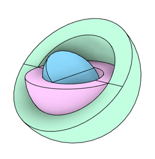

## Concept

:::info Inspiration
The concept of creating a rotating family at any angle seemed impossible until discovering an advanced adaptive family technique. This tutorial simplifies the process to create a photovoltaic panel family that can rotate at any angle.
:::

The principle is similar to a **fractal vise**, where each rotating piece is connected to another, allowing movement in multiple axes:

:::tip Key Concept
For the system to adapt to any element, we use rotating pieces connected sequentially. We'll implement this using Revit's **Revolve** command.
::: 

## Part 1: Creating the Fractal Pivot Family

### 1. Create New Family

- Open Revit
- Create a new family (**Generic Model Adaptive** or **Metric Generic Model**)
- Define the base reference planes

### 2. Create the First Revolve

- Draw the profile for the revolve
- Use the **Revolve** tool to create the first rotating piece
- Configure the rotation axis

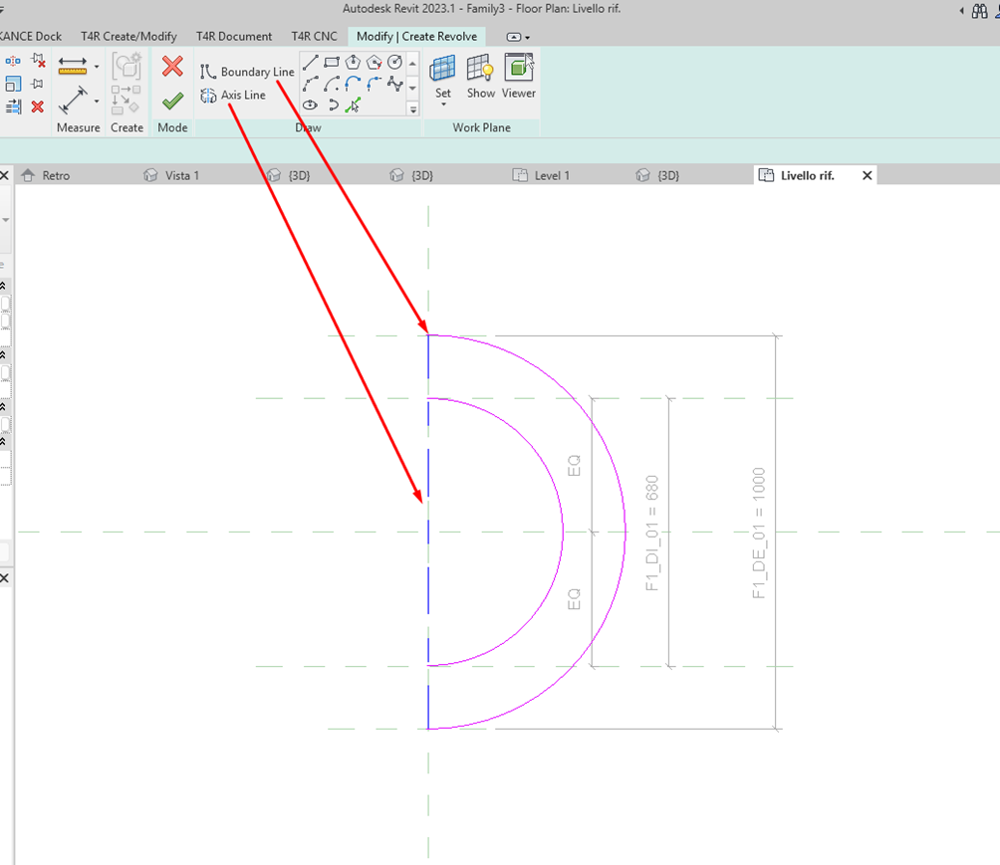

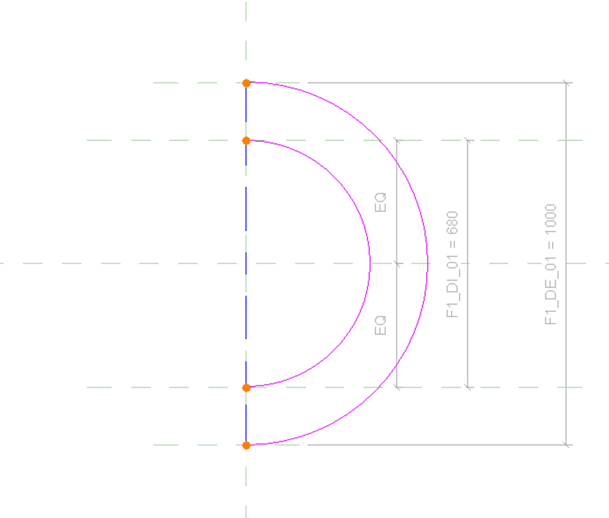

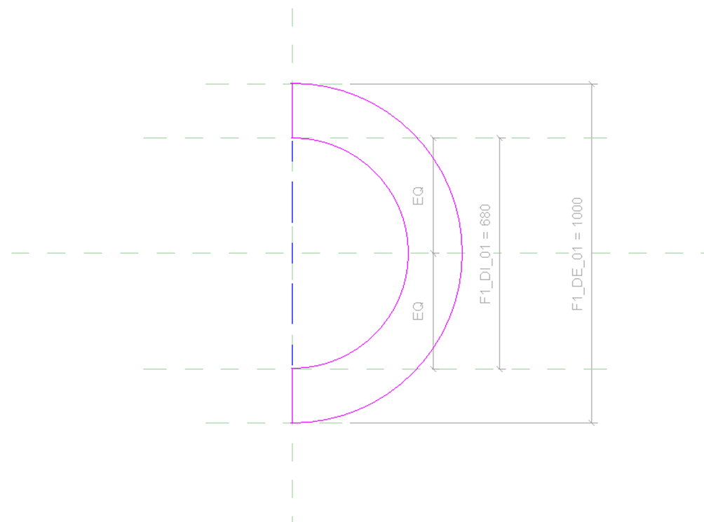

### 3. Add Angular Parameters

:::warning Important
Create clear parameters to control rotation. This is fundamental for parametric control of the system.
:::

- Create angle parameters to control rotation
- Associate parameters with the revolve
- Configure necessary formulas

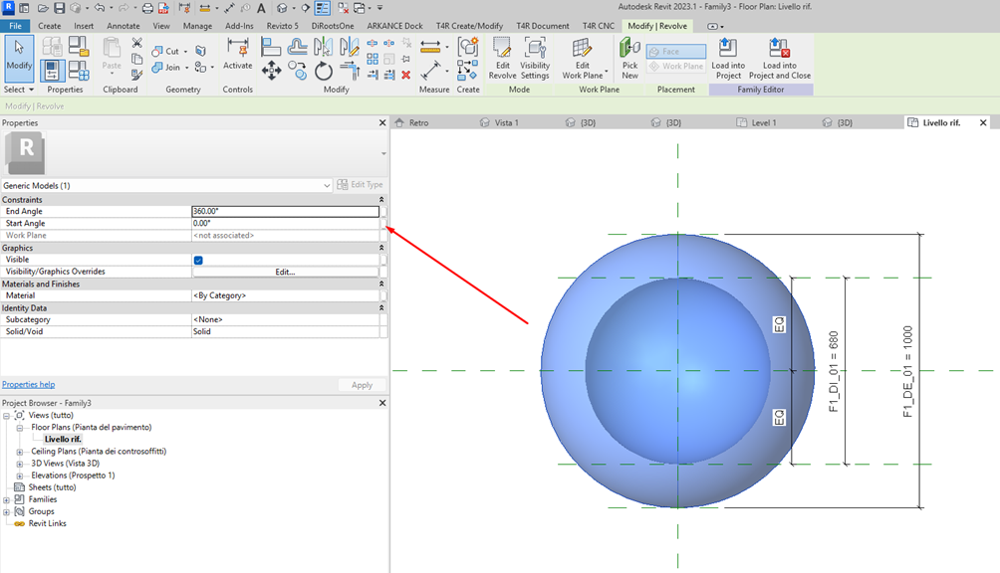

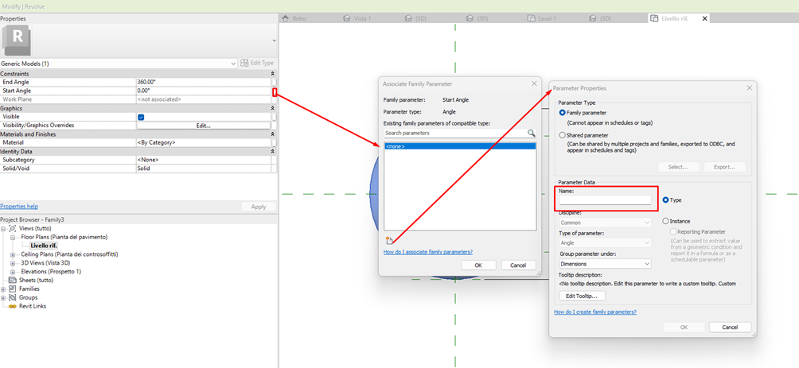

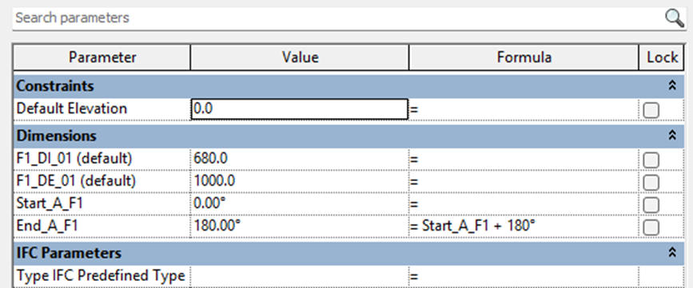

### 4. Apply Workplane on Revolve

:::danger Critical Step
This is the most important step! The workplane applied on the first revolve surface will be the base for the next element.
:::

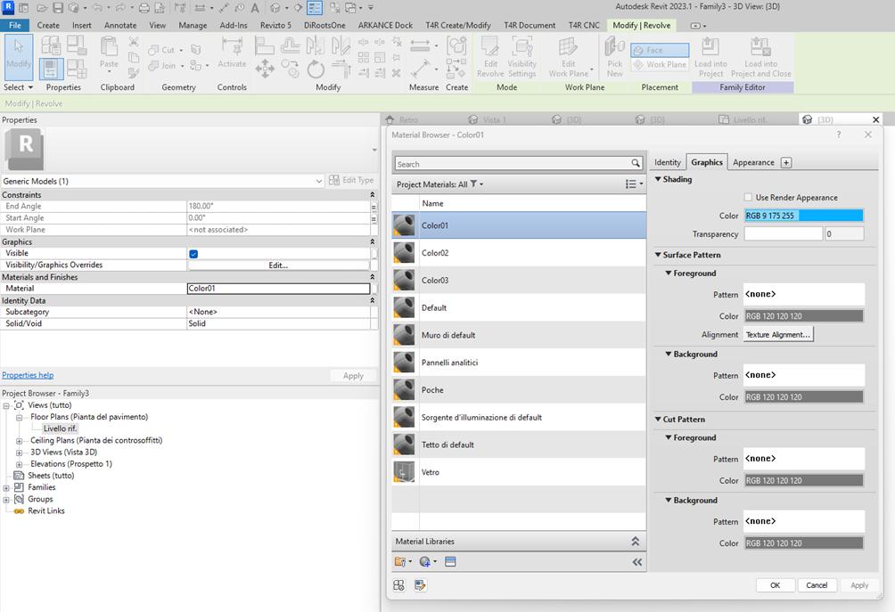

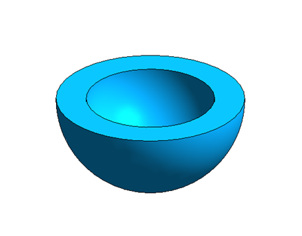

### 5. Create Second Revolve in Different Direction

- With the workplane active, create another revolve
- Orient this revolve in a different direction (perpendicular, for example)
- Configure its own angular parameters

### 6. Configure Relationship Between Revolves

- Establish parametric relationship between elements
- **Test**: when one rotates, the other should follow maintaining its relative orientation
- Adjust constraints as needed

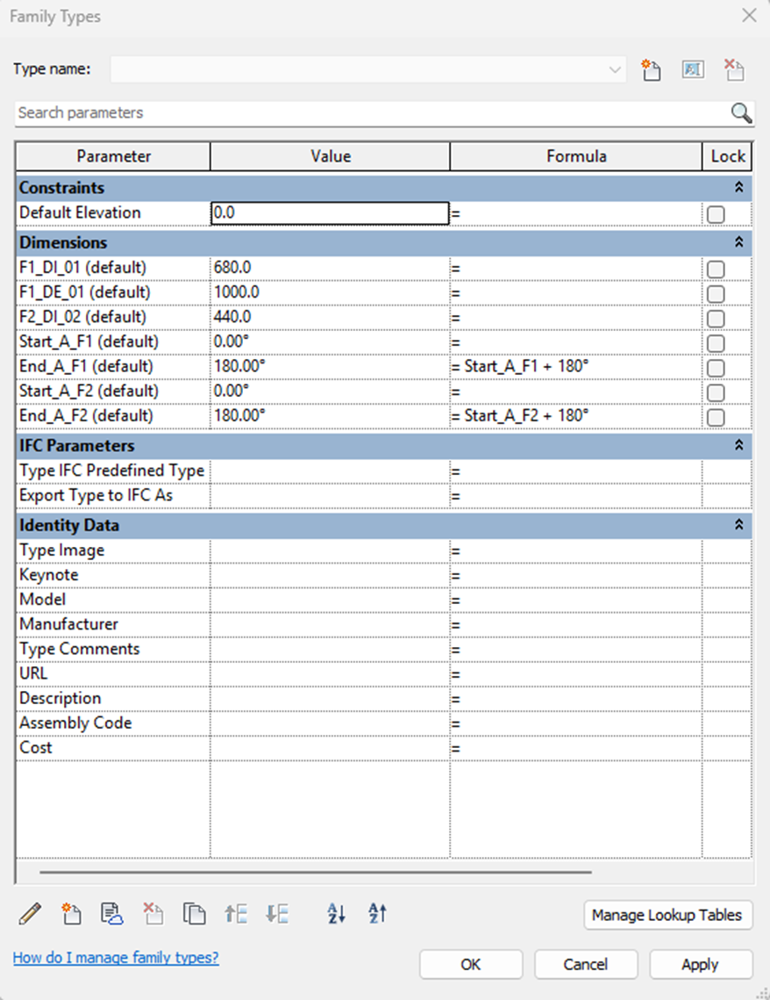

### 7. Save the Pivot Family

- Save this family with a descriptive name (e.g., `Fractal_Pivot_Base`)
- This will be your rotational control family

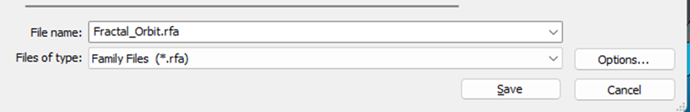

## Part 2: Applying the Face-Based System

### 8. Create or Open Face-Based Family

- Create a new family or use an existing one (e.g., photovoltaic panel)
- Choose the **Face-Based** template
- Model the desired element (panel, plate, etc.)

### 9. Insert into Project

- Load both families into the project
- First, insert the fractal pivot family
- Configure initial angles

### 10. Apply Face-Based Family

:::tip Final Application
- Select the face-based family
- **Apply on the last revolve face** of the pivot family
- The face-based family will now follow all system rotation
:::

---

## Method Advantages

<h4>🎯 Total Control</h4>

Complete control over rotation in multiple axes

<h4>🔧 Flexibility</h4>

Add as many rotation levels as desired

<h4>♻️ Reusability</h4>

The pivot can be used with different face-based elements

<h4>📐 Precision</h4>

Exact angles defined parametrically

## Practical Tips

:::note Best Practices
1. **Naming**: Use clear names for parameters (e.g., `Rotation_Axis_X`, `Rotation_Axis_Y`)
2. **Incremental Testing**: Test each rotation level before adding the next
3. **Performance**: Limit the number of revolves to maintain good performance
4. **Visibility**: Configure pivot visibility to hide it when necessary
:::

## Practical Applications

- 🌞 Photovoltaic panels with precise orientation
- 🏢 Adjustable brise-soleil  
- 🎨 Dynamic facade elements
- ⚙️ Mechanical equipment with multiple degrees of freedom
- 💡 Directional luminaires

## Final Result

:::success Complete System
You will have a system where:
- ✅ The pivot family controls all rotation
- ✅ The face-based element (panel) perfectly follows the movement  
- ✅ Angles can be adjusted in multiple directions
- ✅ The system is fully parametric and reusable
:::