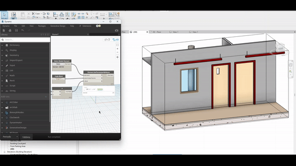

# Script Dinamici di Dynamo per Revit


<div style={{textAlign: 'center', marginBottom: '2rem'}}>



</div>

## Panoramica dello Script

:::info Concetto
Questo tutorial esplora come creare script dinamici in Dynamo che utilizzano data e ora attuali per automatizzare i parametri degli elementi in Revit, dimostrando applicazioni pratiche di automazione temporale.
:::

Lo script utilizza i seguenti componenti principali:

1. **Data e Ora Attuali**: Utilizziamo il nodo `DateTime.Now` per ottenere la data e l'ora attuali, fornendo un contesto temporale all'operazione.
2. **Script Python**: Due script Python sono utilizzati per eseguire calcoli personalizzati.
3. **Iterazioni e Angoli**: Un blocco di codice calcola l'angolo basato sulle iterazioni, generando una sequenza di valori.
4. **Selezione Elemento**: Il nodo `Select Model Element` permette di scegliere l'elemento specifico che avrà i suoi parametri modificati.
5. **Impostazione Parametri**: Infine, il nodo `Element.SetParameterByName` aggiorna il parametro dell'elemento selezionato con il valore calcolato.

## Applicazioni Pratiche

:::tip Casi d'Uso
- Regolazione automatica dei parametri di illuminazione basata sull'ora del giorno
- Aggiornamento di angoli o posizioni in elementi strutturali per simulazioni
- Qualsiasi scenario dove l'automazione può ridurre errori manuali e aumentare l'efficienza
:::

## Codice e Logica

### Script Python 1 - Elaborazione del Tempo

```python
import clr
clr.AddReference('ProtoGeometry')
from Autodesk.DesignScript.Geometry import *

import datetime

# Coleta a hora atual
hora_atual = IN[0]  # Entrada do nó "DateTime.Now"
multiplicador_divisor = IN[1]  # Entrada do valor de multiplicação/divisão (Slider)

# Extrair o valor dos segundos atuais
segundos = hora_atual.Second

# Função para multiplicar e dividir os segundos
def processar_segundos(segundos, valor):
    multiplicado = segundos * valor
    dividido = segundos / valor if valor != 0 else None  # Evitar divisão por zero
    return multiplicado, dividido

# Processa os segundos
resultado_multiplicado, resultado_dividido = processar_segundos(segundos, multiplicador_divisor)

# Assign your output to the OUT variable
OUT = resultado_multiplicado
```

### Script Python 2 - Regolazione dei Valori

```python
# Load the Python Standard and DesignScript Libraries
import sys
import clr
clr.AddReference('ProtoGeometry')
from Autodesk.DesignScript.Geometry import *

# The inputs to this node will be stored as a list in the IN variables.
valores_originais = IN[0]

# Place your code below this line
def ajustar_valores(valores):
    # Verifica se a entrada é uma lista, se não for, converte para uma lista
    if not isinstance(valores, list):
        valores = [valores]
        
    valores_ajustados = []
    for valor in valores:
        if valor > 90:
            valores_ajustados.append(90)
        else:
            valores_ajustados.append(valor)
    return valores_ajustados

# Exemplo de uso:
valores_ajustados = ajustar_valores(valores_originais)

# Assign your output to the OUT variable.
OUT = valores_ajustados
```

## Flusso di Lavoro

:::note Processo
1. **Cattura Temporale**: Lo script cattura l'ora attuale usando `DateTime.Now`
2. **Elaborazione**: I secondi vengono estratti e elaborati attraverso operazioni matematiche
3. **Regolazione Valori**: I valori sono limitati a un massimo di 90 gradi
4. **Applicazione**: Il valore finale viene applicato al parametro dell'elemento selezionato in Revit
:::

Questo esempio dimostra come Dynamo può essere utilizzato per creare automazioni basate sul tempo, aprendo possibilità per simulazioni più realistiche e dinamiche in Revit.

