# Tutorial: Famiglia Revit Frattale - Sistema di Rotazione Universale

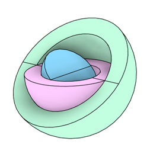

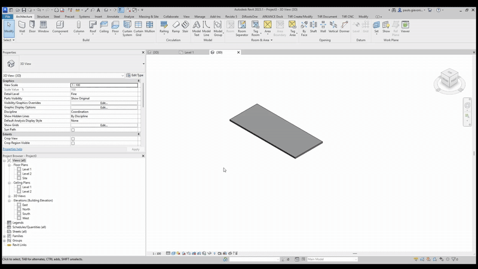

## Concetto

:::info Ispirazione
Il concetto di creare una famiglia girevole a qualsiasi angolo sembrava impossibile fino a scoprire una tecnica avanzata di famiglie adattive. Questo tutorial semplifica il processo per creare una famiglia di pannello fotovoltaico che può ruotare a qualsiasi angolo.
:::

Il principio è simile a quello di una **morsa frattale**, dove ogni pezzo girevole è collegato all'altro, permettendo movimento su più assi:

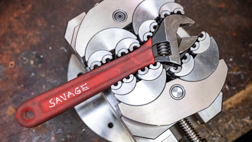

:::tip Concetto Chiave
Affinché il sistema si adatti a qualsiasi elemento, utilizziamo pezzi girevoli collegati sequenzialmente. Implementeremo questo usando il comando **Revolve** di Revit.
:::

## Parte 1: Creazione della Famiglia Perno Frattale

### 1. Creare Nuova Famiglia

- Aprire Revit
- Creare una nuova famiglia (**Generic Model Adaptive** o **Metric Generic Model**)
- Definire i piani di riferimento base

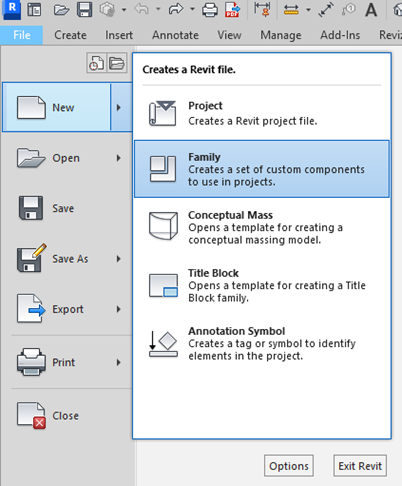

### 2. Creare il Primo Revolve

- Disegnare il profilo per il revolve
- Utilizzare lo strumento **Revolve** per creare il primo pezzo girevole
- Configurare l'asse di rotazione

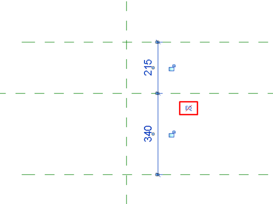

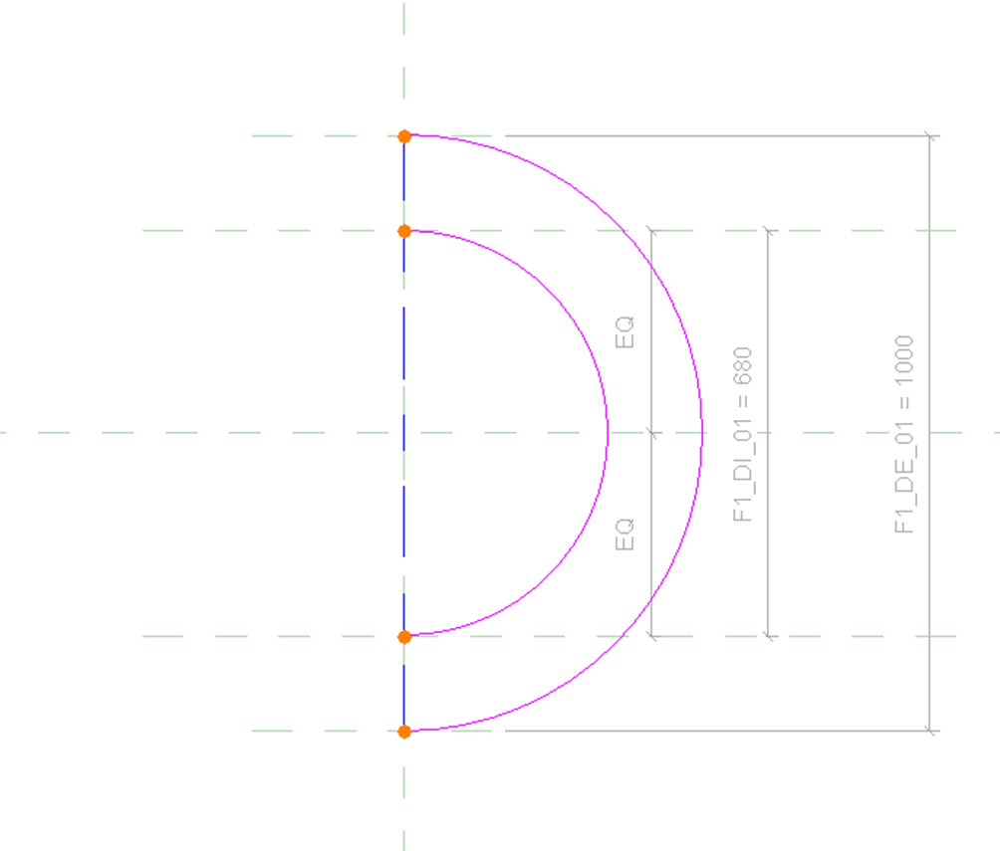

### 3. Aggiungere Parametri Angolari

:::warning Importante
Creare parametri chiari per controllare la rotazione. Questo è fondamentale per il controllo parametrico del sistema.
:::

- Creare parametri angolari per controllare la rotazione
- Associare i parametri al revolve
- Configurare le formule necessarie

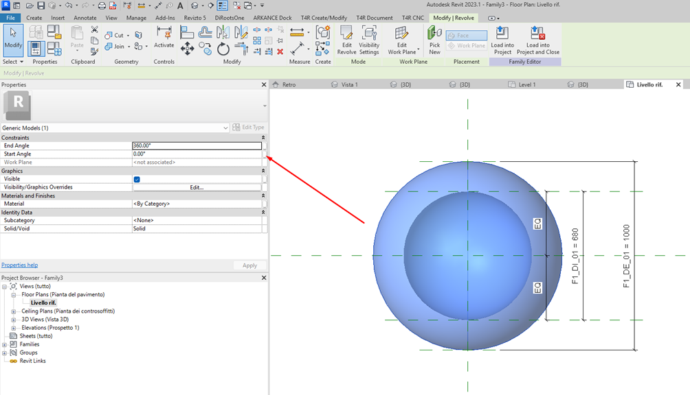

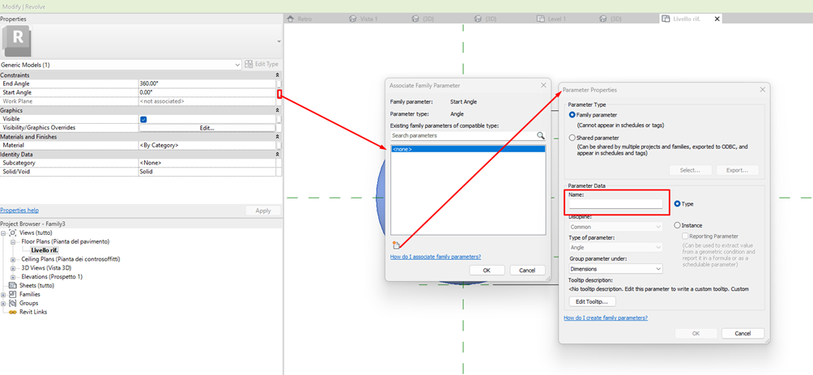

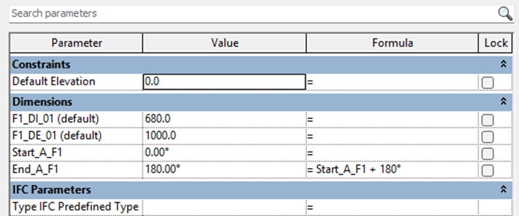

### 4. Applicare Workplane sul Revolve

:::danger Passaggio Critico
Questo è il passaggio più importante! Il workplane applicato sulla superficie del primo revolve sarà la base per l'elemento successivo.
:::

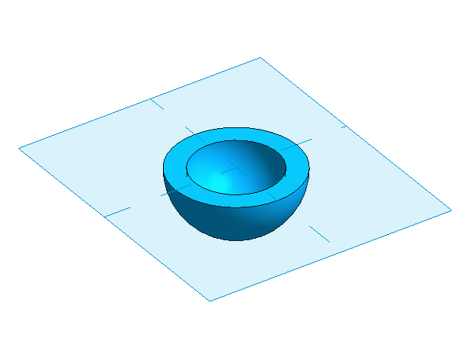

### 5. Creare Secondo Revolve in Direzione Diversa

- Con il workplane attivo, creare un altro revolve
- Orientare questo revolve in una direzione diversa (perpendicolare, ad esempio)
- Configurare i propri parametri angolari

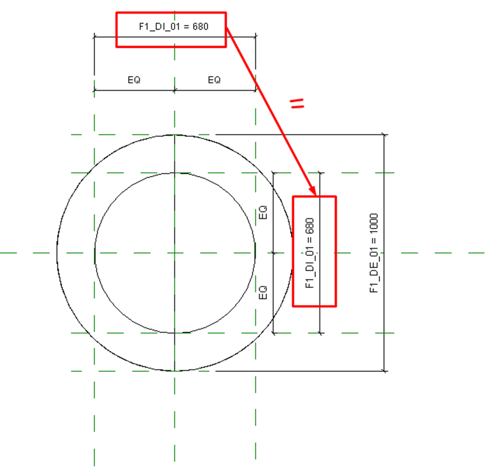

### 6. Configurare Relazione Tra i Revolve

- Stabilire la relazione parametrica tra gli elementi
- **Test**: quando uno ruota, l'altro deve seguire mantenendo il suo orientamento relativo
- Regolare i vincoli secondo necessità

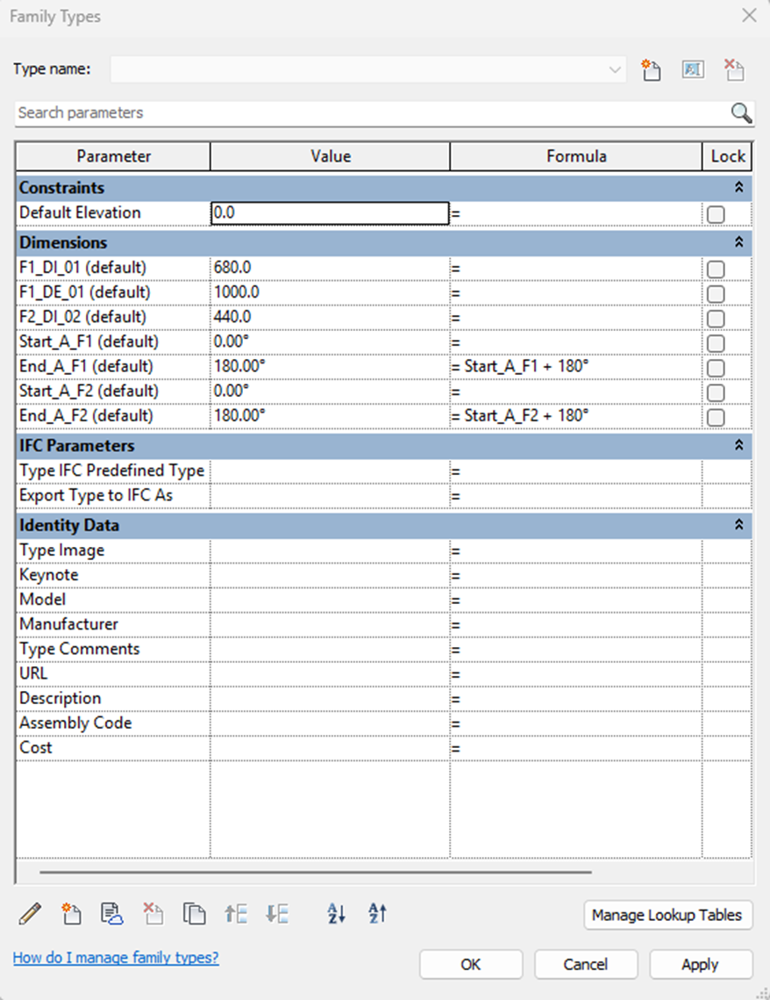

### 7. Salvare la Famiglia Perno

- Salvare questa famiglia con un nome descrittivo (es: `Perno_Frattale_Base`)
- Questa sarà la famiglia di controllo rotazionale

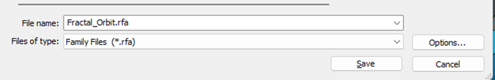

## Parte 2: Applicazione del Sistema Face-Based

### 8. Creare o Aprire Famiglia Face-Based

- Creare una nuova famiglia o utilizzarne una esistente (es: pannello fotovoltaico)
- Scegliere il template **Face-Based**
- Modellare l'elemento desiderato (pannello, piastra, ecc.)

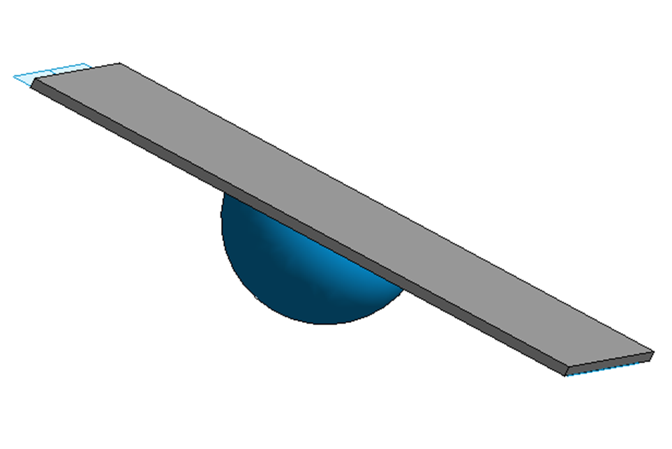

### 9. Inserire nel Progetto

- Caricare entrambe le famiglie nel progetto
- Prima, inserire la famiglia perno frattale
- Configurare gli angoli iniziali

### 10. Applicare Famiglia Face-Based

:::tip Applicazione Finale
- Selezionare la famiglia face-based
- **Applicare sulla faccia dell'ultimo revolve** della famiglia perno
- La famiglia face-based ora seguirà tutta la rotazione del sistema
:::

---

## Vantaggi del Metodo

<h4>🎯 Controllo Totale</h4>

Controllo completo sulla rotazione su più assi

<h4>🔧 Flessibilità</h4>

Aggiungere quanti livelli di rotazione si desiderano

<h4>♻️ Riutilizzo</h4>

Il perno può essere utilizzato con diversi elementi face-based

<h4>📐 Precisione</h4>

Angoli esatti definiti parametricamente

## Consigli Pratici

:::note Buone Pratiche
1. **Denominazione**: Utilizzare nomi chiari per i parametri (es: `Rotazione_Asse_X`, `Rotazione_Asse_Y`)
2. **Test Incrementale**: Testare ogni livello di rotazione prima di aggiungere il successivo
3. **Prestazioni**: Limitare il numero di revolve per mantenere buone prestazioni
4. **Visibilità**: Configurare la visibilità del perno per nasconderlo quando necessario
:::

## Applicazioni Pratiche

- 🌞 Pannelli fotovoltaici con orientamento preciso
- 🏢 Brise-soleil regolabili  
- 🎨 Elementi di facciata dinamici
- ⚙️ Attrezzature meccaniche con più gradi di libertà
- 💡 Illuminazione direzionale

## Risultato Finale

:::success Sistema Completo
Avrete un sistema dove:
- ✅ La famiglia perno controlla tutta la rotazione
- ✅ L'elemento face-based (pannello) segue perfettamente il movimento  
- ✅ Si possono regolare angoli in più direzioni
- ✅ Il sistema è completamente parametrico e riutilizzabile
:::
